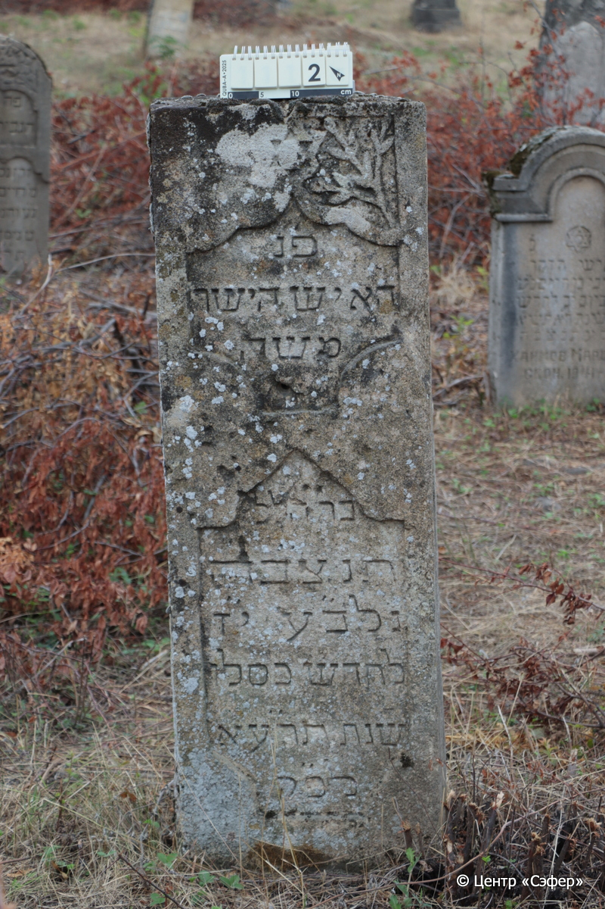

::: {style="font-size: 1em; margin-bottom: 1.2em"}
[Куба (центральное)](../cemeteries/QBA.html) > QBA0002
:::

```{r}
suppressPackageStartupMessages(library(tidyverse))
```


:::: {.columns}

::: {.column width="20%"}

```{r}
#| lightbox:
#|   group: photos



```
:::

::: {.column width="5%"}
:::

::: {.column width="74%"}

::: {.name-style}
Моше, сын Гилеля (Миши)
:::

::: {style="font-size: 1.2em;"}
משה בן הלל
:::

:::: {.columns}
::: {.column width="5%"}
{width=1.3em}
:::

::: {.column style="width: 40%; padding-left: 0.2em;"}
  /  
:::

::: {.column width="5%"}
{width=1.3em}
:::

::: {.column style="width: 50%; padding-left: 0.2em;"}
18.12.1910* / 17.Ki.5671
:::

::::


::: {.panel-tabset}

#### Эпитафия

```{r}
tibble(`Оригинал` = "פ״נ
האיש הישר 
משה
בר״ הלל
תנצ״בה
נלב״ע י״ז
לחדש כסלו 
שנת תר״עא
לפ״ק",
       `Перевод` = "Здесь покоится
праведный человек,
Моше,
сын р. Гилеля,
Да будет душа его завязана в узле жизни!
Отправился в дом вечности 17 <числа>
месяца кислев,
год 671
по малому исчислению.") |>
  mutate(`Оригинал` = str_split(`Оригинал`, "
"),
         `Перевод` = str_split(`Перевод`, "
")) |>
  unnest_longer(c(`Оригинал`, `Перевод`)) |> 
  mutate(id = 1:n()) |> 
  relocate(id, .before = Перевод) |> 
  rename(` ` = id) |> 
  knitr::kable(align = c("r", "c", "l"))
```

|||
|-|---|
|**Примечания**| |
|**Язык**      |иврит    |
|**Метки**     |     |
: {tbl-colwidths="[25,75]"}

#### Памятник

|||
|-|---|
|**Тип памятника**   |стела                                                                         |
|**Материал**        |известняк (сколы, следы эрозии)                                                     |
|**Размеры**         |134×44×19  --- стела                                                                        |
|**Тип декора**      |растительный, традиционная символика                                                                        |
|**Элементы декора** |ветвь в правой верхней части, звезда Давида в центре сверху, две фигурные ниши с текстом                                                                          |
|**Координаты**      |[41.37069514, 48.50583897](https://www.google.com/maps/place/41.37069514, 48.50583897)                    |
: {tbl-colwidths="[25,75]"}

#### Источник

|||
|-|---|
|**Место хранения**        |Архив полевых исследований Центра «Сэфер»     |
|**Контакты**              |students@sefer.ru    |
|**Ссылка**                |https://sfira.org        |
|**Исходный ID**           |  |
|**Условия использования** |[CC BY-NC 4.0](https://creativecommons.org/licenses/by-nc/4.0/deed.ru)     |
: {tbl-colwidths="[25,75]"}

:::

:::

::::

