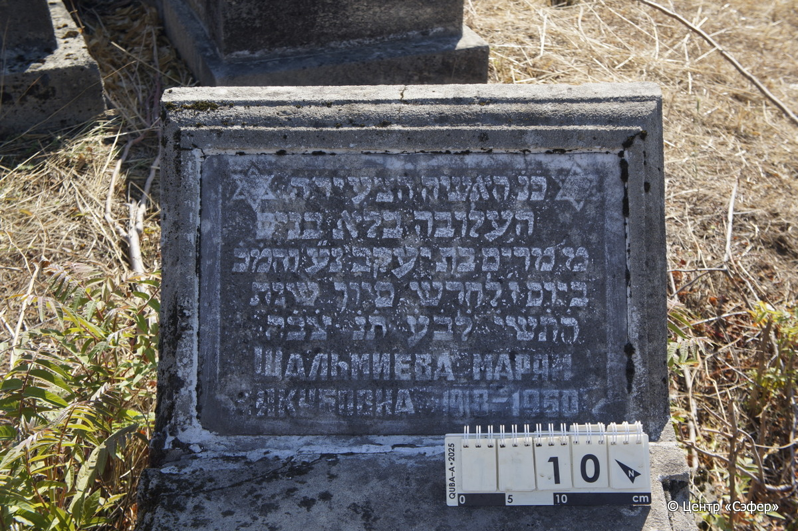

::: {style="font-size: 1em; margin-bottom: 1.2em"}
[Куба (центральное)](../cemeteries/QBA.html) > QBA0010
:::

```{r}
suppressPackageStartupMessages(library(tidyverse))
```


:::: {.columns}

::: {.column width="20%"}

```{r}
#| lightbox:
#|   group: photos



```
:::

::: {.column width="5%"}
:::

::: {.column width="74%"}

::: {.name-style}
ШАЛЬМИЕВА Мирьям, дочь Яакова (Марям Якубовна)
:::

::: {style="font-size: 1.2em;"}
מרים בת יעקב
:::

:::: {.columns}
::: {.column width="5%"}
{width=1.3em}
:::

::: {.column style="width: 40%; padding-left: 0.2em;"}
-.-.1918 /  
:::

::: {.column width="5%"}
{width=1.3em}
:::

::: {.column style="width: 50%; padding-left: 0.2em;"}
-.-.1950 / 7.Si.5710
:::

::::


::: {.panel-tabset}

#### Эпитафия

```{r}
tibble(`Оригинал` = "פ֗נ֗ האשה הצעירה
העלובה בלא בנים
מ׳ מרים בת יעקב נ״ע ו֗ה֗מ֗כ֗
ביום ז׳ לחדש סיון שנת
ה֗ת֗ש֗י֗ ל֗ב֗ע֗ ת֗נ֗ צ֗ב֗ה֗
 Шальмиева Марям
Якубовна 1918–1950",
       `Перевод` = "Здесь покоится молодая женщина
обделённая детьми,
г-жа Мирьям, дочь Яакова, да упокоится в раю, благословен её покой.
<Скончалась> на 7 день месяца сиван, год
5710 от сотворения мира. Да будет душа её завязана в узле жизни.
Шальмиева Марям
Якубовна 1918 – 1950") |>
  mutate(`Оригинал` = str_split(`Оригинал`, "
"),
         `Перевод` = str_split(`Перевод`, "
")) |>
  unnest_longer(c(`Оригинал`, `Перевод`)) |> 
  mutate(id = 1:n()) |> 
  relocate(id, .before = Перевод) |> 
  rename(` ` = id) |> 
  knitr::kable(align = c("r", "c", "l"))
```

|||
|-|---|
|**Примечания**| |
|**Язык**      |иврит, русский    |
|**Метки**     |     |
: {tbl-colwidths="[25,75]"}

#### Памятник

|||
|-|---|
|**Тип памятника**   |L-образный                                                                         |
|**Материал**        |песчаник, мрамор (цементный раствор, трещины, мрамор вставка с текстом)                                                     |
|**Размеры**         |52×60×32  --- стела; 25×61×116  --- плита; 35×90×189  --- основание                                                                        |
|**Тип декора**      |традиционная символика                                                                        |
|**Элементы декора** |две звезды Давида на вставке по краям                                                                          |
|**Координаты**      |[41.37037092, 48.50607227](https://www.google.com/maps/place/41.37037092, 48.50607227)                    |
: {tbl-colwidths="[25,75]"}

#### Источник

|||
|-|---|
|**Место хранения**        |Архив полевых исследований Центра «Сэфер»     |
|**Контакты**              |students@sefer.ru    |
|**Ссылка**                |https://sfira.org        |
|**Исходный ID**           |  |
|**Условия использования** |[CC BY-NC 4.0](https://creativecommons.org/licenses/by-nc/4.0/deed.ru)     |
: {tbl-colwidths="[25,75]"}

:::

:::

::::

