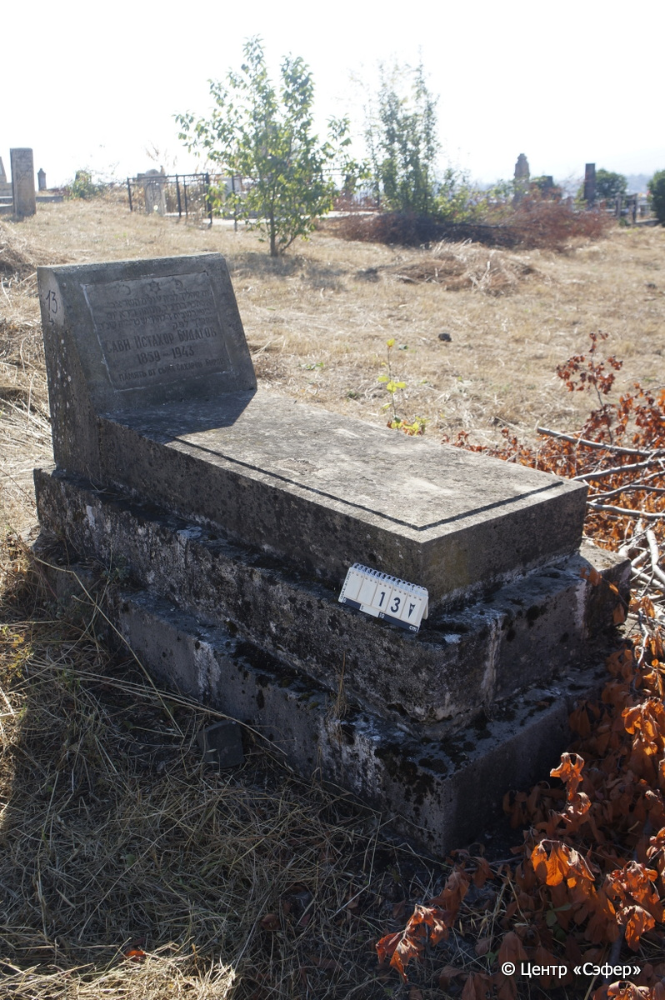
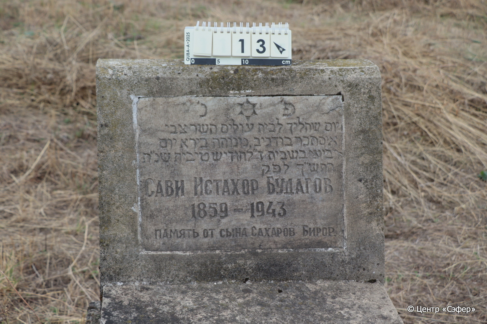

::: {style="font-size: 1em; margin-bottom: 1.2em"}
[Куба (центральное)](../cemeteries/QBA.html) > QBA0013
:::

```{r}
suppressPackageStartupMessages(library(tidyverse))
```


:::: {.columns}

::: {.column width="20%"}

```{r}
#| lightbox:
#|   group: photos




```
:::

::: {.column width="5%"}
:::

::: {.column width="74%"}

::: {.name-style}
БУДАГОВ Цви Истахар Сави Истахор
:::

::: {style="font-size: 1.2em;"}
בודגיב צבי איסתכר
:::

:::: {.columns}
::: {.column width="5%"}
{width=1.3em}
:::

::: {.column style="width: 40%; padding-left: 0.2em;"}
-.-.1859 /  
:::

::: {.column width="5%"}
{width=1.3em}
:::

::: {.column style="width: 50%; padding-left: 0.2em;"}
-.-.1943 / 7.Te.5704
:::

::::


::: {.panel-tabset}

#### Эпитафия

```{r}
tibble(`Оригинал` = "פ׳נ׳
יום שהליך לביח עולים השר צבי
איסתכר בודגיב מנוחה בירא יום 
רביעי בשבית ז״ לחודיש טיבית שנ׳ת
התש״[ד] לפק
Сави Истахор Будагов
1859 – 1943
Память от сына Сахаров Бирор.",
       `Перевод` = "Здесь покоится
День, когда ушёл в дом вечности, [честный] Цви
Истахар Будагов, [упокоился...] в
среду, 7 <числа> месяца тевет, год
5704 по малому исчислению.
Сави Истахор Будагов
1859 – 1943
Память от сына Сахарова Бирора") |>
  mutate(`Оригинал` = str_split(`Оригинал`, "
"),
         `Перевод` = str_split(`Перевод`, "
")) |>
  unnest_longer(c(`Оригинал`, `Перевод`)) |> 
  mutate(id = 1:n()) |> 
  relocate(id, .before = Перевод) |> 
  rename(` ` = id) |> 
  knitr::kable(align = c("r", "c", "l"))
```

|||
|-|---|
|**Примечания**|Орфография в тексте на иврите нарушена. В последней букве года, скорее всего, допущена ошибка. Вероятно, имелось в виду תשג (5703) , что соответствует 1943 г.|
|**Язык**      |иврит, русский    |
|**Метки**     |     |
: {tbl-colwidths="[25,75]"}

#### Памятник

|||
|-|---|
|**Тип памятника**   |L-образный                                                                         |
|**Материал**        |песчаник, мрамор (вставка с текстом мрамор, следы эрозии)                                                     |
|**Размеры**         |58×55×27  --- стела; 17×54×117  --- плита; 38×79×179  --- основание                                                                        |
|**Тип декора**      |традиционная символика                                                                        |
|**Элементы декора** |звезда Давида на вставке                                                                          |
|**Координаты**      |[41.37028226, 48.50614793](https://www.google.com/maps/place/41.37028226, 48.50614793)                    |
: {tbl-colwidths="[25,75]"}

#### Источник

|||
|-|---|
|**Место хранения**        |Архив полевых исследований Центра «Сэфер»     |
|**Контакты**              |students@sefer.ru    |
|**Ссылка**                |https://sfira.org        |
|**Исходный ID**           |  |
|**Условия использования** |[CC BY-NC 4.0](https://creativecommons.org/licenses/by-nc/4.0/deed.ru)     |
: {tbl-colwidths="[25,75]"}

:::

:::

::::

