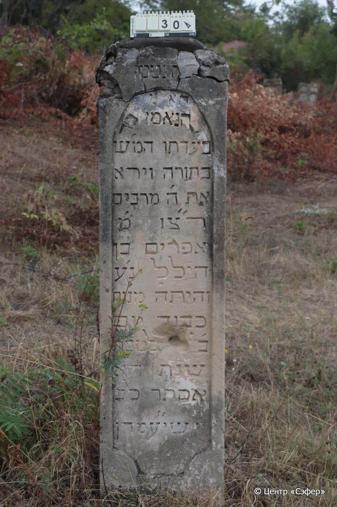
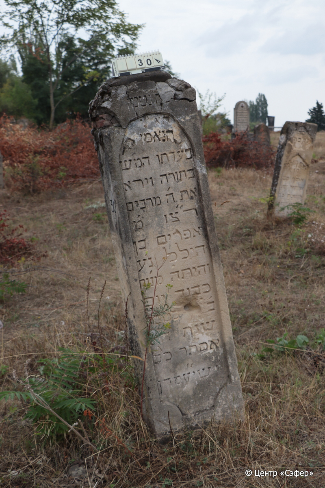

::: {style="font-size: 1em; margin-bottom: 1.2em"}
[Куба (центральное)](../cemeteries/QBA.html) > QBA0030
:::

```{r}
suppressPackageStartupMessages(library(tidyverse))
```


:::: {.columns}

::: {.column width="20%"}

```{r}
#| lightbox:
#|   group: photos




```
:::

::: {.column width="5%"}
:::

::: {.column width="74%"}

::: {.name-style}
Эфраим, сын Гилеля (Ифраим)
:::

::: {style="font-size: 1.2em;"}
אפרים בן הילל
:::

:::: {.columns}
::: {.column width="5%"}
{width=1.3em}
:::

::: {.column style="width: 40%; padding-left: 0.2em;"}
  /  
:::

::: {.column width="5%"}
{width=1.3em}
:::

::: {.column style="width: 50%; padding-left: 0.2em;"}
24.12.1900* / 2.Te.5661
:::

::::


::: {.panel-tabset}

#### Эпитафия

```{r}
tibble(`Оригинал` = "[פה] נטמן
האיש
הנאמן [נכ]בד
בעדתו המ׳ש
בתורה וירא
את ה׳ מרבים
ר״צו מ׳
אפרים בן
הילל נ׳ע
והיתה מנ֗וח
כבוד יום
ב׳ לטבת
שנת ה״א
אס״תר לב׳
ישי״עמהן",
       `Перевод` = "Здесь покоится
человек
преданный и уважаемый
в своей общине, просвещённый
в Торе и бого-
боязненный более многих*,
правдолюбивый и милостивый**, г-н
Эфраим, сын
Гилеля,  да упокоится он в раю,
и будет его покой
благословен. <Скончался> в день
2 тевета,
год
5661 от сотворения мира.
Он обретёт покой! Те, кто идут прямым путём, отдохнут на своём ложе***.") |>
  mutate(`Оригинал` = str_split(`Оригинал`, "
"),
         `Перевод` = str_split(`Перевод`, "
")) |>
  unnest_longer(c(`Оригинал`, `Перевод`)) |> 
  mutate(id = 1:n()) |> 
  relocate(id, .before = Перевод) |> 
  rename(` ` = id) |> 
  knitr::kable(align = c("r", "c", "l"))
```

|||
|-|---|
|**Примечания**|* Цит. Нех 7:2
** Притч 21:21
*** Ис 57:2|
|**Язык**      |иврит    |
|**Метки**     |знаток Писания    |
: {tbl-colwidths="[25,75]"}

#### Памятник

|||
|-|---|
|**Тип памятника**   |стела                                                                         |
|**Материал**        |песчаник, кирпич (сколы и трещины в верхней части, видны камни и куски кирпича)                                                     |
|**Размеры**         |162×41×17                                                                        |
|**Тип декора**      |архитектурно-орнаментальный                                                                        |
|**Элементы декора** |фигурная ниша для текста                                                                          |
|**Координаты**      |[41.37076587, 48.50599599](https://www.google.com/maps/place/41.37076587, 48.50599599)                    |
: {tbl-colwidths="[25,75]"}

#### Источник

|||
|-|---|
|**Место хранения**        |Архив полевых исследований Центра «Сэфер»     |
|**Контакты**              |students@sefer.ru    |
|**Ссылка**                |https://sfira.org        |
|**Исходный ID**           |  |
|**Условия использования** |[CC BY-NC 4.0](https://creativecommons.org/licenses/by-nc/4.0/deed.ru)     |
: {tbl-colwidths="[25,75]"}

:::

:::

::::

