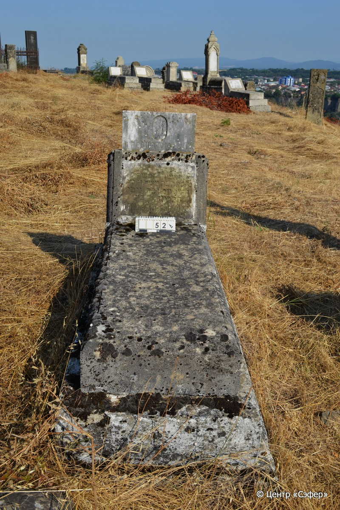
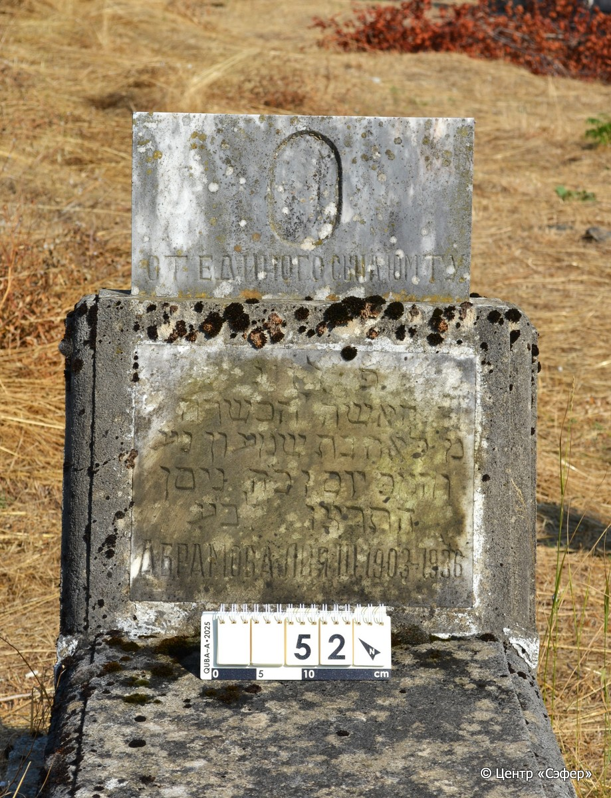

::: {style="font-size: 1em; margin-bottom: 1.2em"}
[Куба (центральное)](../cemeteries/QBA.html) > QBA0052
:::

```{r}
suppressPackageStartupMessages(library(tidyverse))
```


:::: {.columns}

::: {.column width="20%"}

```{r}
#| lightbox:
#|   group: photos




```
:::

::: {.column width="5%"}
:::

::: {.column width="74%"}

::: {.name-style}
АБРАМОВА Лея, дочь Шимона (Лия Шуминовна)
:::

::: {style="font-size: 1.2em;"}
לאה בת שמעון
:::

:::: {.columns}
::: {.column width="5%"}
{width=1.3em}
:::

::: {.column style="width: 40%; padding-left: 0.2em;"}
-.-.1903 /  
:::

::: {.column width="5%"}
{width=1.3em}
:::

::: {.column style="width: 50%; padding-left: 0.2em;"}
-.-.1936 / 25.Ni.5696
:::

::::


::: {.panel-tabset}

#### Эпитафия

```{r}
tibble(`Оригинал` = "сверху
От единого сына Юмту. 

снизу
פ֗נ֗
האשה הכשרה 
מ״ לאה בת שמעון נ֗ע֗
והמ״כ יום ו כ״ה ניסן 
התרצו לב״ע
Абрамова Лия Ш. 1903–1936",
       `Перевод` = "
От единого сына Юмту

 
Здесь покоится
праведная женщина,
г-жа Лея, дочь Шимона, да упокоится в раю,
и будет благословен его покой. <Скончался> в пятницу, 25 нисана
5696 <года> от сотворения мира.
Абрамова Лия Ш[уминовна] 1903 – 1936") |>
  mutate(`Оригинал` = str_split(`Оригинал`, "
"),
         `Перевод` = str_split(`Перевод`, "
")) |>
  unnest_longer(c(`Оригинал`, `Перевод`)) |> 
  mutate(id = 1:n()) |> 
  relocate(id, .before = Перевод) |> 
  rename(` ` = id) |> 
  knitr::kable(align = c("r", "c", "l"))
```

|||
|-|---|
|**Примечания**| |
|**Язык**      |иврит, русский    |
|**Метки**     |     |
: {tbl-colwidths="[25,75]"}

#### Памятник

|||
|-|---|
|**Тип памятника**   |L-образный                                                                         |
|**Материал**        |песчаник, мрамор (следы эрозии, мраморная вставка для текста , мраморная табличка на вершине стелы)                                                     |
|**Размеры**         |83×56×21  --- стела; 24×55×144  --- плита; 32×84×173  --- основание                                                                        |
|**Тип декора**      |традиционная символика                                                                        |
|**Элементы декора** |звезда Давида на вставке                                                                          |
|**Координаты**      |[41.36974599, 48.50624878](https://www.google.com/maps/place/41.36974599, 48.50624878)                    |
: {tbl-colwidths="[25,75]"}

#### Источник

|||
|-|---|
|**Место хранения**        |Архив полевых исследований Центра «Сэфер»     |
|**Контакты**              |students@sefer.ru    |
|**Ссылка**                |https://sfira.org        |
|**Исходный ID**           |  |
|**Условия использования** |[CC BY-NC 4.0](https://creativecommons.org/licenses/by-nc/4.0/deed.ru)     |
: {tbl-colwidths="[25,75]"}

:::

:::

::::

