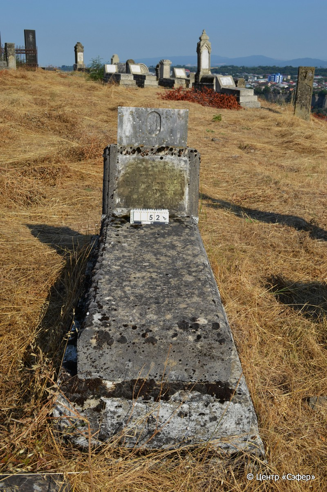
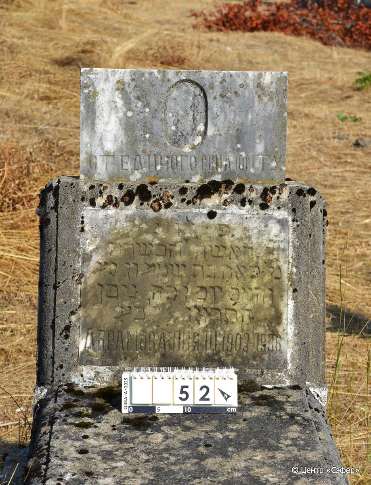

::: {style="font-size: 1em; margin-bottom: 1.2em"}
[Куба (центральное)](../cemeteries/QBA.html) > QBA0052
:::

```{r}
suppressPackageStartupMessages(library(tidyverse))
```


:::: {.columns}

::: {.column width="20%"}

```{r}
#| lightbox:
#|   group: photos




```
:::

::: {.column width="1.5em"}
:::

::: {.column width="74%"}

::: {.custom-frame}
::: {.name-ru-style}
**АБРАМОВА Лея, дочь Шимона (Лия Шуминовна)**
:::

::: {.name-he-style}
לאה בת שמעון
:::

:::: {.columns .date-panel style="display: flex; align-items: center; margin-top: 0.8em;"}
::: {.column .text-center style="width: fit-content; flex: 0 0 auto;"}
{width=1.5em .nolightbox}
:::

::: {.column style="flex: 0 0 auto; width: fit-content; padding-left: 0.8em; padding-right: 3.5em;"}
-.-.1903 

[--]{style="color: #929292"}
:::

::: {.column .text-center style="width: fit-content; flex: 0 0 auto;"}
{width=1.5em .nolightbox}
:::

::: {.column style="flex: 0 0 auto; width: fit-content; padding-left: 0.8em;"}
-.-.1936 

[25.Ni.5696]{style="color: #929292"}
:::

::::

:::

::: {.panel-tabset}

#### Эпитафия

```{r}
tibble(`Оригинал` = "сверху
От единого сына Юмту. 

снизу
פ֗נ֗
האשה הכשרה 
מ״ לאה בת שמעון נ֗ע֗
והמ״כ יום ו כ״ה ניסן 
התרצו לב״ע
Абрамова Лия Ш. 1903–1936",
       `Перевод` = "_T_
От единого сына Юмту

_B_
Здесь покоится
праведная женщина,
г-жа Лея, дочь Шимона, да упокоится в раю,
и будет благословен его покой. <Скончался> в пятницу, 25 нисана
5696 <года> от сотворения мира.
Абрамова Лия Ш[уминовна] 1903 – 1936") |>
  mutate(`Оригинал` = str_split(`Оригинал`, "
"),
         `Перевод` = str_split(`Перевод`, "
")) |>
  unnest_longer(c(`Оригинал`, `Перевод`)) |> 
  mutate(id = 1:n()) |> 
  relocate(id, .before = Перевод) |> 
  rename(` ` = id) |> 
  knitr::kable(align = c("r", "c", "l"))
```

---

::: {.list-table .striped .custom-table .borderless header-rows=0 aligns="l,l" tbl-colwidths="[21,79]"}
- - Примечания
  -  

- - Язык
  - иврит, русский

- - Метки
  -  
:::

#### Памятник

::: {.list-table .striped .custom-table .borderless header-rows=0 aligns="l,l" tbl-colwidths="[21,79]"}
- - Тип памятника
  - L-образный

- - Материал
  - песчаник, мрамор (следы эрозии, мраморная вставка для текста , мраморная табличка на вершине стелы)

- - Размеры
  - 83×56×21  --- стела; 24×55×144  --- плита; 32×84×173  --- основание

- - Тип декора
  - традиционная символика

- - Элементы декора
  - звезда Давида на вставке

- - Координаты
  - 41.36974599, 48.50624878 [[]{style="vertical-align: middle;"} Смотреть на карте](https://www.google.com/maps/place/41.36974599, 48.50624878){.btn .btn-outline-info role="button"}
:::

#### Источник

::: {.list-table .striped .custom-table .borderless header-rows=0 aligns="l,l" tbl-colwidths="[21,79]"}
- - Место хранения
  - Архив полевых исследований Центра «Сэфер»

- - Контакты
  - students@sefer.ru

- - Ссылка
  - [https://sfira.org](https://sfira.org)

- - Исходный ID
  -  

- - Условия использования
  - [CC BY-NC 4.0](https://creativecommons.org/licenses/by-nc/4.0/deed.ru)
:::

:::

:::

::::

