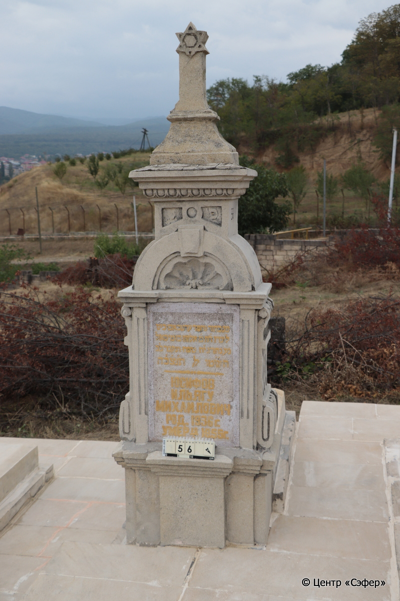
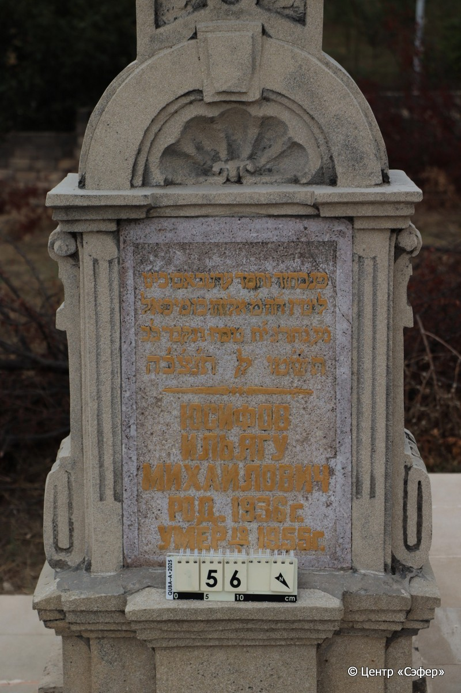

::: {style="font-size: 1em; margin-bottom: 1.2em"}
[Куба (центральное)](../cemeteries/QBA.html) > QBA0056
:::

```{r}
suppressPackageStartupMessages(library(tidyverse))
```


:::: {.columns}

::: {.column width="20%"}

```{r}
#| lightbox:
#|   group: photos




```
:::

::: {.column width="5%"}
:::

::: {.column width="74%"}

::: {.name-style}
ЮСУФОВ элияху, сын Михаэля (Ильягу Михаилович)
:::

::: {style="font-size: 1.2em;"}
אליהו בן מיכאל
:::

:::: {.columns}
::: {.column width="5%"}
{width=1.3em}
:::

::: {.column style="width: 40%; padding-left: 0.2em;"}
-.-.1936 /  
:::

::: {.column width="5%"}
{width=1.3em}
:::

::: {.column style="width: 50%; padding-left: 0.2em;"}
12.01.1955 / 18.Te.5715
:::

::::


::: {.panel-tabset}

#### Эпитафия

```{r}
tibble(`Оригинал` = "сверху
פ [נ] 

снизу
פנ בחור נחמד עדנו באבו ביט 
לימיו ה׳ה מ׳ אליהו ב[ן] מיכאל 
נע נהרג י׳ח טבת ונקבר כ׳ב
תש״טו לפק ת׳נ׳צ׳ב׳ה 
Юсифов
Ильягу
Михаилович 
Род. 1936 г. 
Умер 12/I 1955 г.",
       `Перевод` = "
Здесь покоится

 
Здесь покоится милый юноша, <умерший> преждевременно в 19
лет, которого зовут г-н Элияху, сын Михаэля,
да упокоится в раю. Убит 18 тевета и похоронен 22 числа
715 <года> по малому исчислению. Да будет душа его завязана в узле жизни.
Юсуфов
Ильягу
Михайлович
Родился в 1936 г.
Умер 12.01.1955") |>
  mutate(`Оригинал` = str_split(`Оригинал`, "
"),
         `Перевод` = str_split(`Перевод`, "
")) |>
  unnest_longer(c(`Оригинал`, `Перевод`)) |> 
  mutate(id = 1:n()) |> 
  relocate(id, .before = Перевод) |> 
  rename(` ` = id) |> 
  knitr::kable(align = c("r", "c", "l"))
```

|||
|-|---|
|**Примечания**| |
|**Язык**      |иврит, русский    |
|**Метки**     |преждевременная смерть, насильственная смерть    |
: {tbl-colwidths="[25,75]"}

#### Памятник

|||
|-|---|
|**Тип памятника**   |L-образный                                                                         |
|**Материал**        |известняк (цементный раствор, краска на надписи)                                                     |
|**Размеры**         |209×68×37  --- стела; 18×58×115  --- плита; 44×75×177  --- основание                                                                        |
|**Тип декора**      |архитектурно-орнаментальный, традиционная символика, другое                                                                        |
|**Элементы декора** |архитектурное навершие со звездой Давида на вершине, пилястры по бокам, выемка в виде ракушки                                                                          |
|**Координаты**      |[41.36995162, 48.50632698](https://www.google.com/maps/place/41.36995162, 48.50632698)                    |
: {tbl-colwidths="[25,75]"}

#### Источник

|||
|-|---|
|**Место хранения**        |Архив полевых исследований Центра «Сэфер»     |
|**Контакты**              |students@sefer.ru    |
|**Ссылка**                |https://sfira.org        |
|**Исходный ID**           |  |
|**Условия использования** |[CC BY-NC 4.0](https://creativecommons.org/licenses/by-nc/4.0/deed.ru)     |
: {tbl-colwidths="[25,75]"}

:::

:::

::::

