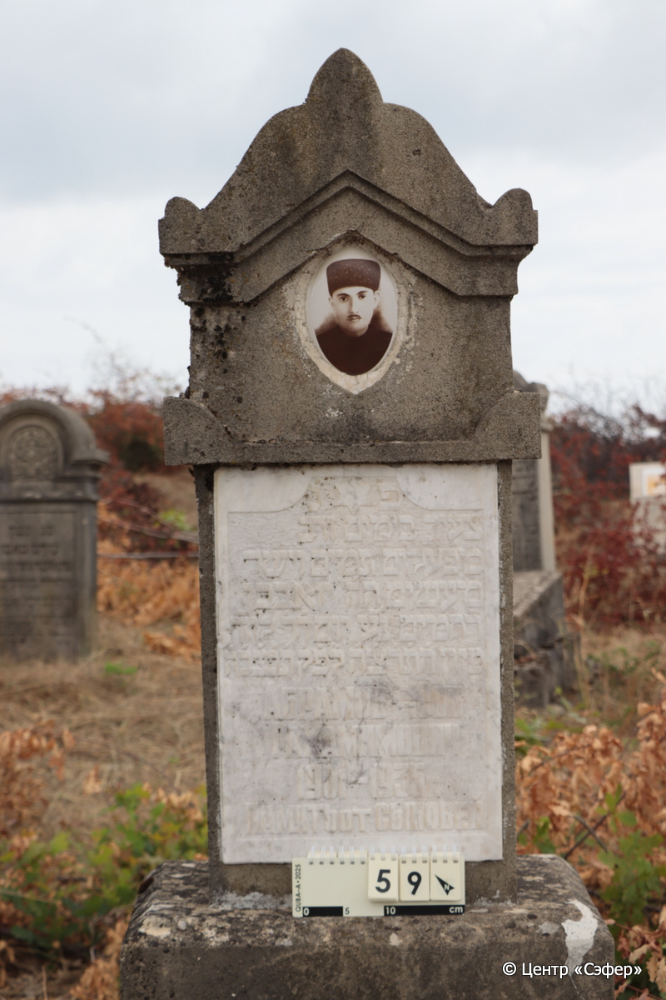
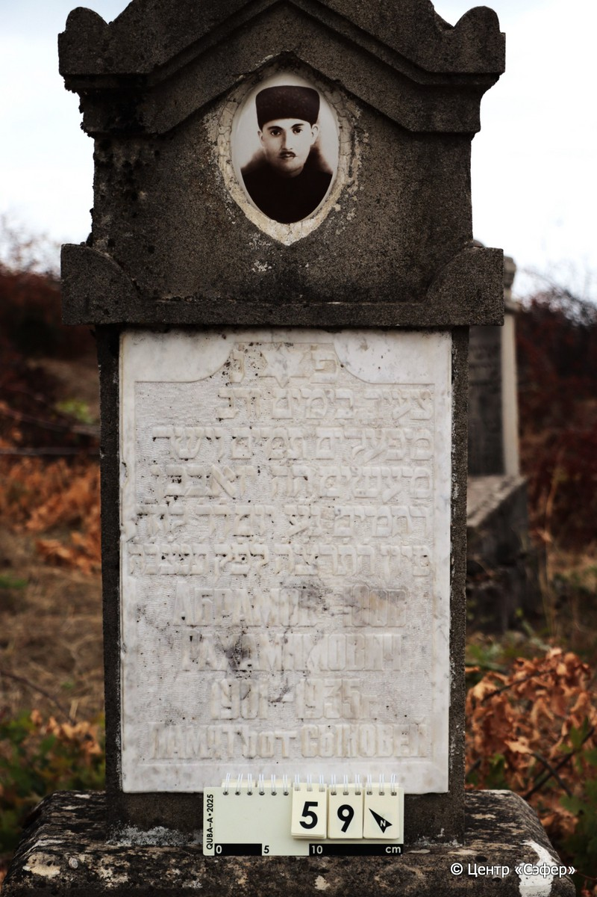
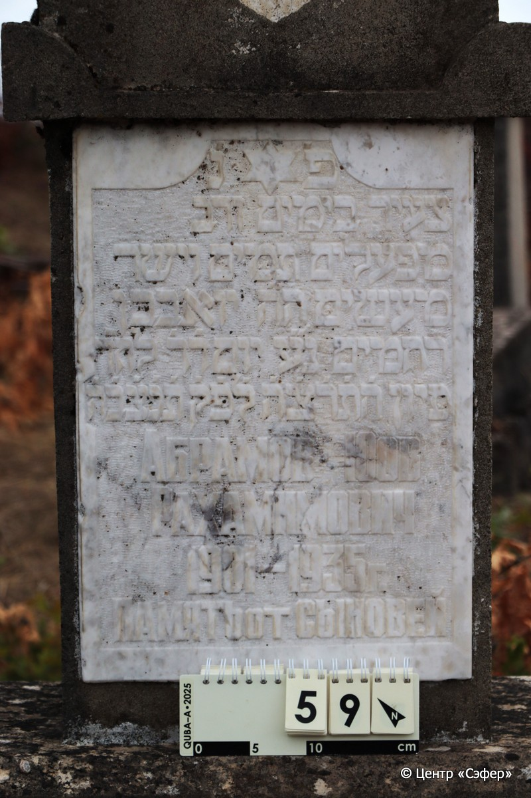
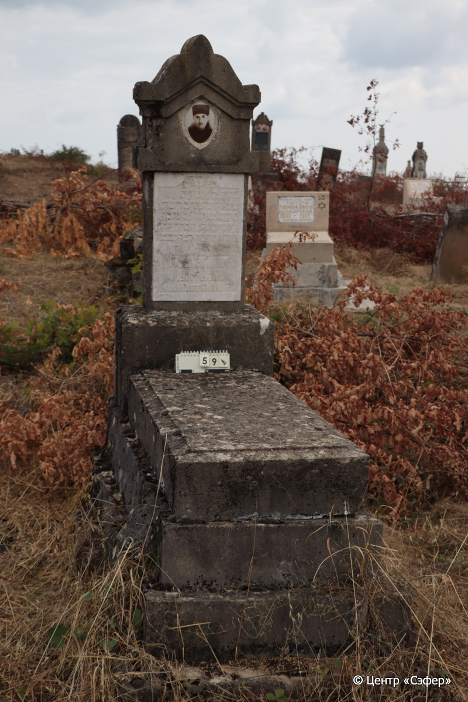

::: {style="font-size: 1em; margin-bottom: 1.2em"}
[Куба (центральное)](../cemeteries/QBA.html) > QBA0059
:::

```{r}
suppressPackageStartupMessages(library(tidyverse))
```


:::: {.columns}

::: {.column width="20%"}

```{r}
#| lightbox:
#|   group: photos






```
:::

::: {.column width="5%"}
:::

::: {.column width="74%"}

::: {.name-style}
АБРАМОВ Йоав, сын Рахамима (Юов Рахамимович)
:::

::: {style="font-size: 1.2em;"}
יואב בן רחמים
:::

:::: {.columns}
::: {.column width="5%"}
{width=1.3em}
:::

::: {.column style="width: 40%; padding-left: 0.2em;"}
-.-.1901 /  
:::

::: {.column width="5%"}
{width=1.3em}
:::

::: {.column style="width: 50%; padding-left: 0.2em;"}
-.-.1935 / 4.Si.5695
:::

::::


::: {.panel-tabset}

#### Эпитафия

```{r}
tibble(`Оригинал` = "פ׳נ׳
צעיר בימים ורב
מפעלים תמים וישר 
מעשים ה״ה יואב בן 
רחמים נ״ע יום ד׳ ד׳ לח״ד
סיון ה֗ת֗ר֗צ֗ה֗ ל֗פ֗ק֗ ת֗נ֗צ֗ב֗ה֗
Абрамов Юов
Рахамимович 
1901 – 1935 г. 
Память от сыновей",
       `Перевод` = "Здесь покоится
<человек> юный днями и великий
делами, честный и прямодушный
в поступках, которого зовут Йоав, сын
Рахамима, да упокоится в раю. <Скончался> в среду, 4 <числа> месяца
сиван 5695 <года> по малому исчислению. Да будет душа его завязана в узле жизни
Абрамов Юов
Рахамимович
1901 – 1935 г.
Память от сыновей") |>
  mutate(`Оригинал` = str_split(`Оригинал`, "
"),
         `Перевод` = str_split(`Перевод`, "
")) |>
  unnest_longer(c(`Оригинал`, `Перевод`)) |> 
  mutate(id = 1:n()) |> 
  relocate(id, .before = Перевод) |> 
  rename(` ` = id) |> 
  knitr::kable(align = c("r", "c", "l"))
```

|||
|-|---|
|**Примечания**| |
|**Язык**      |иврит, русский    |
|**Метки**     |преждевременная смерть    |
: {tbl-colwidths="[25,75]"}

#### Памятник

|||
|-|---|
|**Тип памятника**   |L-образный                                                                         |
|**Материал**        |песчаник, мрамор (мраморная вставка для текста, керамический медальон с фото, следы эрозии, выпавший блок в основании)                                                     |
|**Размеры**         |145×60×33  --- стела; 20×57×111  --- плита; 55×93×185  --- основание                                                                        |
|**Тип декора**      |архитектурно-орнаментальный, традиционная символика                                                                        |
|**Элементы декора** |звезда Давида на табличке, архитектурное навершие со скосами                                                                          |
|**Координаты**      |[41.3697923, 48.50632105](https://www.google.com/maps/place/41.3697923, 48.50632105)                    |
: {tbl-colwidths="[25,75]"}

#### Источник

|||
|-|---|
|**Место хранения**        |Архив полевых исследований Центра «Сэфер»     |
|**Контакты**              |students@sefer.ru    |
|**Ссылка**                |https://sfira.org        |
|**Исходный ID**           |  |
|**Условия использования** |[CC BY-NC 4.0](https://creativecommons.org/licenses/by-nc/4.0/deed.ru)     |
: {tbl-colwidths="[25,75]"}

:::

:::

::::

