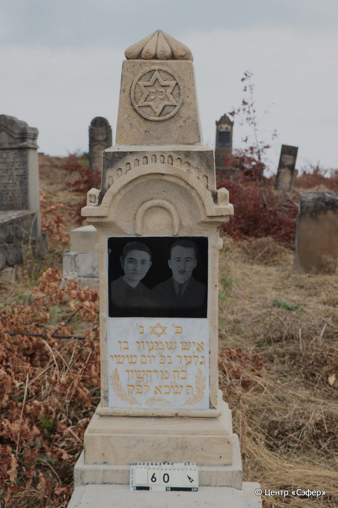
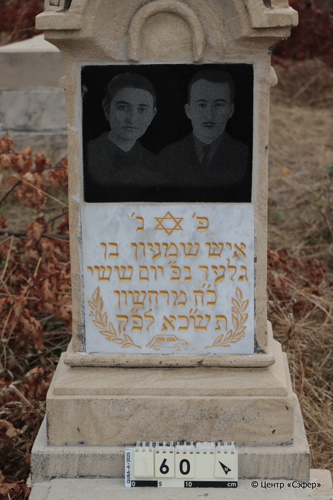
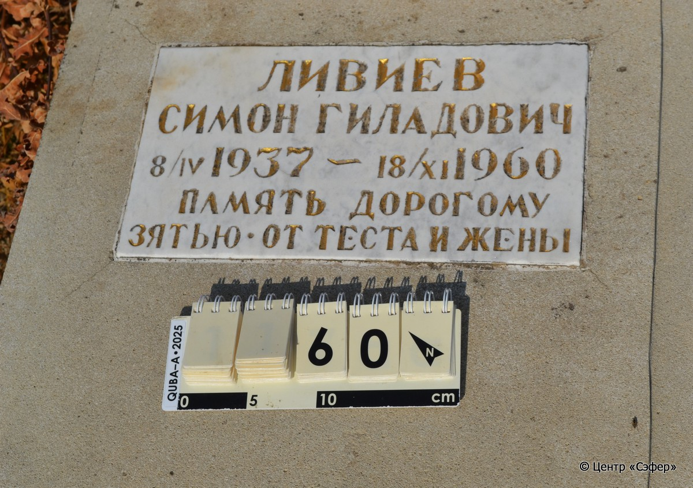
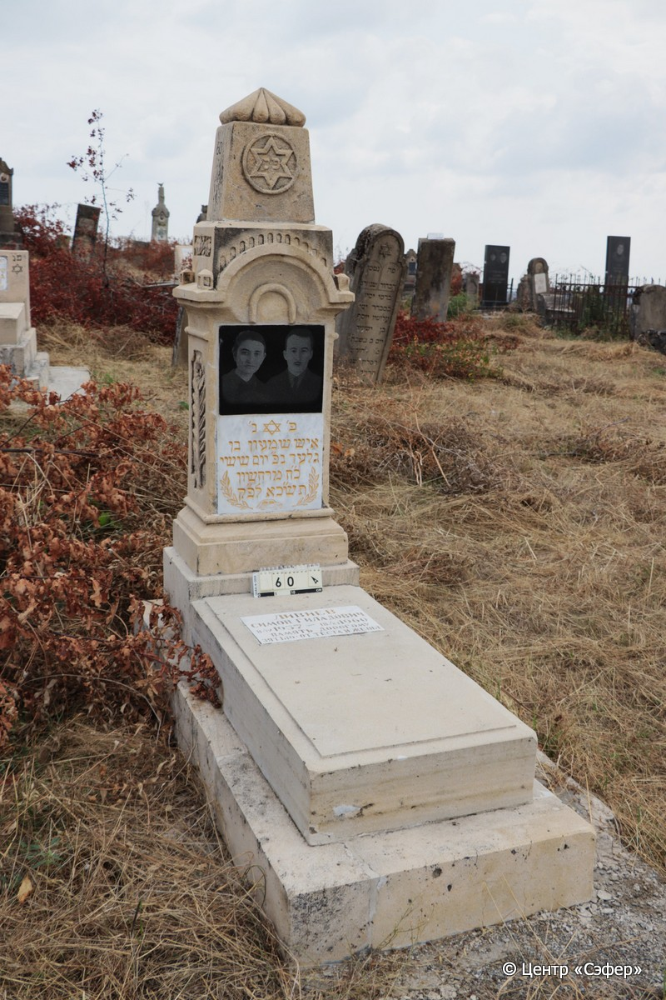
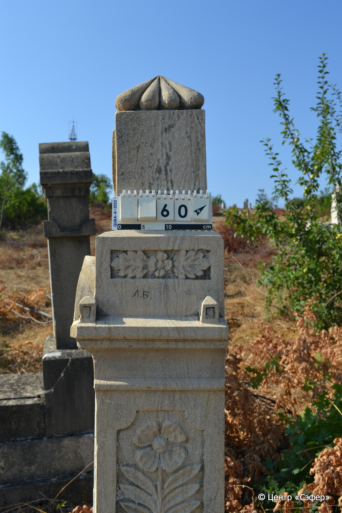

::: {style="font-size: 1em; margin-bottom: 1.2em"}
[Куба (центральное)](../cemeteries/QBA.html) > QBA0060
:::

```{r}
suppressPackageStartupMessages(library(tidyverse))
```


:::: {.columns}

::: {.column width="20%"}

```{r}
#| lightbox:
#|   group: photos







```
:::

::: {.column width="5%"}
:::

::: {.column width="74%"}

::: {.name-style}
ЛИВИЕВ Шимон, сын Гилада (Симон Гиладович)
:::

::: {style="font-size: 1.2em;"}
שמעון בן גלעד
:::

:::: {.columns}
::: {.column width="5%"}
{width=1.3em}
:::

::: {.column style="width: 40%; padding-left: 0.2em;"}
08.04.1937 /  
:::

::: {.column width="5%"}
{width=1.3em}
:::

::: {.column style="width: 50%; padding-left: 0.2em;"}
18.11.1960 / 28.Ch.5721
:::

::::


::: {.panel-tabset}

#### Эпитафия

```{r}
tibble(`Оригинал` = "сверху
פנ

снизу
פ׳ נ׳
איש שמעון בן 
גלעד נפ״ יום ששי 
כ״ח מרחשון 
תש״כא לפ״ק

табличка
Ливиев
Симон Гиладович
8/IV 1937 – 18/XI 1960
Память дорогому 
зятью • От теста и жены

правая сторона
Л.Б.",
       `Перевод` = "
Здесь покоится

 
Здесь покоится
мужчина, Шимон, сын
Гилада. Скончался в пятницу
28 мархешвана
721 <года> по малому исчислению.

 
Ливиев
Симон Гиладович
8.04.1937 – 18.11.1960
Память дорогому 
затю от тестя и жены

 
Л.Б.") |>
  mutate(`Оригинал` = str_split(`Оригинал`, "
"),
         `Перевод` = str_split(`Перевод`, "
")) |>
  unnest_longer(c(`Оригинал`, `Перевод`)) |> 
  mutate(id = 1:n()) |> 
  relocate(id, .before = Перевод) |> 
  rename(` ` = id) |> 
  knitr::kable(align = c("r", "c", "l"))
```

|||
|-|---|
|**Примечания**| |
|**Язык**      |иврит, русский    |
|**Метки**     |     |
: {tbl-colwidths="[25,75]"}

#### Памятник

|||
|-|---|
|**Тип памятника**   |L-образный                                                                         |
|**Материал**        |песчаник, известняк (стоит на бетонной площадке, две светлые мраморные вставки для текста, темная мраморная вставка с фото)                                                     |
|**Размеры**         |160×53×37  --- стела; 20×54×103  --- плита; 19×70×169  --- основание                                                                        |
|**Тип декора**      |архитектурно-орнаментальный, растительный, традиционная символика, другое                                                                        |
|**Элементы декора** |архитектурное навершие, увенчанное пирамидой из сглаженных конусов, звезда Давида на навершии и на табличке с текстом, цветы в фигурных нишах по бокам, ветви , изображение автомобиля на табличке                                                                          |
|**Координаты**      |[41.3697783, 48.50633348](https://www.google.com/maps/place/41.3697783, 48.50633348)                    |
: {tbl-colwidths="[25,75]"}

#### Источник

|||
|-|---|
|**Место хранения**        |Архив полевых исследований Центра «Сэфер»     |
|**Контакты**              |students@sefer.ru    |
|**Ссылка**                |https://sfira.org        |
|**Исходный ID**           |  |
|**Условия использования** |[CC BY-NC 4.0](https://creativecommons.org/licenses/by-nc/4.0/deed.ru)     |
: {tbl-colwidths="[25,75]"}

:::

:::

::::

