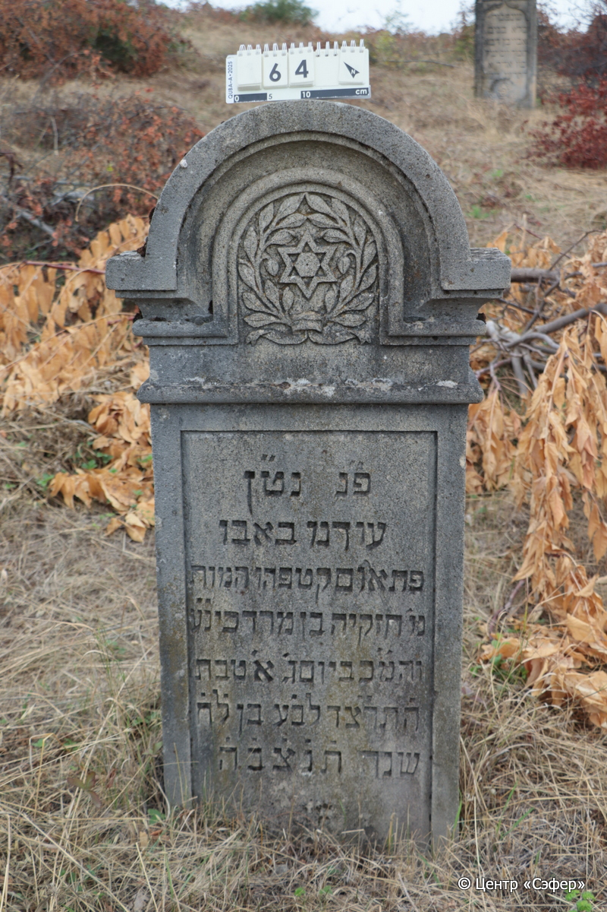
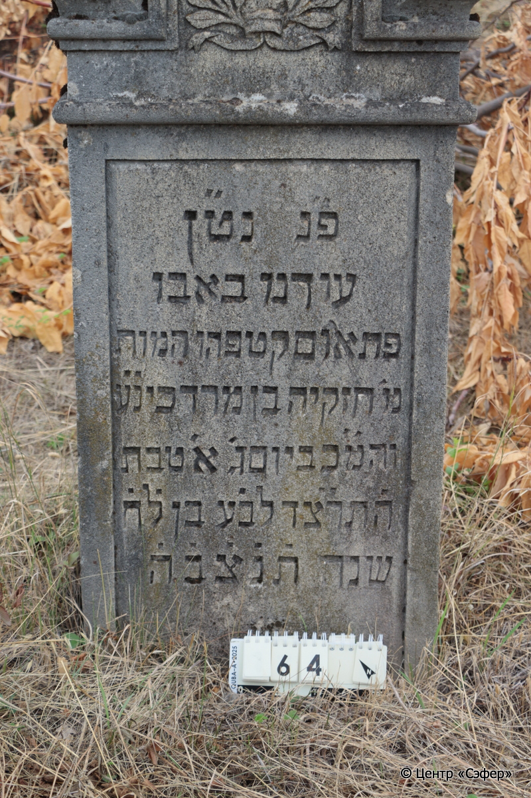

::: {style="font-size: 1em; margin-bottom: 1.2em"}
[Куба (центральное)](../cemeteries/QBA.html) > QBA0064
:::

```{r}
suppressPackageStartupMessages(library(tidyverse))
```


:::: {.columns}

::: {.column width="20%"}

```{r}
#| lightbox:
#|   group: photos




```
:::

::: {.column width="5%"}
:::

::: {.column width="74%"}

::: {.name-style}
Хизкия, сын Мордехая (Изгиё)
:::

::: {style="font-size: 1.2em;"}
חזקיה בן מרדכי
:::

:::: {.columns}
::: {.column width="5%"}
{width=1.3em}
:::

::: {.column style="width: 40%; padding-left: 0.2em;"}
  /  
:::

::: {.column width="5%"}
{width=1.3em}
:::

::: {.column style="width: 50%; padding-left: 0.2em;"}
19.12.1933* / 1.Te.5694
:::

::::


::: {.panel-tabset}

#### Эпитафия

```{r}
tibble(`Оригинал` = "פ״נ נט״ן
עודנו באבו
פתאום קטפהו המות
מ׳ חזקיה בן מרדכי נ״ע 
והמ״כ ביום ג׳ א׳ טבת
ה֗תר״צד לב׳ע בן ל֗ח֗
שנה ת֗נ֗צ֗ב֗ה֗",
       `Перевод` = "Здесь похоронен и покоится
в расцвете,
внезапно оборвала его смерть,
г-н Хизкия, сын Мордехая, да упокоится в раю,
и будет благословен его покой. <Скончался> во вторник, 1 тевета
5694 <года> от сотворения мира, в возрасте 38
лет. Да будет душа его завязана в узле жизни.") |>
  mutate(`Оригинал` = str_split(`Оригинал`, "
"),
         `Перевод` = str_split(`Перевод`, "
")) |>
  unnest_longer(c(`Оригинал`, `Перевод`)) |> 
  mutate(id = 1:n()) |> 
  relocate(id, .before = Перевод) |> 
  rename(` ` = id) |> 
  knitr::kable(align = c("r", "c", "l"))
```

|||
|-|---|
|**Примечания**| |
|**Язык**      |иврит    |
|**Метки**     |преждевременная смерть    |
: {tbl-colwidths="[25,75]"}

#### Памятник

|||
|-|---|
|**Тип памятника**   |стела                                                                         |
|**Материал**        |известняк ( )                                                     |
|**Размеры**         |122×60×24                                                                        |
|**Тип декора**      |архитектурно-орнаментальный, растительный, традиционная символика                                                                        |
|**Элементы декора** |звезда Давида на фигурной выемке, окруженная ветвями с плодами, полукруглое завершение, рамка                                                                          |
|**Координаты**      |[41.36982816, 48.50637315](https://www.google.com/maps/place/41.36982816, 48.50637315)                    |
: {tbl-colwidths="[25,75]"}

#### Источник

|||
|-|---|
|**Место хранения**        |Архив полевых исследований Центра «Сэфер»     |
|**Контакты**              |students@sefer.ru    |
|**Ссылка**                |https://sfira.org        |
|**Исходный ID**           |  |
|**Условия использования** |[CC BY-NC 4.0](https://creativecommons.org/licenses/by-nc/4.0/deed.ru)     |
: {tbl-colwidths="[25,75]"}

:::

:::

::::

