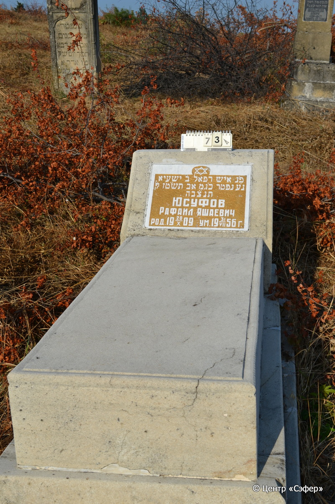
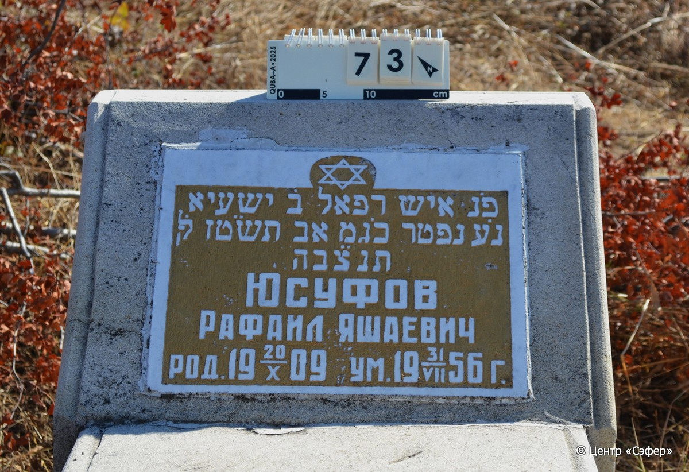
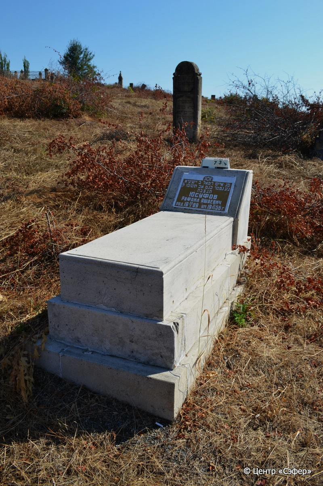

::: {style="font-size: 1em; margin-bottom: 1.2em"}
[Куба (центральное)](../cemeteries/QBA.html) > QBA0073
:::

```{r}
suppressPackageStartupMessages(library(tidyverse))
```


:::: {.columns}

::: {.column width="20%"}

```{r}
#| lightbox:
#|   group: photos





```
:::

::: {.column width="1.5em"}
:::

::: {.column width="74%"}

::: {.custom-frame}
::: {.name-ru-style}
**ЮСУФОВ Рафаэль, сын Йешайи (Рафаил Яшаевич)**
:::

::: {.name-he-style}
רפאל בן ישעיא
:::

:::: {.columns .date-panel style="display: flex; align-items: top; margin-top: 0.8em;"}
::: {.column .text-center style="width: fit-content; flex: 0 0 auto;"}
{width=1.5em .nolightbox}
:::

::: {.column style="flex: 0 0 auto; width: fit-content; padding-left: 0.8em; padding-right: 3.5em;"}
20.10.1909 

[--]{style="color: #929292"}
:::

::: {.column .text-center style="width: fit-content; flex: 0 0 auto;"}
{width=1.5em .nolightbox}
:::

::: {.column style="flex: 0 0 auto; width: fit-content; padding-left: 0.8em;"}
31.07.1956 

[23.Av.5716]{style="color: #929292"}
:::

::::

:::

::: {.panel-tabset}

#### Эпитафия

```{r}
tibble(`Оригинал` = "פ׳נ איש רפאל ב׳ ישעיא
נ׳ע נפטר כ׳ג מ אב תש״טז לפ֗ק
תנצ״בה
Юсуфов
Рафаил Яшаевич
род. 20/Х 1909  ум. 31/VII 1956 г.",
       `Перевод` = "Здесь покоится мужчина Рафаэль, сын Йешайи,
да упокоится в раю. Скончался 23 менахем-ава 716 <года> по малому исчислению.
Да будет душа его завязана в узле жизни.
Юсуфов
Рафаил Яшаевич
Родился 20.10.1909, умер 31.07.1956") |>
  mutate(`Оригинал` = str_split(`Оригинал`, "
"),
         `Перевод` = str_split(`Перевод`, "
")) |>
  unnest_longer(c(`Оригинал`, `Перевод`)) |> 
  mutate(id = 1:n()) |> 
  relocate(id, .before = Перевод) |> 
  rename(` ` = id) |> 
  knitr::kable(align = c("r", "c", "l"))
```

---

:::: {.custom-table-wrap}
::: {.list-table .borderless header-rows=0 aligns="l,l" tbl-colwidths="[21,79]"}
- - Примечания
  -  

- - Язык
  - иврит, русский

- - Метки
  -  

:::
::::

#### Памятник

:::: {.custom-table-wrap}
::: {.list-table .borderless header-rows=0 aligns="l,l" tbl-colwidths="[21,79]"}
- - Тип памятника
  - L-образный

- - Материал
  - известняк, мрамор (мраморная вставка для текста)

- - Размеры
  - 51×37×59  --- стела; 25×53×117  --- плита; 33×80×180  --- Основсние

- - Тип декора
  - традиционная символика

- - Элементы декора
  - звезда Давида на вставке, надпись на золотом фоне

- - Координаты
  - 41.36982327, 48.50645349 [Показать на карте](https://www.google.com/maps/place/41.36982327, 48.50645349){style="margin-left: 1em"}

:::
::::

#### Источник

:::: {.custom-table-wrap}
::: {.list-table .borderless header-rows=0 aligns="l,l" tbl-colwidths="[21,79]"}
- - Место хранения
  - Архив полевых исследований Центра «Сэфер»

- - Контакты
  - students@sefer.ru

- - Ссылка
  - [https://sfira.org](https://sfira.org)

- - Исходный ID
  -  

- - Условия использования
  - [CC BY-NC 4.0](https://creativecommons.org/licenses/by-nc/4.0/deed.ru)

:::
::::

:::

:::

:::

