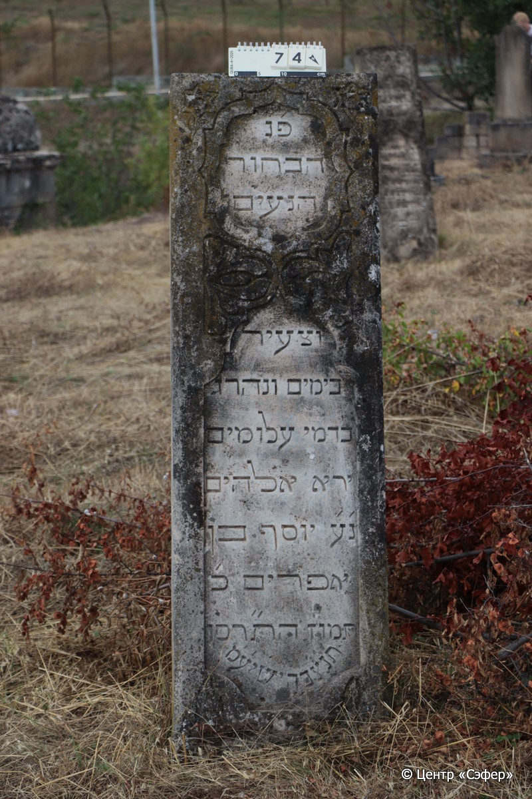
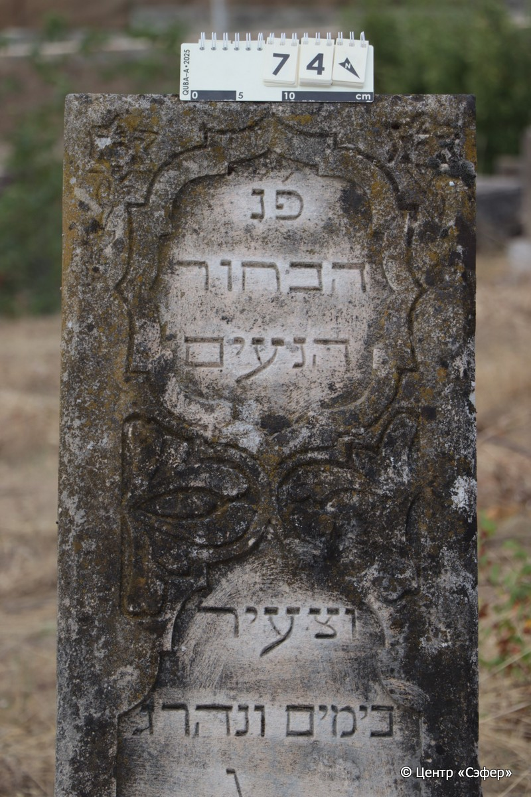
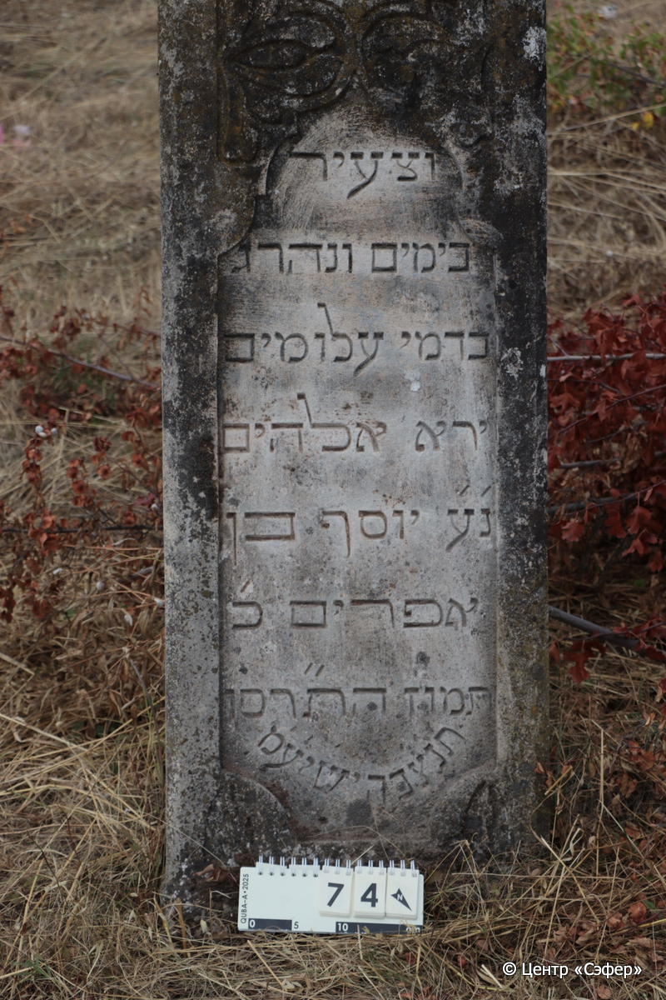

::: {style="font-size: 1em; margin-bottom: 1.2em"}
[Куба (центральное)](../cemeteries/QBA.html) > QBA0074
:::

```{r}
suppressPackageStartupMessages(library(tidyverse))
```


:::: {.columns}

::: {.column width="20%"}

```{r}
#| lightbox:
#|   group: photos





```
:::

::: {.column width="5%"}
:::

::: {.column width="74%"}

::: {.name-style}
Йосеф, сын Эфраима (Юсуф)
:::

::: {style="font-size: 1.2em;"}
יוסף בן אפרים
:::

:::: {.columns}
::: {.column width="5%"}
{width=1.3em}
:::

::: {.column style="width: 40%; padding-left: 0.2em;"}
  /  
:::

::: {.column width="5%"}
{width=1.3em}
:::

::: {.column style="width: 50%; padding-left: 0.2em;"}
13.07.1906* / 20.Ta.5666
:::

::::


::: {.panel-tabset}

#### Эпитафия

```{r}
tibble(`Оригинал` = "פ׳נ׳
הבחור
הנעים
וצעיר
בימים ונהרג
בדמי עלומים
ירא אלהים
נ׳ע׳ יוסף בן
אפרים כ׳
תמוז הת״רסו
ת׳נ׳צ׳ב׳ה׳ י׳ש׳יע׳מ׳",
       `Перевод` = "Здесь покоится
молодой человек
милый и
юный
днями, убитый
в расцвете молодости,
богобоязненный,
да упокоится он в раю, Йосеф, сын
Эфраима. <Скончался> 20
таммуза 5666 <года>.
Да будет душа его завязана в узле жизни. Он обретает покой! Те, кто идет прямым путем, отдохнут на своём ложе*.") |>
  mutate(`Оригинал` = str_split(`Оригинал`, "
"),
         `Перевод` = str_split(`Перевод`, "
")) |>
  unnest_longer(c(`Оригинал`, `Перевод`)) |> 
  mutate(id = 1:n()) |> 
  relocate(id, .before = Перевод) |> 
  rename(` ` = id) |> 
  knitr::kable(align = c("r", "c", "l"))
```

|||
|-|---|
|**Примечания**|* Цит. Ис 57:2|
|**Язык**      |иврит    |
|**Метки**     |юноша, насильственная смерть    |
: {tbl-colwidths="[25,75]"}

#### Памятник

|||
|-|---|
|**Тип памятника**   |стела                                                                         |
|**Материал**        |песчаник (следы эрозии)                                                     |
|**Размеры**         |148×45×18                                                                        |
|**Тип декора**      |архитектурно-орнаментальный, растительный, традиционная символика                                                                        |
|**Элементы декора** |две фигурные ниши для текста, две Звезды Давида на верхних углах, оформленные в форме цветов, цветочный орнамент между нишами
                                                                          |
|**Координаты**      |[41.36976849, 48.5064637](https://www.google.com/maps/place/41.36976849, 48.5064637)                    |
: {tbl-colwidths="[25,75]"}

#### Источник

|||
|-|---|
|**Место хранения**        |Архив полевых исследований Центра «Сэфер»     |
|**Контакты**              |students@sefer.ru    |
|**Ссылка**                |https://sfira.org        |
|**Исходный ID**           |  |
|**Условия использования** |[CC BY-NC 4.0](https://creativecommons.org/licenses/by-nc/4.0/deed.ru)     |
: {tbl-colwidths="[25,75]"}

:::

:::

::::

