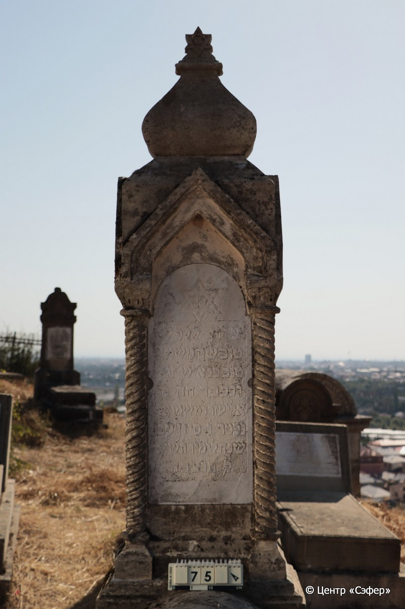
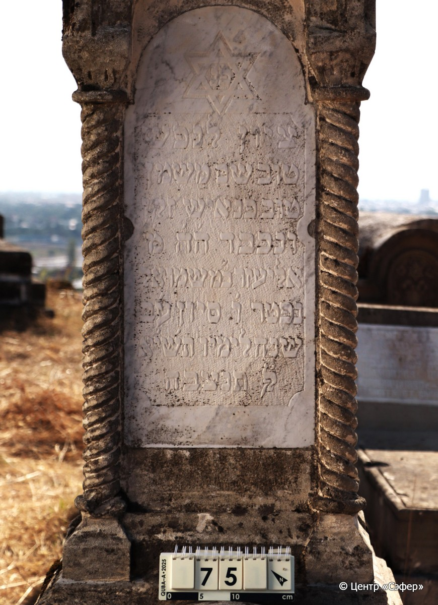
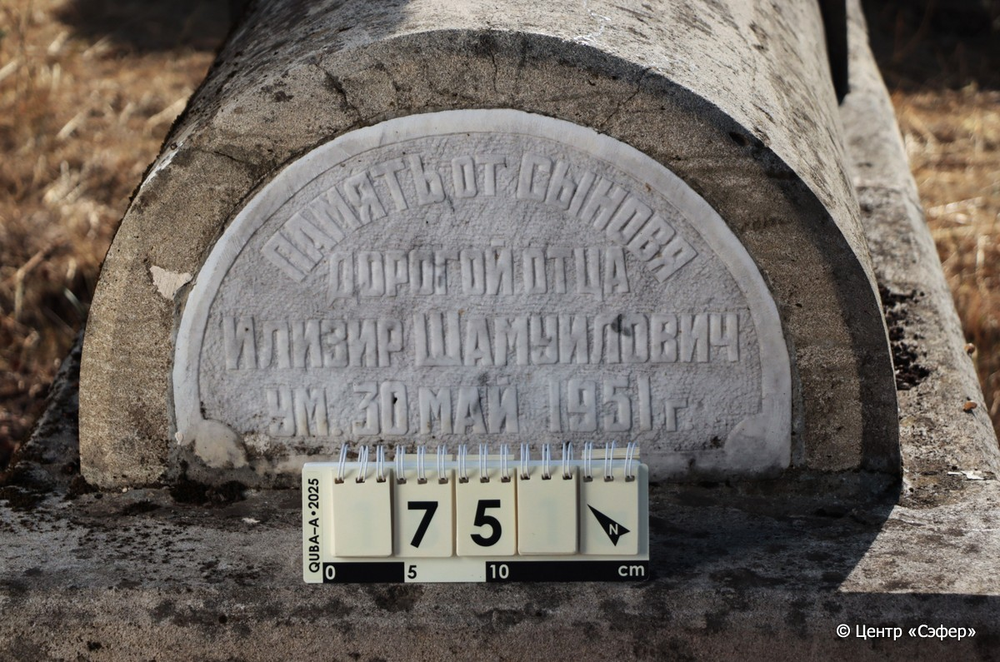
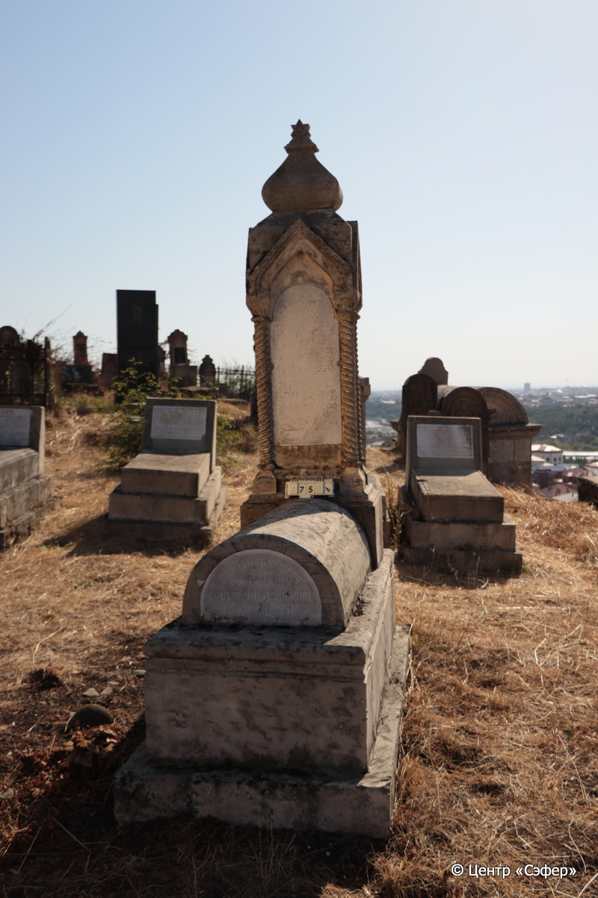

::: {style="font-size: 1em; margin-bottom: 1.2em"}
[Куба (центральное)](../cemeteries/QBA.html) > QBA0075
:::

```{r}
suppressPackageStartupMessages(library(tidyverse))
```


:::: {.columns}

::: {.column width="20%"}

```{r}
#| lightbox:
#|   group: photos






```
:::

::: {.column width="5%"}
:::

::: {.column width="74%"}

::: {.name-style}
Элиэзер, сын Шмуэля (Илизир Шамуилович)
:::

::: {style="font-size: 1.2em;"}
אליעזר בן שמואל
:::

:::: {.columns}
::: {.column width="5%"}
{width=1.3em}
:::

::: {.column style="width: 40%; padding-left: 0.2em;"}
  /  
:::

::: {.column width="5%"}
{width=1.3em}
:::

::: {.column style="width: 50%; padding-left: 0.2em;"}
30.05.1951 / 06.Si.5711
:::

::::


::: {.panel-tabset}

#### Эпитафия

```{r}
tibble(`Оригинал` = "сверху
פ׳נ׳
ציון לנפש
טוב שם משמן
טוב  פ׳נ איש זקן
ונכבר ה׳ה׳ מ׳
אליעזר ב׳מ שמואל
נפטר ו׳ סיון ע׳ב
שנה לימיו ת׳ש׳יא
לפ֗ק תנצבה

снизу
Память от сыновя
дорогой отца
Илизир Шамуилович
ум. 30 май 1951 г.",
       `Перевод` = "
Здесь покоится
Знак душе
Доброе имя лучше
благовонного масла*. Здесь покоится мужчина пожилой и
уважаемый, которого зовут г-н
Элиэзер, сын г-на Шмуэля.
Скончался 6 сивана, в 72-летнем
возрасте, <в> 711 <году>
по малому исчислению. Да будет душа его завязана в узле жизни.

 
Память от сыновей
дорогому отцу
Илизиру Шамуиловичу
Умер 30 мая 1951 г.") |>
  mutate(`Оригинал` = str_split(`Оригинал`, "
"),
         `Перевод` = str_split(`Перевод`, "
")) |>
  unnest_longer(c(`Оригинал`, `Перевод`)) |> 
  mutate(id = 1:n()) |> 
  relocate(id, .before = Перевод) |> 
  rename(` ` = id) |> 
  knitr::kable(align = c("r", "c", "l"))
```

|||
|-|---|
|**Примечания**|*Цит Еккл 7:1|
|**Язык**      |иврит, русский    |
|**Метки**     |пожилой(-ая)    |
: {tbl-colwidths="[25,75]"}

#### Памятник

|||
|-|---|
|**Тип памятника**   |L-образный                                                                         |
|**Материал**        |известняк, мрамор (цементный раствор, две мраморные вставки для текста, следы эрозии)                                                     |
|**Размеры**         |195×60×43  --- стела; 33×56×107  --- Саркофаг; 56×86×193  --- основание                                                                        |
|**Тип декора**      |архитектурно-орнаментальный, традиционная символика                                                                        |
|**Элементы декора** |архитектурное куполообразное навершие со звездой Давида на вершине, звезда Давида на вставке, витые полуколонны по всем граням стелы                                                                          |
|**Координаты**      |[41.36966619, 48.50643358](https://www.google.com/maps/place/41.36966619, 48.50643358)                    |
: {tbl-colwidths="[25,75]"}

#### Источник

|||
|-|---|
|**Место хранения**        |Архив полевых исследований Центра «Сэфер»     |
|**Контакты**              |students@sefer.ru    |
|**Ссылка**                |https://sfira.org        |
|**Исходный ID**           |  |
|**Условия использования** |[CC BY-NC 4.0](https://creativecommons.org/licenses/by-nc/4.0/deed.ru)     |
: {tbl-colwidths="[25,75]"}

:::

:::

::::

