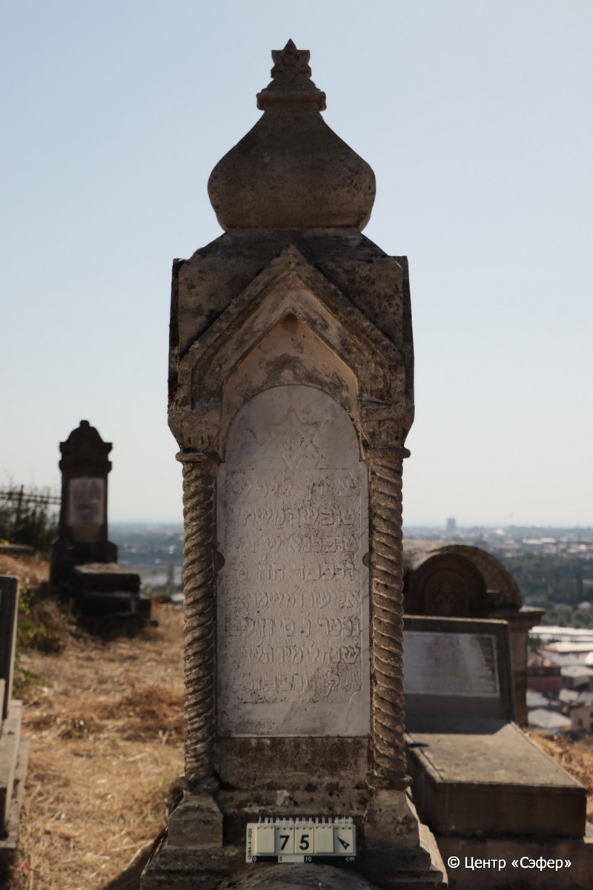
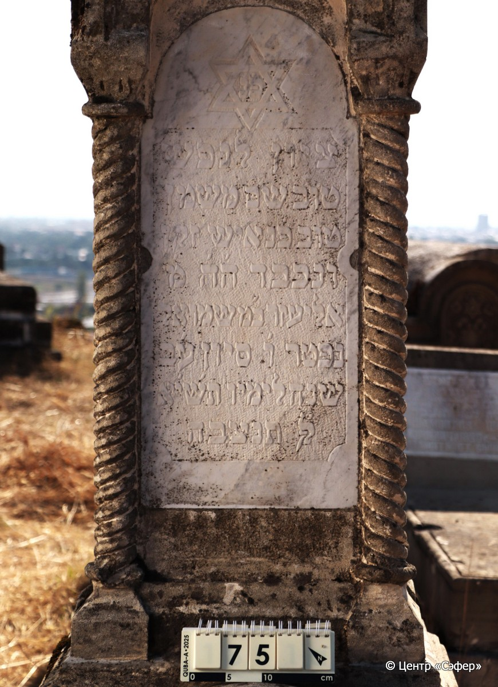
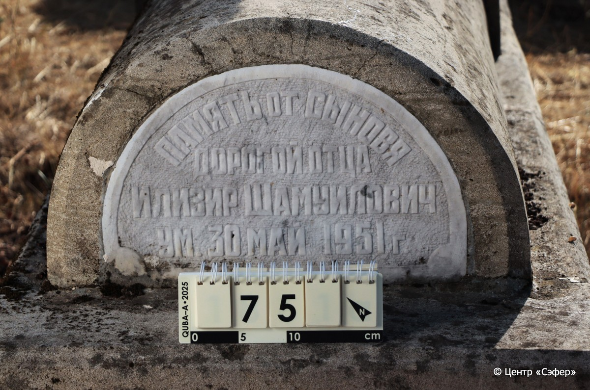
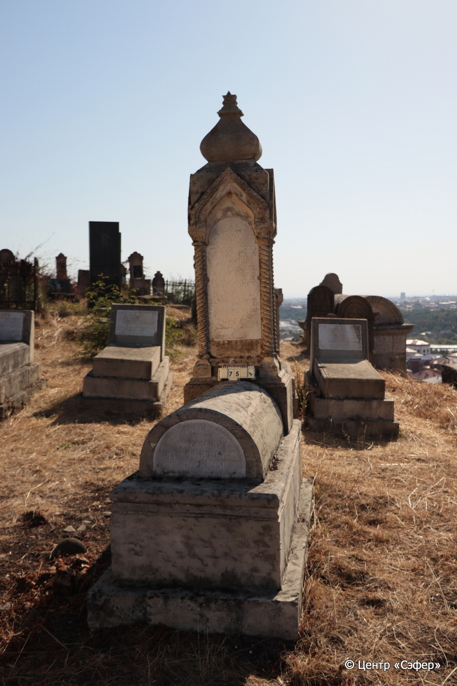

::: {style="font-size: 1em; margin-bottom: 1.2em"}
[Куба (центральное)](../cemeteries/QBA.html) > QBA0075
:::

```{r}
suppressPackageStartupMessages(library(tidyverse))
```


:::: {.columns}

::: {.column width="20%"}

```{r}
#| lightbox:
#|   group: photos






```
:::

::: {.column width="5%"}
:::

::: {.column width="74%"}

::: {.custom-frame}
::: {.name-style}
**Элиэзер, сын Шмуэля (Илизир Шамуилович)**
:::

::: {style="font-size: 1.2em; color: #929292;"}
אליעזר בן שמואל
:::

:::: {.columns .date-panel .align-items-center}
::: {.column width="1.5em" .text-center}
{width=1.3em .nolightbox}
:::

::: {.column style="width: fit-content; padding-left: 0.4em; padding-right: 4em;"}
-- 

[--]{style="color: #929292"}
:::

::: {.column width="1.5em" .text-center}
{width=1.3em .nolightbox}
:::

::: {.column style="width: fit-content; padding-left: 0.4em;"}
30.05.1951 

[06.Si.5711]{style="color: #929292"}
:::

::::

:::

::: {.panel-tabset}

#### Эпитафия

```{r}
tibble(`Оригинал` = "сверху
פ׳נ׳
ציון לנפש
טוב שם משמן
טוב  פ׳נ איש זקן
ונכבר ה׳ה׳ מ׳
אליעזר ב׳מ שמואל
נפטר ו׳ סיון ע׳ב
שנה לימיו ת׳ש׳יא
לפ֗ק תנצבה

снизу
Память от сыновя
дорогой отца
Илизир Шамуилович
ум. 30 май 1951 г.",
       `Перевод` = "_T_
Здесь покоится
Знак душе
Доброе имя лучше
благовонного масла*. Здесь покоится мужчина пожилой и
уважаемый, которого зовут г-н
Элиэзер, сын г-на Шмуэля.
Скончался 6 сивана, в 72-летнем
возрасте, <в> 711 <году>
по малому исчислению. Да будет душа его завязана в узле жизни.

_B_
Память от сыновей
дорогому отцу
Илизиру Шамуиловичу
Умер 30 мая 1951 г.") |>
  mutate(`Оригинал` = str_split(`Оригинал`, "
"),
         `Перевод` = str_split(`Перевод`, "
")) |>
  unnest_longer(c(`Оригинал`, `Перевод`)) |> 
  mutate(id = 1:n()) |> 
  relocate(id, .before = Перевод) |> 
  rename(` ` = id) |> 
  knitr::kable(align = c("r", "c", "l"))
```

|||
|-|---|
|Примечания|*Цит Еккл 7:1|
|Язык      |иврит, русский    |
|Метки     |пожилой(-ая)    |
: {.striped .custom-table tbl-colwidths="[25,75]"}

#### Памятник

|||
|-|---|
|Тип памятника   |L-образный                                                                         |
|Материал        |известняк, мрамор (цементный раствор, две мраморные вставки для текста, следы эрозии)                                                     |
|Размеры         |195×60×43  --- стела; 33×56×107  --- Саркофаг; 56×86×193  --- основание                                                                        |
|Тип декора      |архитектурно-орнаментальный, традиционная символика                                                                        |
|Элементы декора |архитектурное куполообразное навершие со звездой Давида на вершине, звезда Давида на вставке, витые полуколонны по всем граням стелы                                                                          |
|Координаты      |[41.36966619, 48.50643358](https://www.google.com/maps/place/41.36966619, 48.50643358)                    |
: {.striped .custom-table tbl-colwidths="[25,75]"}

#### Источник

|                          |                 |
|--------------------------|-----------------|
|Место хранения        |Архив полевых исследований Центра «Сэфер»        |
|Контакты              |students@sefer.ru       |
|Ссылка                |[https://sfira.org](https://sfira.org) |
|Исходный ID           |     |
|Условия использования |[CC BY-NC 4.0](https://creativecommons.org/licenses/by-nc/4.0/deed.ru)        |
: {.striped .custom-table tbl-colwidths="[25,75]"}

:::

:::

::::

