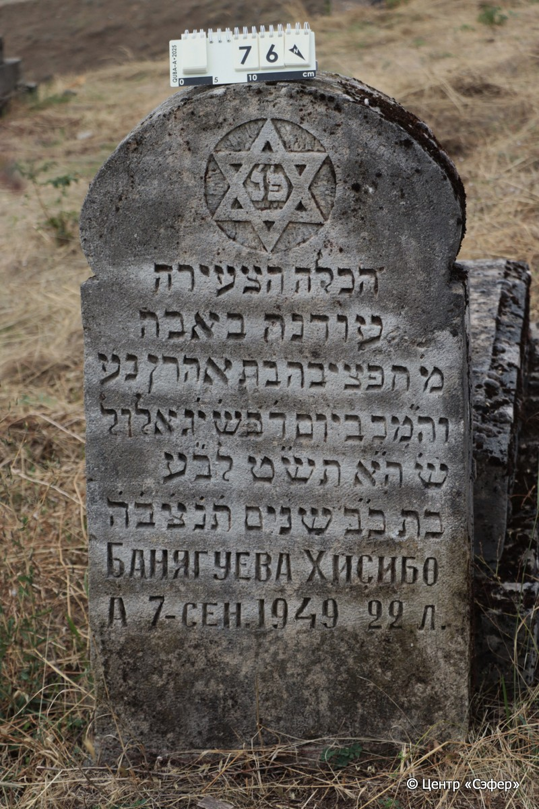
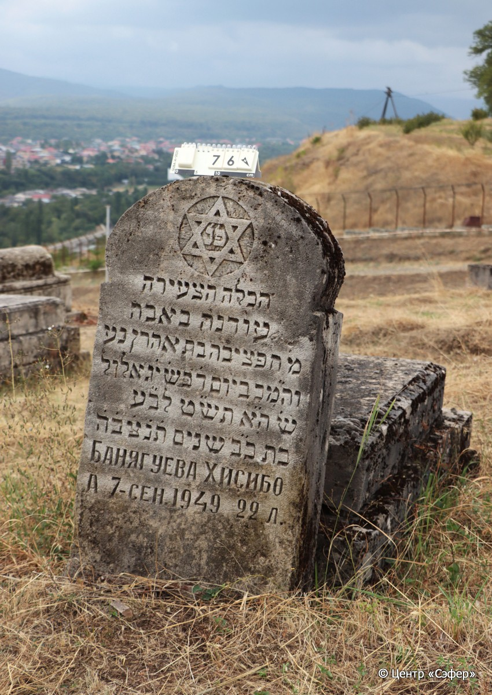

::: {style="font-size: 1em; margin-bottom: 1.2em"}
[Куба (центральное)](../cemeteries/QBA.html) > QBA0076
:::

```{r}
suppressPackageStartupMessages(library(tidyverse))
```


:::: {.columns}

::: {.column width="20%"}

```{r}
#| lightbox:
#|   group: photos




```
:::

::: {.column width="5%"}
:::

::: {.column width="74%"}

::: {.name-style}
БАНГУЕВА Хефциба, дочь Аарона (Хисибо Агаруновна)
:::

::: {style="font-size: 1.2em;"}
תפציבה בת אהרון
:::

:::: {.columns}
::: {.column width="5%"}
{width=1.3em}
:::

::: {.column style="width: 40%; padding-left: 0.2em;"}
  /  
:::

::: {.column width="5%"}
{width=1.3em}
:::

::: {.column style="width: 50%; padding-left: 0.2em;"}
07.09.1949 / 13.El.5709
:::

::::


::: {.panel-tabset}

#### Эпитафия

```{r}
tibble(`Оригинал` = "פ׳נ׳
הכלה הצעירה
עודנה באבה
מ׳ חפציבה בת אהרון נע
וה״מכ ביום ד׳ בש׳ י׳ג אלול
ש׳ ה״א תש״ט לב״ע
בת כ״ב שנים ת׳נ׳צ׳ב׳ה׳
Бангуева Хисибо
А  7-сен. 1949  22 л.",
       `Перевод` = "Здесь покоится
молодая невеста
<умершая> в расцвете <жизни>,
г-жа Хефциба, дочь Аарона, да упокоится в раю,
и будет благословен её покой. <Скончалась> в среду, 13 элула,
год 5709 от сотворения мира,
в возрасте 22 лет. Да будет душа её завязана в узле жизни.
Бангуева Хисибо 
А[гаруновна]. 7 сентября 1949 года, 22 года") |>
  mutate(`Оригинал` = str_split(`Оригинал`, "
"),
         `Перевод` = str_split(`Перевод`, "
")) |>
  unnest_longer(c(`Оригинал`, `Перевод`)) |> 
  mutate(id = 1:n()) |> 
  relocate(id, .before = Перевод) |> 
  rename(` ` = id) |> 
  knitr::kable(align = c("r", "c", "l"))
```

|||
|-|---|
|**Примечания**| |
|**Язык**      |иврит, русский    |
|**Метки**     |невеста, преждевременная смерть    |
: {tbl-colwidths="[25,75]"}

#### Памятник

|||
|-|---|
|**Тип памятника**   |L-образный                                                                         |
|**Материал**        |известняк ( )                                                     |
|**Размеры**         |109×56×25  --- стела; 21×58×119  --- плита; 39×76×173  --- основание                                                                        |
|**Тип декора**      |архитектурно-орнаментальный, традиционная символика                                                                        |
|**Элементы декора** |полукруглое завершение, звезда Давида в круглой нише                                                                          |
|**Координаты**      |[41.36973429, 48.50650188](https://www.google.com/maps/place/41.36973429, 48.50650188)                    |
: {tbl-colwidths="[25,75]"}

#### Источник

|||
|-|---|
|**Место хранения**        |Архив полевых исследований Центра «Сэфер»     |
|**Контакты**              |students@sefer.ru    |
|**Ссылка**                |https://sfira.org        |
|**Исходный ID**           |  |
|**Условия использования** |[CC BY-NC 4.0](https://creativecommons.org/licenses/by-nc/4.0/deed.ru)     |
: {tbl-colwidths="[25,75]"}

:::

:::

::::

