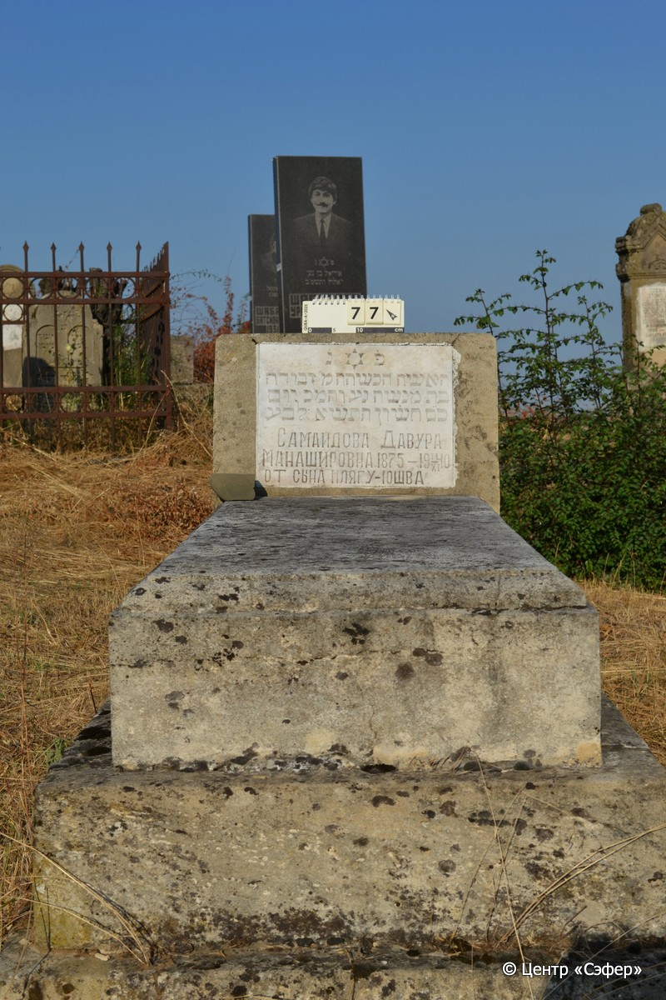
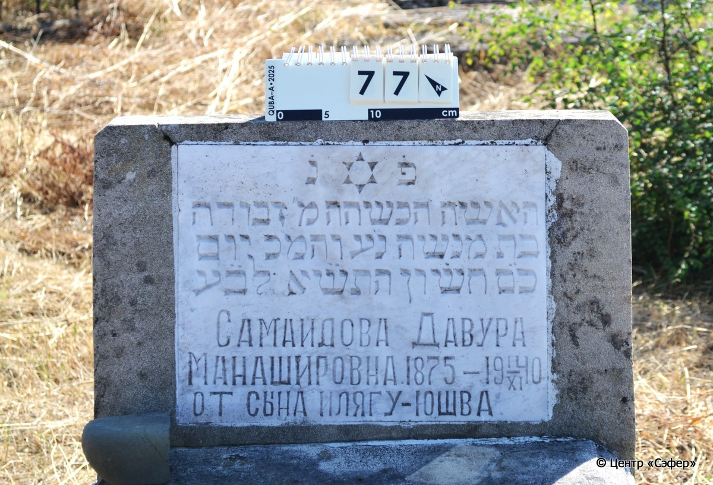

::: {style="font-size: 1em; margin-bottom: 1.2em"}
[Куба (центральное)](../cemeteries/QBA.html) > QBA0077
:::

```{r}
suppressPackageStartupMessages(library(tidyverse))
```


:::: {.columns}

::: {.column width="20%"}

```{r}
#| lightbox:
#|   group: photos




```
:::

::: {.column width="5%"}
:::

::: {.column width="74%"}

::: {.name-style}
САМАИЛОВА Дебора, дочь Манаше (Давура Манашировна)
:::

::: {style="font-size: 1.2em;"}
דבורה בת מנשה
:::

:::: {.columns}
::: {.column width="5%"}
{width=1.3em}
:::

::: {.column style="width: 40%; padding-left: 0.2em;"}
-.-.1875 /  
:::

::: {.column width="5%"}
{width=1.3em}
:::

::: {.column style="width: 50%; padding-left: 0.2em;"}
01.11.1940 / 01.Ch.5701
:::

::::


::: {.panel-tabset}

#### Эпитафия

```{r}
tibble(`Оригинал` = "פ֗ נ֗
האשה הכש[ר]ה מ״ דבורה
בת מנשה נ״ע והמ״כ יום
כ״ס חשון התש֗֗א לב֗֗ע
Самаилова Давура 
Манашировна 1875 – I/XI 1940
От сына Илягу-Юшва.",
       `Перевод` = "Здесь покоится
праведная женщина, г-жа Двора,
дочь Менаше, да упокоится в раю, и будет благословен её покой. <Скончалась> в день
[новомесячья]* хешвана 5701 <года> от сотворения мира.
Самаилова Давура
Манашировна 1875 – 1.11.1940
От сына Илягу-Юшва") |>
  mutate(`Оригинал` = str_split(`Оригинал`, "
"),
         `Перевод` = str_split(`Перевод`, "
")) |>
  unnest_longer(c(`Оригинал`, `Перевод`)) |> 
  mutate(id = 1:n()) |> 
  relocate(id, .before = Перевод) |> 
  rename(` ` = id) |> 
  knitr::kable(align = c("r", "c", "l"))
```

|||
|-|---|
|**Примечания**|Дата в тексте на иврите записана с ошибкой. Вероятно, имелось в виду ר״ח חשון –  1  хешвана.|
|**Язык**      |иврит, русский    |
|**Метки**     |     |
: {tbl-colwidths="[25,75]"}

#### Памятник

|||
|-|---|
|**Тип памятника**   |L-образный                                                                         |
|**Материал**        |известняк, мрамор (мраморная вставка для текста)                                                     |
|**Размеры**         |56×60×17  --- стела; 24×59×130  --- плита; 17×84×170  --- основание                                                                        |
|**Тип декора**      |традиционная символика                                                                        |
|**Элементы декора** |звезда Давида на вставке                                                                          |
|**Координаты**      |[41.3696922, 48.50646636](https://www.google.com/maps/place/41.3696922, 48.50646636)                    |
: {tbl-colwidths="[25,75]"}

#### Источник

|||
|-|---|
|**Место хранения**        |Архив полевых исследований Центра «Сэфер»     |
|**Контакты**              |students@sefer.ru    |
|**Ссылка**                |https://sfira.org        |
|**Исходный ID**           |  |
|**Условия использования** |[CC BY-NC 4.0](https://creativecommons.org/licenses/by-nc/4.0/deed.ru)     |
: {tbl-colwidths="[25,75]"}

:::

:::

::::

