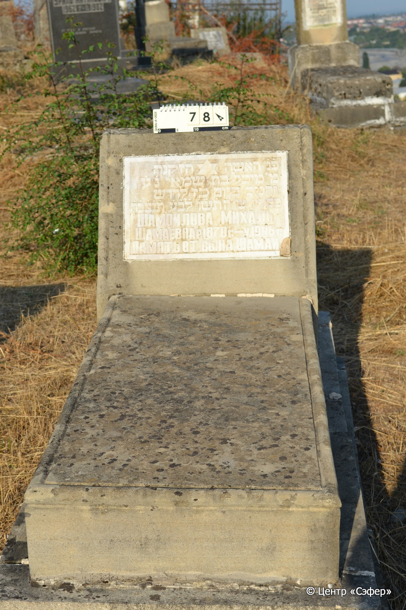
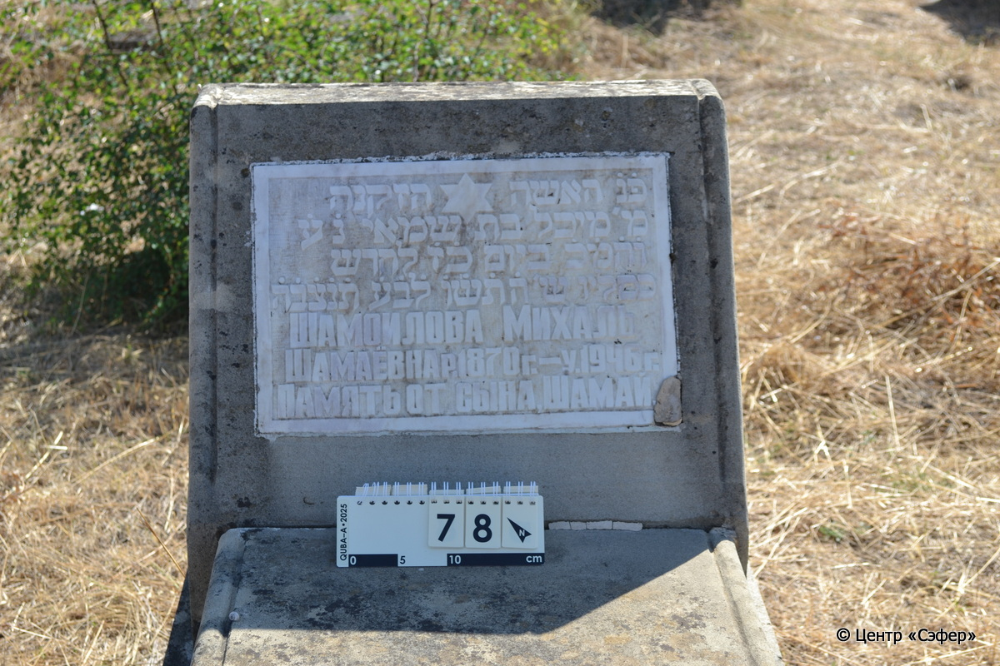
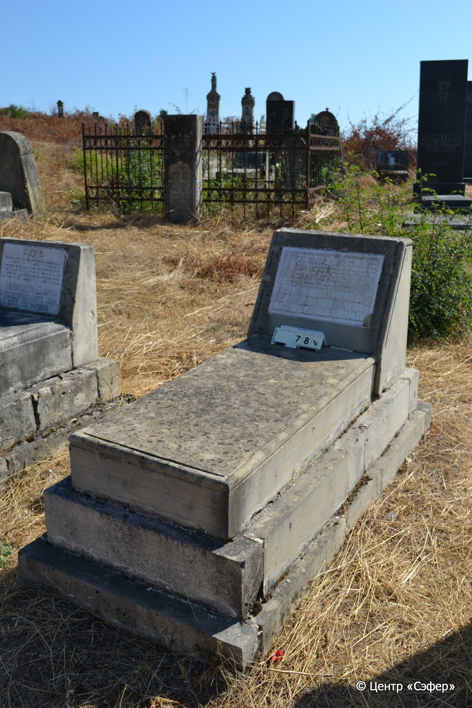

::: {style="font-size: 1em; margin-bottom: 1.2em"}
[Куба (центральное)](../cemeteries/QBA.html) > QBA0078
:::

```{r}
suppressPackageStartupMessages(library(tidyverse))
```


:::: {.columns}

::: {.column width="20%"}

```{r}
#| lightbox:
#|   group: photos





```
:::

::: {.column width="5%"}
:::

::: {.column width="74%"}

::: {.name-style}
ШАМОИЛОВА Михаль, дочь Шамая (Шамаёвна)
:::

::: {style="font-size: 1.2em;"}
מיכל בת שמאי
:::

:::: {.columns}
::: {.column width="5%"}
{width=1.3em}
:::

::: {.column style="width: 40%; padding-left: 0.2em;"}
-.-.1870 /  
:::

::: {.column width="5%"}
{width=1.3em}
:::

::: {.column style="width: 50%; padding-left: 0.2em;"}
-.-.1946 / 27.Ki.5706
:::

::::


::: {.panel-tabset}

#### Эпитафия

```{r}
tibble(`Оригинал` = "פ֗נ֗ האשה הזקנה 
מ׳ מיכל בת שמאי נ֗ע֗ 
ו֗ה֗מ֗כ֗ ביום כ֗ז֗ לחדש 
כסליו ש׳ ה֗ת֗ש֗ו֗ ל֗ב֗ע֗ ת֗נ֗צ֗ב֗ה֗
Шамоилова Михаль
Шамаёвна р. 1870 г. – у. 1946 г.
Память от сына Шамай.",
       `Перевод` = "Здесь покоится пожилая женщина,
г-жа Михаль, дочь Шамая, да упокоится в раю,
и будет благословен её покой. <Скончалась> на 27 день месяца
кислев, год 5706 от сотворения мира. Да будет душа её завязана в узле жизни.
Шамоилова Михаль
Шамаёвна. Родилась в 1870 г., умерла в 1946 г.
Память от сына Шамая") |>
  mutate(`Оригинал` = str_split(`Оригинал`, "
"),
         `Перевод` = str_split(`Перевод`, "
")) |>
  unnest_longer(c(`Оригинал`, `Перевод`)) |> 
  mutate(id = 1:n()) |> 
  relocate(id, .before = Перевод) |> 
  rename(` ` = id) |> 
  knitr::kable(align = c("r", "c", "l"))
```

|||
|-|---|
|**Примечания**| |
|**Язык**      |иврит, русский    |
|**Метки**     |пожилой(-ая)    |
: {tbl-colwidths="[25,75]"}

#### Памятник

|||
|-|---|
|**Тип памятника**   |L-образный                                                                         |
|**Материал**        |песчаник, известняк (цементный раствор, следы эрозии, мраморная вставка для текста)                                                     |
|**Размеры**         |58×60×34  --- стела; 18×55×115  --- плита; 37×79×177  --- основание                                                                        |
|**Тип декора**      |традиционная символика                                                                        |
|**Элементы декора** |звезды Давида на вставке                                                                          |
|**Координаты**      |[41.36968051, 48.50647376](https://www.google.com/maps/place/41.36968051, 48.50647376)                    |
: {tbl-colwidths="[25,75]"}

#### Источник

|||
|-|---|
|**Место хранения**        |Архив полевых исследований Центра «Сэфер»     |
|**Контакты**              |students@sefer.ru    |
|**Ссылка**                |https://sfira.org        |
|**Исходный ID**           |  |
|**Условия использования** |[CC BY-NC 4.0](https://creativecommons.org/licenses/by-nc/4.0/deed.ru)     |
: {tbl-colwidths="[25,75]"}

:::

:::

::::

