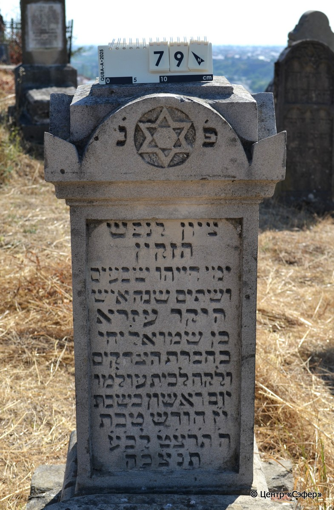
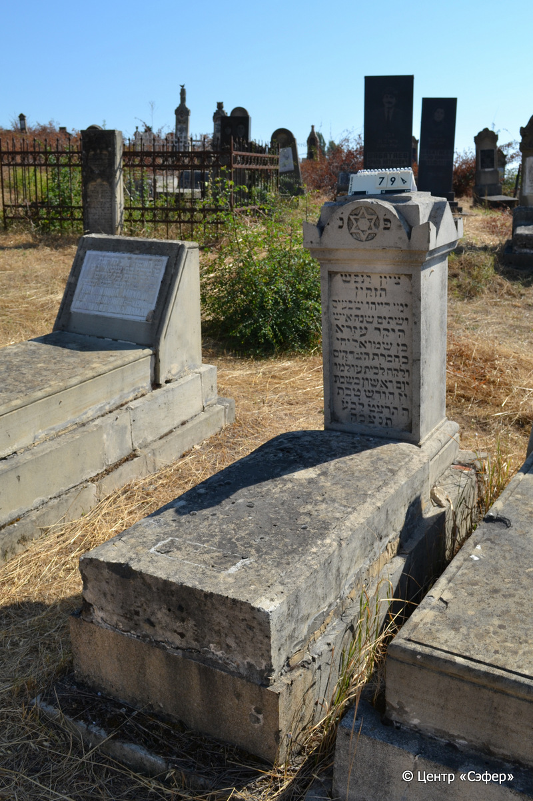

::: {style="font-size: 1em; margin-bottom: 1.2em"}
[Куба (центральное)](../cemeteries/QBA.html) > QBA0079
:::

```{r}
suppressPackageStartupMessages(library(tidyverse))
```


:::: {.columns}

::: {.column width="20%"}

```{r}
#| lightbox:
#|   group: photos




```
:::

::: {.column width="5%"}
:::

::: {.column width="74%"}

::: {.name-style}
Эзра, сын Шмуэля (Изро)
:::

::: {style="font-size: 1.2em;"}
עזרא בן שמואל
:::

:::: {.columns}
::: {.column width="5%"}
{width=1.3em}
:::

::: {.column style="width: 40%; padding-left: 0.2em;"}
  /  
:::

::: {.column width="5%"}
{width=1.3em}
:::

::: {.column style="width: 50%; padding-left: 0.2em;"}
08.01.1939* / 17.Te.5699
:::

::::


::: {.panel-tabset}

#### Эпитафия

```{r}
tibble(`Оригинал` = "פ׳ נ׳
ציון לנפש
הזקין
ימי הייהו שבעים
ושתים שנה איש
היקר עזרא
בן שמואל יהי 
בחברת הצדקים
ולקחה לבית עולמו
יום ראשון בשבת 
י״ז חודש טבת
ה׳ ת׳ר׳צ׳ט׳ לב֗ע֗
ת׳נ׳צ׳ב׳ה׳",
       `Перевод` = "Здесь покоится
Знак душе
пожилой,
дней его жизни семьдесят
и два года. Дорогой
человек, Эзра,
сын Шмуэля, да пребудет
среди праведников.
Был взят в дом вечности
в воскресенье
17 <числа> месяца тевет
5699 <года> от сотворения мира.
Да будет душа его завязана в узле жизни.") |>
  mutate(`Оригинал` = str_split(`Оригинал`, "
"),
         `Перевод` = str_split(`Перевод`, "
")) |>
  unnest_longer(c(`Оригинал`, `Перевод`)) |> 
  mutate(id = 1:n()) |> 
  relocate(id, .before = Перевод) |> 
  rename(` ` = id) |> 
  knitr::kable(align = c("r", "c", "l"))
```

|||
|-|---|
|**Примечания**| |
|**Язык**      |иврит    |
|**Метки**     |пожилой(-ая)    |
: {tbl-colwidths="[25,75]"}

#### Памятник

|||
|-|---|
|**Тип памятника**   |L-образный                                                                         |
|**Материал**        |песчаник, известняк, кирпич (цементный раствор, кирпич в основании)                                                     |
|**Размеры**         |98×43×37  --- стела; 18×55×105  --- плита; 30×69×182  --- основание                                                                        |
|**Тип декора**      |архитектурно-орнаментальный, традиционная символика                                                                        |
|**Элементы декора** |стела в виде башни, звезда Давида на лицевой стороне                                                                          |
|**Координаты**      |[41.36966776, 48.50647168](https://www.google.com/maps/place/41.36966776, 48.50647168)                    |
: {tbl-colwidths="[25,75]"}

#### Источник

|||
|-|---|
|**Место хранения**        |Архив полевых исследований Центра «Сэфер»     |
|**Контакты**              |students@sefer.ru    |
|**Ссылка**                |https://sfira.org        |
|**Исходный ID**           |  |
|**Условия использования** |[CC BY-NC 4.0](https://creativecommons.org/licenses/by-nc/4.0/deed.ru)     |
: {tbl-colwidths="[25,75]"}

:::

:::

::::

