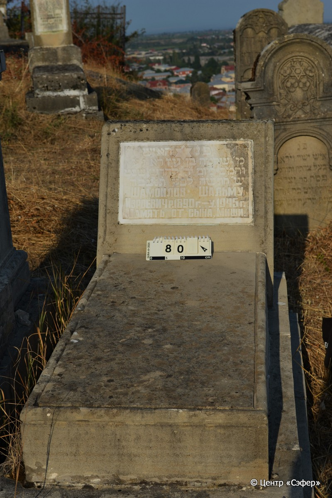
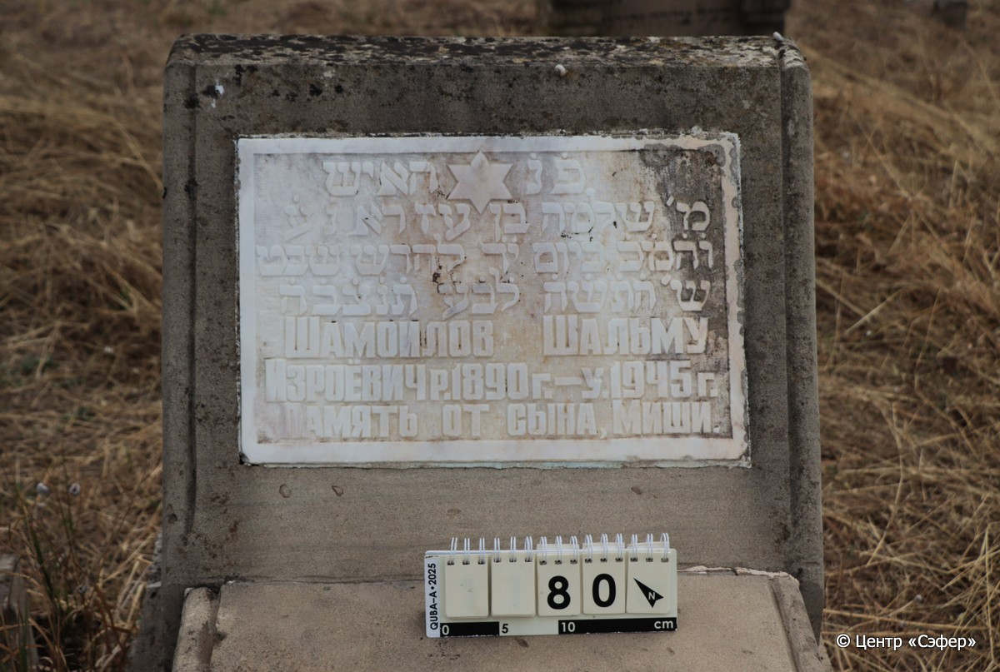

::: {style="font-size: 1em; margin-bottom: 1.2em"}
[Куба (центральное)](../cemeteries/QBA.html) > QBA0080
:::

```{r}
suppressPackageStartupMessages(library(tidyverse))
```


:::: {.columns}

::: {.column width="20%"}

```{r}
#| lightbox:
#|   group: photos




```
:::

::: {.column width="5%"}
:::

::: {.column width="74%"}

::: {.name-style}
ШАМОИЛОВ Шломо, сын Эзры (Шальму Изроёвич)
:::

::: {style="font-size: 1.2em;"}
שלומה בן עזרא
:::

:::: {.columns}
::: {.column width="5%"}
{width=1.3em}
:::

::: {.column style="width: 40%; padding-left: 0.2em;"}
-.-.1890 /  
:::

::: {.column width="5%"}
{width=1.3em}
:::

::: {.column style="width: 50%; padding-left: 0.2em;"}
-.-.1945 / 14.Sh.5705
:::

::::


::: {.panel-tabset}

#### Эпитафия

```{r}
tibble(`Оригинал` = "פ֗נ֗ האיש
מ׳ שלמה בן עזרא נ֗ע֗
ו֗ה֗מ֗כ֗ ביום י֗ד֗ לחדש שבט
ש׳ ה֗ת֗ש֗ה֗ ל֗ב֗ע֗ ת֗נ֗צ֗ב֗ה֗
Шамоилов Шальму
Изроёвич р. 1890 г. – у. 1945 г.
Память от сына, Миши.",
       `Перевод` = "Здесь покоится мужчина
г-н Шломо, сын Эзры, да упокоится в раю,
и будет благословен его покой. <Скончался> на 14 день месяца шват,
год 5705 от сотворения мира. Да будет душа его завязана в узле жизни.
Шамоилов Шальму
Изроёвич. Родился в 1890 г. – умер в 1945 г.
Память от сына Миши") |>
  mutate(`Оригинал` = str_split(`Оригинал`, "
"),
         `Перевод` = str_split(`Перевод`, "
")) |>
  unnest_longer(c(`Оригинал`, `Перевод`)) |> 
  mutate(id = 1:n()) |> 
  relocate(id, .before = Перевод) |> 
  rename(` ` = id) |> 
  knitr::kable(align = c("r", "c", "l"))
```

|||
|-|---|
|**Примечания**| |
|**Язык**      |иврит, русский    |
|**Метки**     |     |
: {tbl-colwidths="[25,75]"}

#### Памятник

|||
|-|---|
|**Тип памятника**   |L-образный                                                                         |
|**Материал**        |песчаник, известняк (цементный раствор, мраморная вставка для текста)                                                     |
|**Размеры**         |59×60×35  --- стела; 19×55×114  --- плита; 31×80×172  --- основание                                                                        |
|**Тип декора**      |традиционная символика                                                                        |
|**Элементы декора** |звезды Давида на вставке                                                                          |
|**Координаты**      |[41.36966162, 48.50647372](https://www.google.com/maps/place/41.36966162, 48.50647372)                    |
: {tbl-colwidths="[25,75]"}

#### Источник

|||
|-|---|
|**Место хранения**        |Архив полевых исследований Центра «Сэфер»     |
|**Контакты**              |students@sefer.ru    |
|**Ссылка**                |https://sfira.org        |
|**Исходный ID**           |  |
|**Условия использования** |[CC BY-NC 4.0](https://creativecommons.org/licenses/by-nc/4.0/deed.ru)     |
: {tbl-colwidths="[25,75]"}

:::

:::

::::

