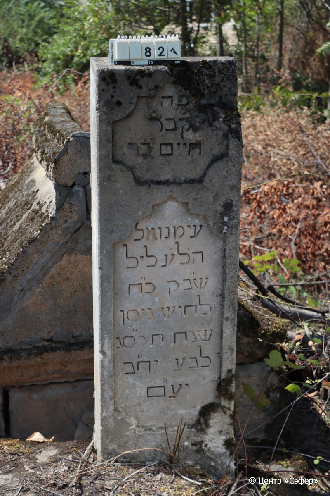
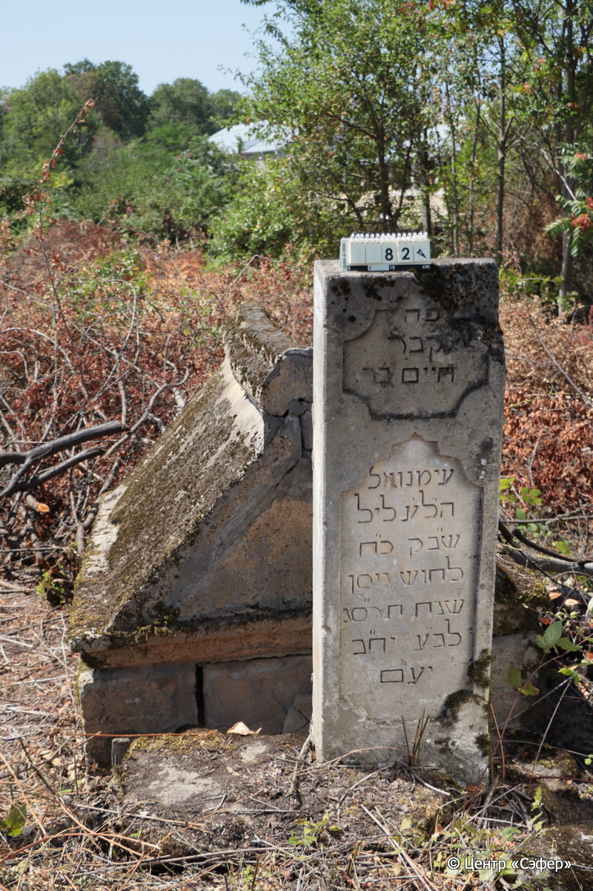
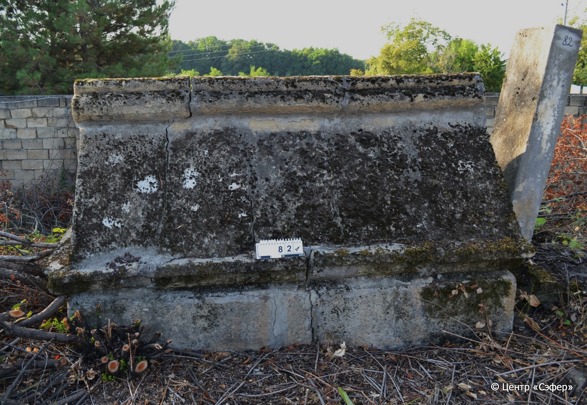

::: {style="font-size: 1em; margin-bottom: 1.2em"}
[Куба (центральное)](../cemeteries/QBA.html) > QBA0082
:::

```{r}
suppressPackageStartupMessages(library(tidyverse))
```


:::: {.columns}

::: {.column width="20%"}

```{r}
#| lightbox:
#|   group: photos





```
:::

::: {.column width="5%"}
:::

::: {.column width="74%"}

::: {.name-style}
Хаим, сын Эмануэля
:::

::: {style="font-size: 1.2em;"}
חיים בן עימנואל
:::

:::: {.columns}
::: {.column width="5%"}
{width=1.3em}
:::

::: {.column style="width: 40%; padding-left: 0.2em;"}
  /  
:::

::: {.column width="5%"}
{width=1.3em}
:::

::: {.column style="width: 50%; padding-left: 0.2em;"}
25.04.1903* / 28.Ni.5663
:::

::::


::: {.panel-tabset}

#### Эпитафия

```{r}
tibble(`Оригинал` = "פה
נקבר
חיים בר
עימנואל
ה״ל׳ע ליל
ש״בק כ״ח
לחו׳ש ניסן
שנת תר״סג
לב״ע יח״ב
יע״ם",
       `Перевод` = "Здесь
похоронен
Хаим, сын
Имануэля,
ушедший навеки в ночь
святой субботы, 28 <числа>
месяца нисан,
год {5}663
от сотворения мира. Пусть торжествуют праведники во славе
и радуются на ложах своих*.") |>
  mutate(`Оригинал` = str_split(`Оригинал`, "
"),
         `Перевод` = str_split(`Перевод`, "
")) |>
  unnest_longer(c(`Оригинал`, `Перевод`)) |> 
  mutate(id = 1:n()) |> 
  relocate(id, .before = Перевод) |> 
  rename(` ` = id) |> 
  knitr::kable(align = c("r", "c", "l"))
```

|||
|-|---|
|**Примечания**|* Цит. Пс 149:2|
|**Язык**      |иврит    |
|**Метки**     |     |
: {tbl-colwidths="[25,75]"}

#### Памятник

|||
|-|---|
|**Тип памятника**   |шатёр (охель)                                                                         |
|**Материал**        |песчаник (цементный раствор, следы эрозии, сколы)                                                     |
|**Размеры**         |130×45×18  --- стела; 124×140×250  --- саркофаг                                                                        |
|**Тип декора**      |архитектурно-орнаментальный                                                                        |
|**Элементы декора** |две фигурные ниши для текста                                                                          |
|**Координаты**      |[41.37088804, 48.50603906](https://www.google.com/maps/place/41.37088804, 48.50603906)                    |
: {tbl-colwidths="[25,75]"}

#### Источник

|||
|-|---|
|**Место хранения**        |Архив полевых исследований Центра «Сэфер»     |
|**Контакты**              |students@sefer.ru    |
|**Ссылка**                |https://sfira.org        |
|**Исходный ID**           |  |
|**Условия использования** |[CC BY-NC 4.0](https://creativecommons.org/licenses/by-nc/4.0/deed.ru)     |
: {tbl-colwidths="[25,75]"}

:::

:::

::::

