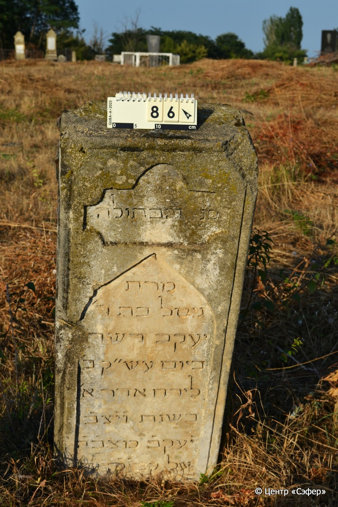
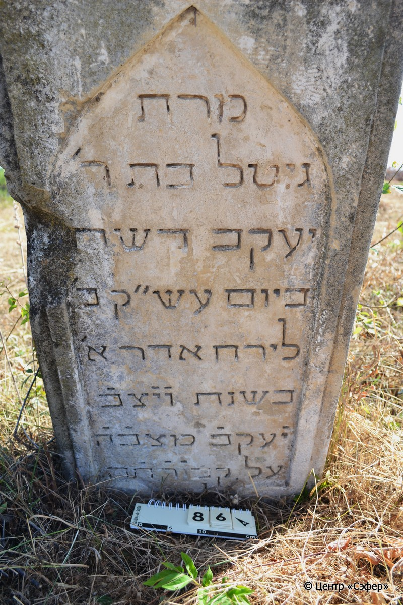
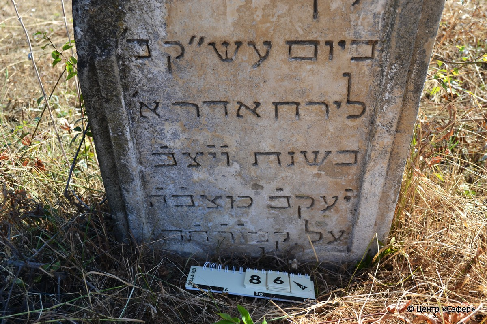

::: {style="font-size: 1em; margin-bottom: 1.2em"}
[Куба (центральное)](../cemeteries/QBA.html) > QBA0086
:::

```{r}
suppressPackageStartupMessages(library(tidyverse))
```


:::: {.columns}

::: {.column width="20%"}

```{r}
#| lightbox:
#|   group: photos





```
:::

::: {.column width="5%"}
:::

::: {.column width="74%"}

::: {.name-style}
Гитл, дочь Яакова
:::

::: {style="font-size: 1.2em;"}
גיטל בת יעקב
:::

:::: {.columns}
::: {.column width="5%"}
{width=1.3em}
:::

::: {.column style="width: 40%; padding-left: 0.2em;"}
  /  
:::

::: {.column width="5%"}
{width=1.3em}
:::

::: {.column style="width: 50%; padding-left: 0.2em;"}
  / 2.Ad1.5643
:::

::::


::: {.panel-tabset}

#### Эпитафия

```{r}
tibble(`Оригинал` = "פ״נ הבתולה
מרת
גיטל בת ר'
יעקב דשח
ביום עש״ק ב׳
לירח אדר א׳
בשנת ו֗י֗צב֗
י֗עקב֗ מצב֗ה֗
על קבו֗ר֗ת֗ה
לפק",
       `Перевод` = "Здесь покоится девушка,
госпожа
Гитл, дочь р.
Яакова, оставившая жизнь
в день святой субботы, 2 <числа>
месяца адар I,
год и установил
Яаков надгробие
на могиле* {643}
по малому исчислению.") |>
  mutate(`Оригинал` = str_split(`Оригинал`, "
"),
         `Перевод` = str_split(`Перевод`, "
")) |>
  unnest_longer(c(`Оригинал`, `Перевод`)) |> 
  mutate(id = 1:n()) |> 
  relocate(id, .before = Перевод) |> 
  rename(` ` = id) |> 
  knitr::kable(align = c("r", "c", "l"))
```

|||
|-|---|
|**Примечания**|Год записан с помощью хронограммы в виде цитаты из Быт 35:20, в которой говорится об установке памятника Яаковом на могиле праматери Рахели. Числовое значение отмеченных букв в цитате соответствует 643.|
|**Язык**      |иврит    |
|**Метки**     |девушка    |
: {tbl-colwidths="[25,75]"}

#### Памятник

|||
|-|---|
|**Тип памятника**   |стела                                                                         |
|**Материал**        |песчаник (сколы, следы эрозии)                                                     |
|**Размеры**         |125×47×25                                                                        |
|**Тип декора**      |архитектурно-орнаментальный                                                                        |
|**Элементы декора** |две фигурные ниши для текста                                                                          |
|**Координаты**      |[41.37071798, 48.50619125](https://www.google.com/maps/place/41.37071798, 48.50619125)                    |
: {tbl-colwidths="[25,75]"}

#### Источник

|||
|-|---|
|**Место хранения**        |Архив полевых исследований Центра «Сэфер»     |
|**Контакты**              |students@sefer.ru    |
|**Ссылка**                |https://sfira.org        |
|**Исходный ID**           |  |
|**Условия использования** |[CC BY-NC 4.0](https://creativecommons.org/licenses/by-nc/4.0/deed.ru)     |
: {tbl-colwidths="[25,75]"}

:::

:::

::::

