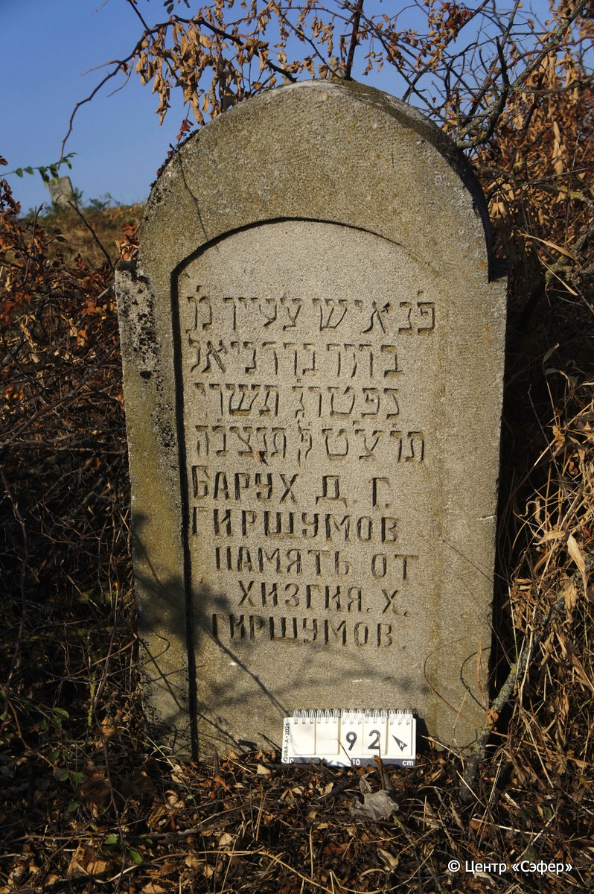

::: {style="font-size: 1em; margin-bottom: 1.2em"}
[Куба (центральное)](../cemeteries/QBA.html) > QBA0092
:::

```{r}
suppressPackageStartupMessages(library(tidyverse))
```


:::: {.columns}

::: {.column width="20%"}

```{r}
#| lightbox:
#|   group: photos



```
:::

::: {.column width="5%"}
:::

::: {.column width="74%"}

::: {.name-style}
ГИРШУМОВ Барух, сын Даниэля (Даниилович)
:::

::: {style="font-size: 1.2em;"}
ברוך בן דניאל
:::

:::: {.columns}
::: {.column width="5%"}
{width=1.3em}
:::

::: {.column style="width: 40%; padding-left: 0.2em;"}
  /  
:::

::: {.column width="5%"}
{width=1.3em}
:::

::: {.column style="width: 50%; padding-left: 0.2em;"}
28.09.1938* / 3.Ti.5699
:::

::::


::: {.panel-tabset}

#### Эпитафия

```{r}
tibble(`Оригинал` = "פ֗נ איש צעיר מ֗
ברו[ך] בר דניאל 
נפטר ג֗ תשרי 
תר֗צ֗ט לפ֗ק תנצב֗ה 
Барух Д. Г. 
Гиршумов 
память от
Хизгия. Х. 
Гиршумов",
       `Перевод` = "Здесь покоится молодой человек, г-н
Барух, сын р. Даниэля.
Скончался 3 тишрея
699 <года> по малому исчислению. Да будет душа его завязана в узле жизни.
Барух Д[аниилович] Г.
Гиршумов
Память от
Хизгии Х.
Гиршумова") |>
  mutate(`Оригинал` = str_split(`Оригинал`, "
"),
         `Перевод` = str_split(`Перевод`, "
")) |>
  unnest_longer(c(`Оригинал`, `Перевод`)) |> 
  mutate(id = 1:n()) |> 
  relocate(id, .before = Перевод) |> 
  rename(` ` = id) |> 
  knitr::kable(align = c("r", "c", "l"))
```

|||
|-|---|
|**Примечания**| |
|**Язык**      |иврит, русский    |
|**Метки**     |преждевременная смерть    |
: {tbl-colwidths="[25,75]"}

#### Памятник

|||
|-|---|
|**Тип памятника**   |стела                                                                         |
|**Материал**        |известняк (сколы)                                                     |
|**Размеры**         |108×54×18                                                                        |
|**Тип декора**      |архитектурно-орнаментальный                                                                        |
|**Элементы декора** |полукруглое завершение, ниша для текста                                                                          |
|**Координаты**      |[41.37040395, 48.50629193](https://www.google.com/maps/place/41.37040395, 48.50629193)                    |
: {tbl-colwidths="[25,75]"}

#### Источник

|||
|-|---|
|**Место хранения**        |Архив полевых исследований Центра «Сэфер»     |
|**Контакты**              |students@sefer.ru    |
|**Ссылка**                |https://sfira.org        |
|**Исходный ID**           |  |
|**Условия использования** |[CC BY-NC 4.0](https://creativecommons.org/licenses/by-nc/4.0/deed.ru)     |
: {tbl-colwidths="[25,75]"}

:::

:::

::::

