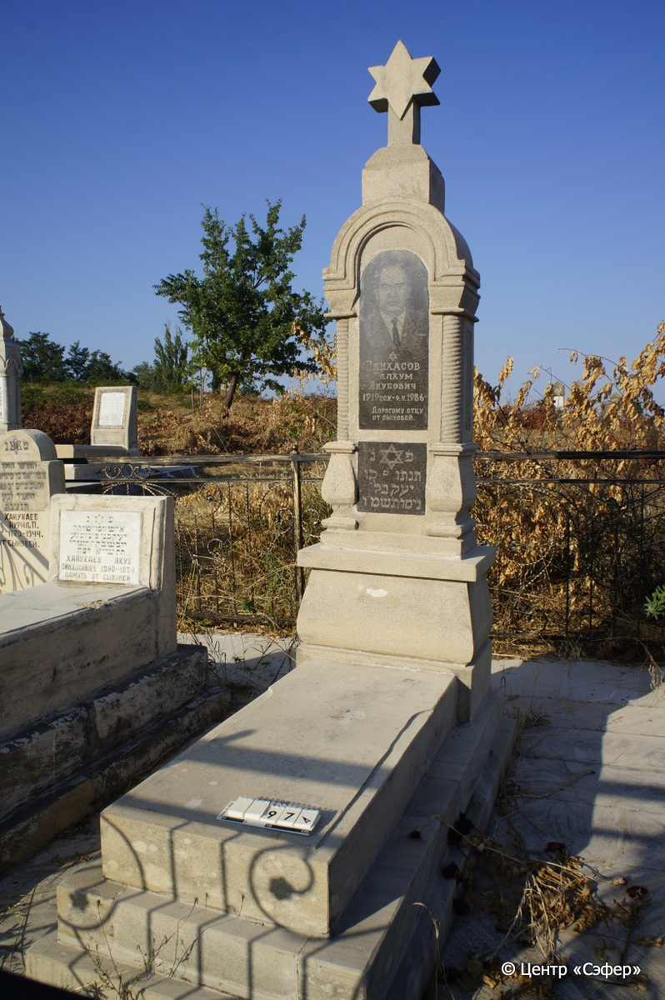
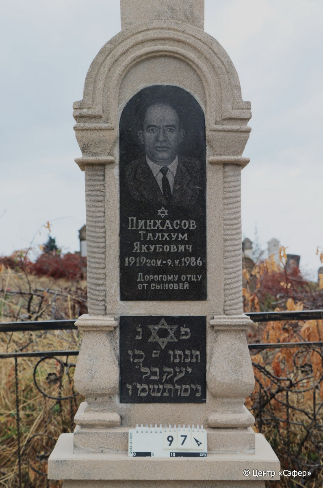
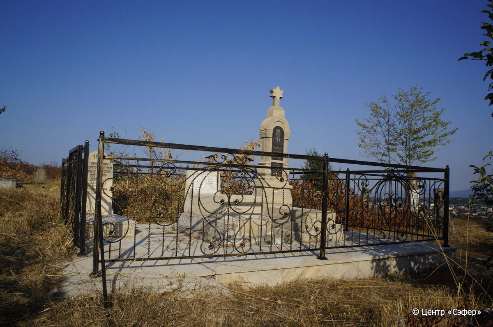

::: {style="font-size: 1em; margin-bottom: 1.2em"}
[Куба (центральное)](../cemeteries/QBA.html) > QBA0097
:::

```{r}
suppressPackageStartupMessages(library(tidyverse))
```


:::: {.columns}

::: {.column width="20%"}

```{r}
#| lightbox:
#|   group: photos





```
:::

::: {.column width="5%"}
:::

::: {.column width="74%"}

::: {.name-style}
ПИНХАСОВ Танхум, сын Яакова (Талхум Якубович)
:::

::: {style="font-size: 1.2em;"}
תנחום בן יעקב
:::

:::: {.columns}
::: {.column width="5%"}
{width=1.3em}
:::

::: {.column style="width: 40%; padding-left: 0.2em;"}
20.05.1919 /  
:::

::: {.column width="5%"}
{width=1.3em}
:::

::: {.column style="width: 50%; padding-left: 0.2em;"}
09.05.1986 / 30.Ni.5746
:::

::::


::: {.panel-tabset}

#### Эпитафия

```{r}
tibble(`Оригинал` = "сверху
Пинхасов
Талхум
Якубович
1919 20.V. – 9.V.1986

снизу
פ׳נ׳
[תנתו ם בן]
יעקב ל״
ניסן תשמ״ו",
       `Перевод` = "
Пинхасов
Талхум
Якубович
20.05.1919 – 9.05.1986

 
Здесь покоится
[Танхум, сын
Яакова. <Скончался> 30]
нисана {5}746 <года>.") |>
  mutate(`Оригинал` = str_split(`Оригинал`, "
"),
         `Перевод` = str_split(`Перевод`, "
")) |>
  unnest_longer(c(`Оригинал`, `Перевод`)) |> 
  mutate(id = 1:n()) |> 
  relocate(id, .before = Перевод) |> 
  rename(` ` = id) |> 
  knitr::kable(align = c("r", "c", "l"))
```

|||
|-|---|
|**Примечания**|Написание отдельных букв в еврейской надписи искажено. В переводе дано предположительное чтение.|
|**Язык**      |иврит, русский    |
|**Метки**     |     |
: {tbl-colwidths="[25,75]"}

#### Памятник

|||
|-|---|
|**Тип памятника**   |L-образный                                                                         |
|**Материал**        |ракушечник (цементный раствор, две темные гранитные вставки)                                                     |
|**Размеры**         |235×62×38  --- стела; 17×54×116  --- плита; 27×83×176  --- основание                                                                        |
|**Тип декора**      |архитектурно-орнаментальный, традиционная символика                                                                        |
|**Элементы декора** |архитектурное навершие, увенчанное звездой Давида, портал образованный полукруглым сводом и витыми полуколоннами, портрет на одной гранитной вставке, звезда Давида на второй                                                                          |
|**Координаты**      |[41.37022445, 48.50642152](https://www.google.com/maps/place/41.37022445, 48.50642152)                    |
: {tbl-colwidths="[25,75]"}

#### Источник

|||
|-|---|
|**Место хранения**        |Архив полевых исследований Центра «Сэфер»     |
|**Контакты**              |students@sefer.ru    |
|**Ссылка**                |https://sfira.org        |
|**Исходный ID**           |  |
|**Условия использования** |[CC BY-NC 4.0](https://creativecommons.org/licenses/by-nc/4.0/deed.ru)     |
: {tbl-colwidths="[25,75]"}

:::

:::

::::

