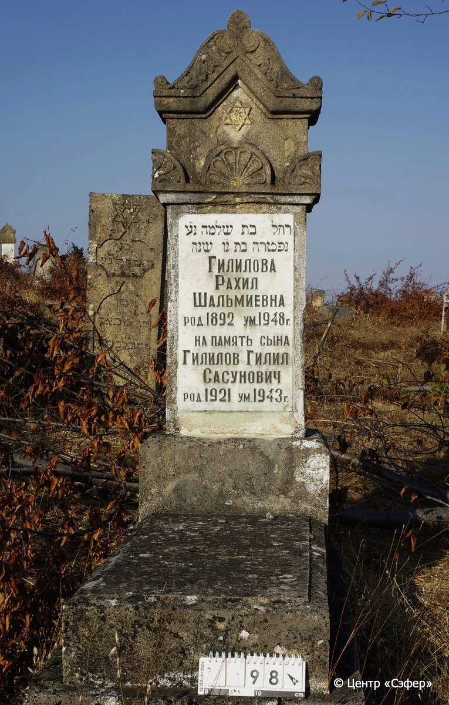
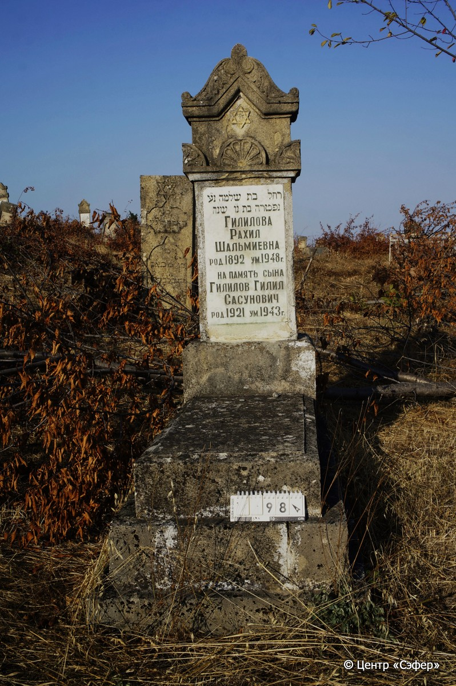

::: {style="font-size: 1em; margin-bottom: 1.2em"}
[Куба (центральное)](../cemeteries/QBA.html) > QBA0098
:::

```{r}
suppressPackageStartupMessages(library(tidyverse))
```


:::: {.columns}

::: {.column width="20%"}

```{r}
#| lightbox:
#|   group: photos




```
:::

::: {.column width="5%"}
:::

::: {.column width="74%"}

::: {.name-style}
ГИЛИЛОВА Рахель, дочь Шломо (Рахил Шальмиевна)
:::

::: {style="font-size: 1.2em;"}
רחל בת שלמה
:::

:::: {.columns}
::: {.column width="5%"}
{width=1.3em}
:::

::: {.column style="width: 40%; padding-left: 0.2em;"}
-.-.1892 /  
:::

::: {.column width="5%"}
{width=1.3em}
:::

::: {.column style="width: 50%; padding-left: 0.2em;"}
-.-.1948 /  
:::

::::

---

::: {.name-style}
ГИЛИЛОВ Гилил Сасунович
:::

::: {style="font-size: 1.2em;"}

:::

:::: {.columns}
::: {.column width="5%"}
{width=1.3em}
:::

::: {.column style="width: 40%; padding-left: 0.2em;"}
-.-.1921 /  
:::

::: {.column width="5%"}
{width=1.3em}
:::

::: {.column style="width: 50%; padding-left: 0.2em;"}
-.-.1943 /  
:::

::::


::: {.panel-tabset}

#### Эпитафия

```{r}
tibble(`Оригинал` = "רחל בת שלמה נ״ע
נפטרה בת נ״ו שנה
Гилилова
Рахил
Шальмиевна
род. 1892  ум. 1948 г.
На память сына
Гилилов Гилил
Сасунович
род. 1921 ум. 1943 г.",
       `Перевод` = "Рахель, дочь Шломо, да упокоится в раю.
Скончалась в возрасте 56 лет.
Гилилова
Рахил
Шальмиевна
Родилась в 1892 г., умерла в 1948 г.
На память сына
Гилилов Гилил
Сасунович
Родился в 1921 г., умер в 1943 г.") |>
  mutate(`Оригинал` = str_split(`Оригинал`, "
"),
         `Перевод` = str_split(`Перевод`, "
")) |>
  unnest_longer(c(`Оригинал`, `Перевод`)) |> 
  mutate(id = 1:n()) |> 
  relocate(id, .before = Перевод) |> 
  rename(` ` = id) |> 
  knitr::kable(align = c("r", "c", "l"))
```

|||
|-|---|
|**Примечания**| |
|**Язык**      |иврит, русский    |
|**Метки**     |     |
: {tbl-colwidths="[25,75]"}

#### Памятник

|||
|-|---|
|**Тип памятника**   |L-образный                                                                         |
|**Материал**        |известняк (следы эрозии, сколы, цементный раствор, следы краски белой и золотой, мраморная вставка для текста)                                                     |
|**Размеры**         |170×56×38  --- стела; 18×55×110  --- плита; 30×80×165  --- основание                                                                        |
|**Тип декора**      |архитектурно-орнаментальный, растительный, традиционная символика                                                                        |
|**Элементы декора** |трегульное завершение, оформленное растительным орнаментом, пальметки по периметру в верхней части стелы, звезда Давида, окрашенная золотым                                                                          |
|**Координаты**      |[41.37017802, 48.50648105](https://www.google.com/maps/place/41.37017802, 48.50648105)                    |
: {tbl-colwidths="[25,75]"}

#### Источник

|||
|-|---|
|**Место хранения**        |Архив полевых исследований Центра «Сэфер»     |
|**Контакты**              |students@sefer.ru    |
|**Ссылка**                |https://sfira.org        |
|**Исходный ID**           |  |
|**Условия использования** |[CC BY-NC 4.0](https://creativecommons.org/licenses/by-nc/4.0/deed.ru)     |
: {tbl-colwidths="[25,75]"}

:::

:::

::::

