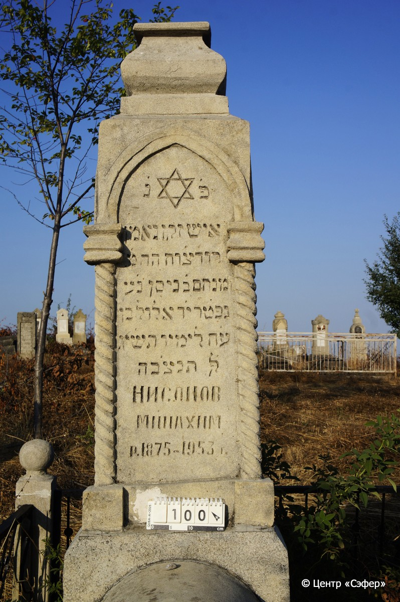
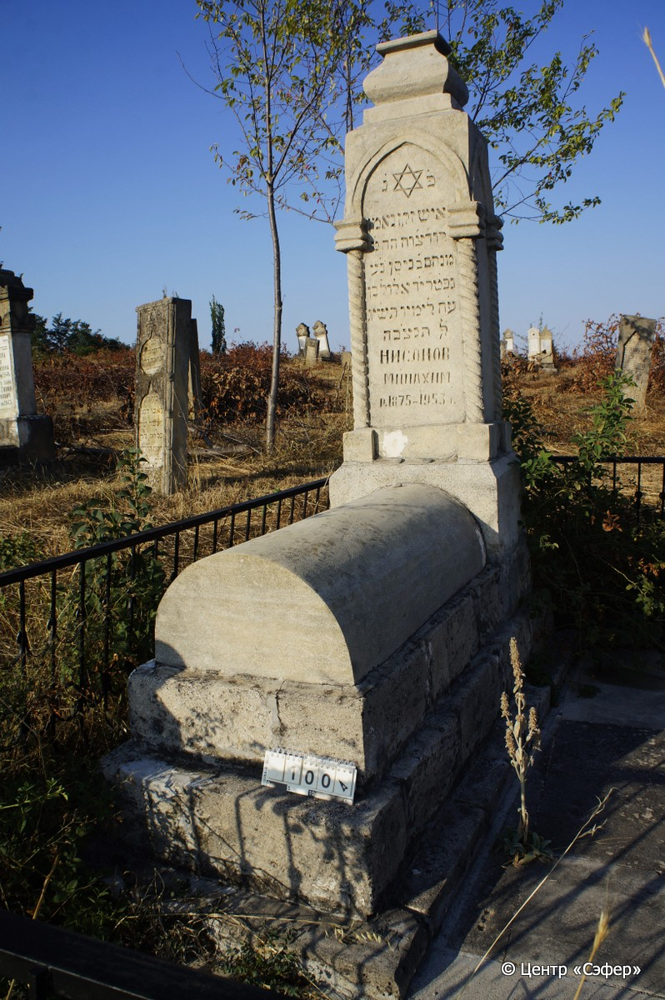
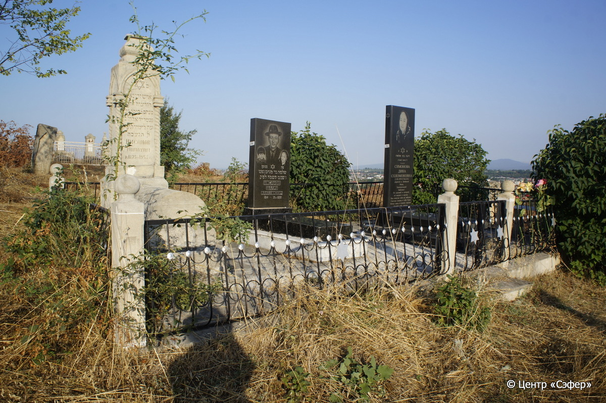

::: {style="font-size: 1em; margin-bottom: 1.2em"}
[Куба (центральное)](../cemeteries/QBA.html) > QBA0100
:::

```{r}
suppressPackageStartupMessages(library(tidyverse))
```


:::: {.columns}

::: {.column width="20%"}

```{r}
#| lightbox:
#|   group: photos





```
:::

::: {.column width="5%"}
:::

::: {.column width="74%"}

::: {.name-style}
НИСАНОВ Менахем, сын Нисана (Минахим)
:::

::: {style="font-size: 1.2em;"}
מנחם בן ניסן
:::

:::: {.columns}
::: {.column width="5%"}
{width=1.3em}
:::

::: {.column style="width: 40%; padding-left: 0.2em;"}
  /  
:::

::: {.column width="5%"}
{width=1.3em}
:::

::: {.column style="width: 50%; padding-left: 0.2em;"}
-.-.1953 / 14.El.5709
:::

::::


::: {.panel-tabset}

#### Эпитафия

```{r}
tibble(`Оригинал` = "פ׳ נ׳
איש זקן נאמן
רוד׳צ׳וח ה׳ה מ׳
מנחם ב֗ ניסן נ׳ע
נפטר י׳ד אלול בן
ע׳ה לימיו תש׳יג
לפ֗ק תנצ׳בה
Нисанов
Минахим 
р.1875 – 1953 г.",
       `Перевод` = "Здесь покоится
человек пожилой и преданный,
правдолюбивый и милостивый, которого зовут г-н
Менахем, сын Нисана, да упокоится в раю.
Скончался 14 элула, в
75 лет, 713 <году>
по малому исчислению. Да будет душа его завязана в узле жизни.
Нисанов
Минахим
Родился в 1875 г. – умер в 1953 г.") |>
  mutate(`Оригинал` = str_split(`Оригинал`, "
"),
         `Перевод` = str_split(`Перевод`, "
")) |>
  unnest_longer(c(`Оригинал`, `Перевод`)) |> 
  mutate(id = 1:n()) |> 
  relocate(id, .before = Перевод) |> 
  rename(` ` = id) |> 
  knitr::kable(align = c("r", "c", "l"))
```

|||
|-|---|
|**Примечания**| |
|**Язык**      |иврит, русский    |
|**Метки**     |пожилой(-ая)    |
: {tbl-colwidths="[25,75]"}

#### Памятник

|||
|-|---|
|**Тип памятника**   |L-образный                                                                         |
|**Материал**        |ракушечник (цементный раствор, следы эрозии, латки белого цвета, стоит на огражденной платформе из плит)                                                     |
|**Размеры**         |180×58×46  --- стела; 28×51×108  --- Саркофаг; 50×89×205  --- основание                                                                        |
|**Тип декора**      |архитектурно-орнаментальный, традиционная символика                                                                        |
|**Элементы декора** |архитектурное навершие, витые полуколонны по всем граням, звезда Давида на стеле                                                                          |
|**Координаты**      |[41.37013436, 48.50648095](https://www.google.com/maps/place/41.37013436, 48.50648095)                    |
: {tbl-colwidths="[25,75]"}

#### Источник

|||
|-|---|
|**Место хранения**        |Архив полевых исследований Центра «Сэфер»     |
|**Контакты**              |students@sefer.ru    |
|**Ссылка**                |https://sfira.org        |
|**Исходный ID**           |  |
|**Условия использования** |[CC BY-NC 4.0](https://creativecommons.org/licenses/by-nc/4.0/deed.ru)     |
: {tbl-colwidths="[25,75]"}

:::

:::

::::

