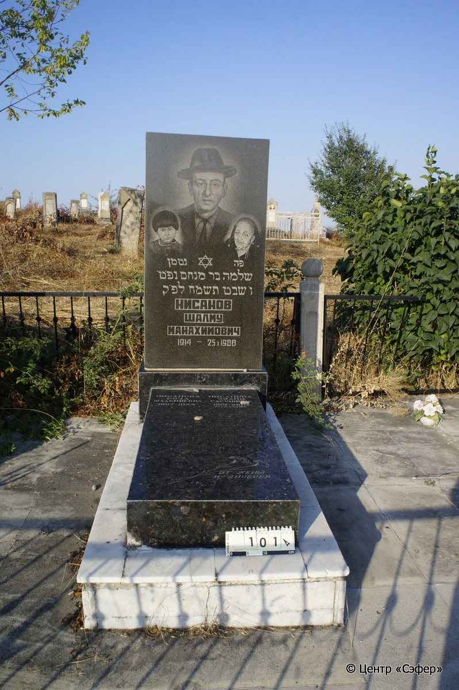
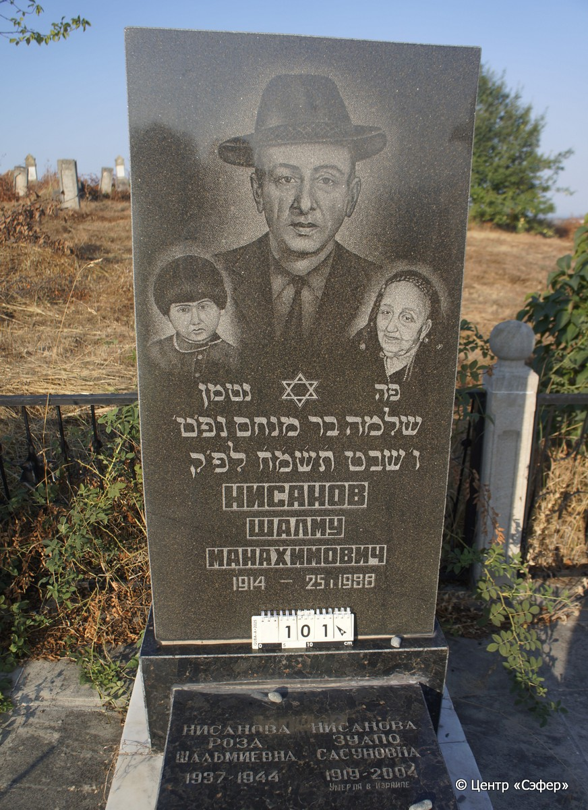
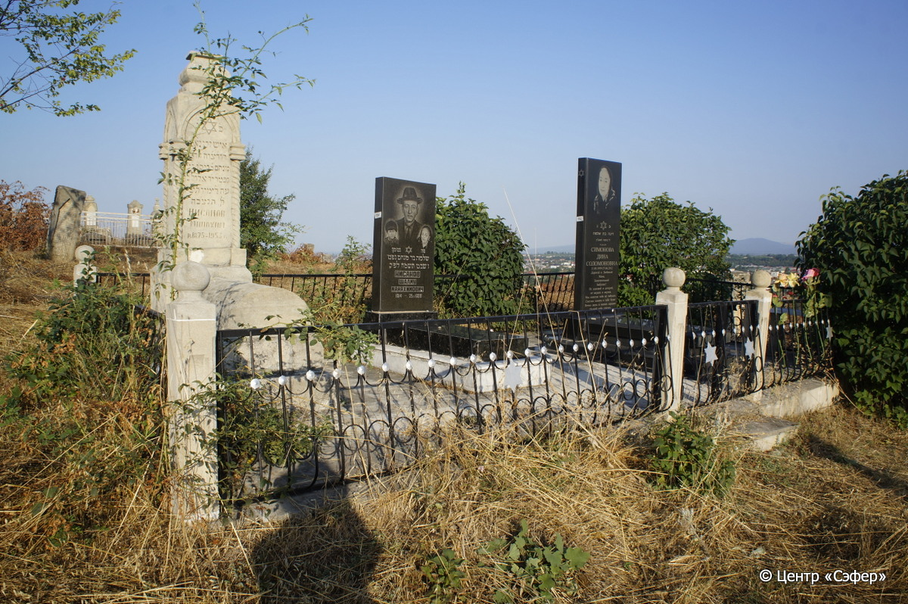

::: {style="font-size: 1em; margin-bottom: 1.2em"}
[Куба (центральное)](../cemeteries/QBA.html) > QBA0101
:::

```{r}
suppressPackageStartupMessages(library(tidyverse))
```


:::: {.columns}

::: {.column width="20%"}

```{r}
#| lightbox:
#|   group: photos





```
:::

::: {.column width="5%"}
:::

::: {.column width="74%"}

::: {.name-style}
НИСАНОВ Шломо, сын Менахема (Шалму Манахович)
:::

::: {style="font-size: 1.2em;"}
שלמה בן מנחם
:::

:::: {.columns}
::: {.column width="5%"}
{width=1.3em}
:::

::: {.column style="width: 40%; padding-left: 0.2em;"}
-.-.1914 /  
:::

::: {.column width="5%"}
{width=1.3em}
:::

::: {.column style="width: 50%; padding-left: 0.2em;"}
25.01.1988 / 06.Sh.5748
:::

::::

---

::: {.name-style}
НИСАНОВА Зулпо Сасуновна
:::

::: {style="font-size: 1.2em;"}

:::

:::: {.columns}
::: {.column width="5%"}
{width=1.3em}
:::

::: {.column style="width: 40%; padding-left: 0.2em;"}
-.-.1919 /  
:::

::: {.column width="5%"}
{width=1.3em}
:::

::: {.column style="width: 50%; padding-left: 0.2em;"}
-.-.2004 /  
:::

::::

---

::: {.name-style}
НИСАНОВА Роза Шальмиевна
:::

::: {style="font-size: 1.2em;"}

:::

:::: {.columns}
::: {.column width="5%"}
{width=1.3em}
:::

::: {.column style="width: 40%; padding-left: 0.2em;"}
-.-.1944 /  
:::

::: {.column width="5%"}
{width=1.3em}
:::

::: {.column style="width: 50%; padding-left: 0.2em;"}
-.-.1944 /  
:::

::::


::: {.panel-tabset}

#### Эпитафия

```{r}
tibble(`Оригинал` = "сверху
פנ נטמן
שלמה בר מנחם נפ׳ט׳
ו׳ שבט ת֗ש֗מ֗ח֗ לפ׳ק
Нисанов
Шалму
Манахович
1914 – 25.I.1988

снизу
справа
Нисанова
Зулпо 
Сасуновна
1919–2004
умерла в Израиле

слева
Нисанова
Роза
Шальмиевна
1937–1944

по центру
от жены
и дочерей",
       `Перевод` = "
Здесь похоронен
Шломо, сын Менахема. Скончался
6 швата 748 <года> по малому исчислению.
Нисанов
Шалму
Манахович
1914 – 25.01.1988

 
 
Нисанова
Зулпо
Сасуновна
1919 – 2004
умерла в Израиле

 
Нисанова
Роза
Шальмиевна
1937 – 1944

 
От жены
и дочерей") |>
  mutate(`Оригинал` = str_split(`Оригинал`, "
"),
         `Перевод` = str_split(`Перевод`, "
")) |>
  unnest_longer(c(`Оригинал`, `Перевод`)) |> 
  mutate(id = 1:n()) |> 
  relocate(id, .before = Перевод) |> 
  rename(` ` = id) |> 
  knitr::kable(align = c("r", "c", "l"))
```

|||
|-|---|
|**Примечания**| |
|**Язык**      |иврит, русский    |
|**Метки**     |     |
: {tbl-colwidths="[25,75]"}

#### Памятник

|||
|-|---|
|**Тип памятника**   |L-образный                                                                         |
|**Материал**        |гранит, лабрадорит, мрамор (цементный раствор, трещины, стоит на огражденной платформе из плит)                                                     |
|**Размеры**         |140×13×59  --- стела; 17×53×116  --- плита; 20×80×165  --- основание                                                                        |
|**Тип декора**      |традиционная символика                                                                        |
|**Элементы декора** |звезда Давида, тройной портрет                                                                          |
|**Координаты**      |[41.37012037, 48.50649399](https://www.google.com/maps/place/41.37012037, 48.50649399)                    |
: {tbl-colwidths="[25,75]"}

#### Источник

|||
|-|---|
|**Место хранения**        |Архив полевых исследований Центра «Сэфер»     |
|**Контакты**              |students@sefer.ru    |
|**Ссылка**                |https://sfira.org        |
|**Исходный ID**           |  |
|**Условия использования** |[CC BY-NC 4.0](https://creativecommons.org/licenses/by-nc/4.0/deed.ru)     |
: {tbl-colwidths="[25,75]"}

:::

:::

::::

