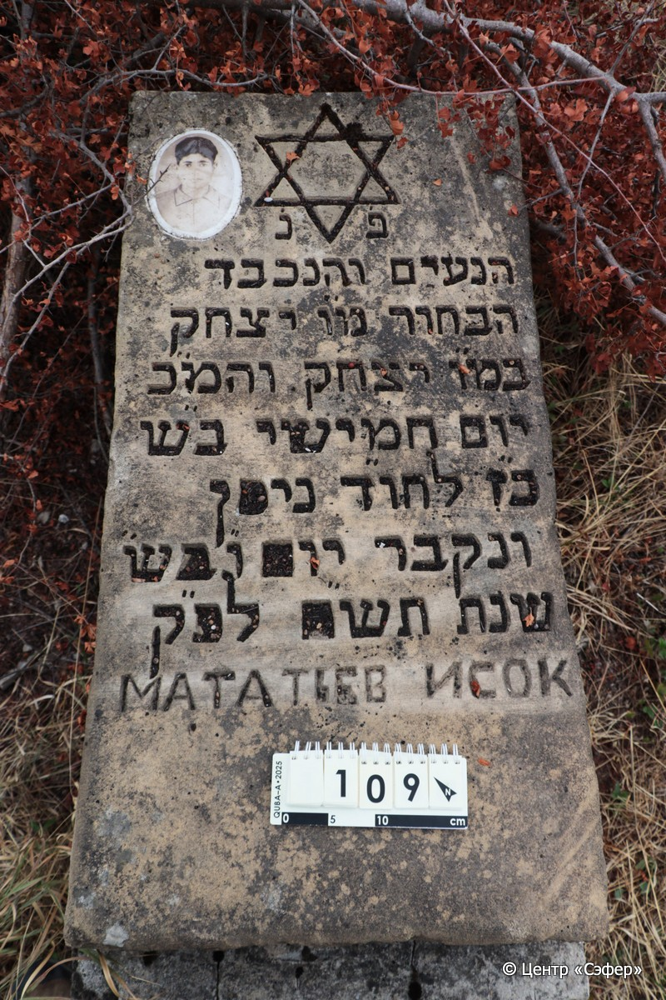
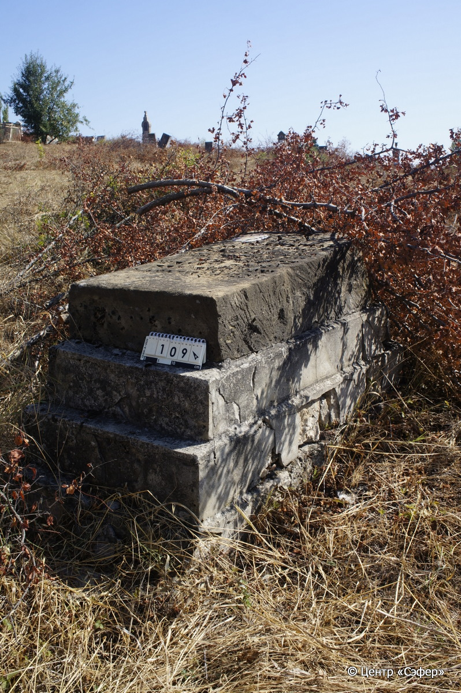

::: {style="font-size: 1em; margin-bottom: 1.2em"}
[Куба (центральное)](../cemeteries/QBA.html) > QBA0109
:::

```{r}
suppressPackageStartupMessages(library(tidyverse))
```


:::: {.columns}

::: {.column width="20%"}

```{r}
#| lightbox:
#|   group: photos




```
:::

::: {.column width="5%"}
:::

::: {.column width="74%"}

::: {.name-style}
МАТАТЬЕВ Ицхак, сын Ицхака (Исок)
:::

::: {style="font-size: 1.2em;"}
יצחק בן יצחק
:::

:::: {.columns}
::: {.column width="5%"}
{width=1.3em}
:::

::: {.column style="width: 40%; padding-left: 0.2em;"}
  /  
:::

::: {.column width="5%"}
{width=1.3em}
:::

::: {.column style="width: 50%; padding-left: 0.2em;"}
13.04.1980* / 27.Ni.5740
:::

::::


::: {.panel-tabset}

#### Эпитафия

```{r}
tibble(`Оригинал` = "פ׳ נ׳
הנעים והנכבד
הבחור מ״ו יצחק
במ״ו יצחק והמ״כ
יום חמישי ב״ש
כ״ז לחו״ד ניסן
ונקבר יום ו״ בש״
שנת תש״ם לפ״ק
Мататьев Исок",
       `Перевод` = "Здесь покоится
милый и уважаемый
юноша, наш учитель Ицхак,
сын нашего учителя Ицхака, да будет благословен его покой.
<Скончался> в четверг,
27 <числа> месяца нисан,
и похоронен в пятницу,
год 740 по малому исчислению.
Мататьев Исок") |>
  mutate(`Оригинал` = str_split(`Оригинал`, "
"),
         `Перевод` = str_split(`Перевод`, "
")) |>
  unnest_longer(c(`Оригинал`, `Перевод`)) |> 
  mutate(id = 1:n()) |> 
  relocate(id, .before = Перевод) |> 
  rename(` ` = id) |> 
  knitr::kable(align = c("r", "c", "l"))
```

|||
|-|---|
|**Примечания**|Возможно, в тексте на иврите вместо имени отца (Мататья) по ошибке повторно указано имя покойного - Ицхак.|
|**Язык**      |иврит, русский    |
|**Метки**     |юноша, преждевременная смерть    |
: {tbl-colwidths="[25,75]"}

#### Памятник

|||
|-|---|
|**Тип памятника**   |плита/саркофаг                                                                         |
|**Материал**        |песчаник, известняк (портрет на керамическом медальоне, основание из цементного раствора и известковых блоков, трещины, следы эрозии)                                                     |
|**Размеры**         |21×57×110  --- плита; 50×79×164  --- основание                                                                        |
|**Тип декора**      |традиционная символика                                                                        |
|**Элементы декора** |фотопортрет на медальоне, звезда Давида на плите                                                                          |
|**Координаты**      |[41.36984015, 48.50655401](https://www.google.com/maps/place/41.36984015, 48.50655401)                    |
: {tbl-colwidths="[25,75]"}

#### Источник

|||
|-|---|
|**Место хранения**        |Архив полевых исследований Центра «Сэфер»     |
|**Контакты**              |students@sefer.ru    |
|**Ссылка**                |https://sfira.org        |
|**Исходный ID**           |  |
|**Условия использования** |[CC BY-NC 4.0](https://creativecommons.org/licenses/by-nc/4.0/deed.ru)     |
: {tbl-colwidths="[25,75]"}

:::

:::

::::

