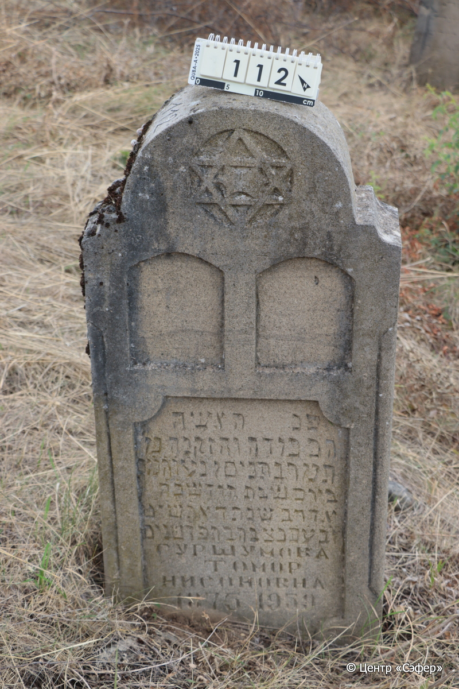
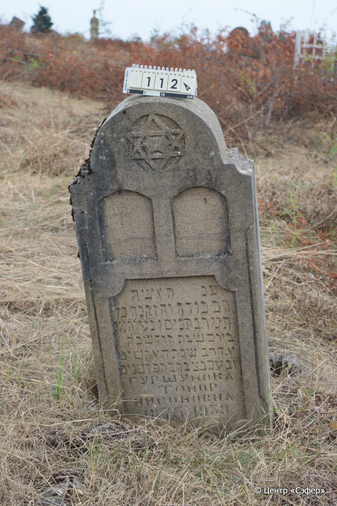

::: {style="font-size: 1em; margin-bottom: 1.2em"}
[Куба (центральное)](../cemeteries/QBA.html) > QBA0112
:::

```{r}
suppressPackageStartupMessages(library(tidyverse))
```


:::: {.columns}

::: {.column width="20%"}

```{r}
#| lightbox:
#|   group: photos




```
:::

::: {.column width="5%"}
:::

::: {.column width="74%"}

::: {.name-style}
СУРШУМОВА Тамар, дочь Нисана (Томор Нисоновна)
:::

::: {style="font-size: 1.2em;"}
תמר בת ניסן
:::

:::: {.columns}
::: {.column width="5%"}
{width=1.3em}
:::

::: {.column style="width: 40%; padding-left: 0.2em;"}
-.-.1875 /  
:::

::: {.column width="5%"}
{width=1.3em}
:::

::: {.column style="width: 50%; padding-left: 0.2em;"}
-.-.1959 / 25.Ad2.5719
:::

::::


::: {.panel-tabset}

#### Эпитафия

```{r}
tibble(`Оригинал` = "פנ האשה 
וכבודה והזקנה מ׳
תמר בת ניסן נ׳ע׳ וה׳מ׳כ׳
ביום שבת חודש כ׳ה׳ 
אדר ב׳ שנת ה֗א֗ת֗ש֗י֗ט֗ 
ל׳ב׳ע׳ תנצבה בת פ֗ד֗  שנים 
Суршумова 
Томор
Нисоновна
1875 1959",
       `Перевод` = "Здесь покоится женщина
уважаемая и пожилая, г-жа
Тамар, дочь Нисана, да упокоится в раю, и будет благословен его покой.
<Скончалась> в день святой субботы, 25
адара II, год 5719
от сотворения мира. Да будет душа её завязана в узле жизни. В возрасте 84 года.
Суршумова
Томор
Нисоновна
1875 – 1959") |>
  mutate(`Оригинал` = str_split(`Оригинал`, "
"),
         `Перевод` = str_split(`Перевод`, "
")) |>
  unnest_longer(c(`Оригинал`, `Перевод`)) |> 
  mutate(id = 1:n()) |> 
  relocate(id, .before = Перевод) |> 
  rename(` ` = id) |> 
  knitr::kable(align = c("r", "c", "l"))
```

|||
|-|---|
|**Примечания**| |
|**Язык**      |иврит, русский    |
|**Метки**     |пожилой(-ая)    |
: {tbl-colwidths="[25,75]"}

#### Памятник

|||
|-|---|
|**Тип памятника**   |стела                                                                         |
|**Материал**        |известняк (следы эрозии)                                                     |
|**Размеры**         |102×54×17                                                                        |
|**Тип декора**      |архитектурно-орнаментальный, традиционная символика                                                                        |
|**Элементы декора** |фигурная ниша с текстом, две пустые ниши, напоминающие скрижали, полукруглое завершение со звездой Давида                                                                          |
|**Координаты**      |[41.3697737, 48.50652969](https://www.google.com/maps/place/41.3697737, 48.50652969)                    |
: {tbl-colwidths="[25,75]"}

#### Источник

|||
|-|---|
|**Место хранения**        |Архив полевых исследований Центра «Сэфер»     |
|**Контакты**              |students@sefer.ru    |
|**Ссылка**                |https://sfira.org        |
|**Исходный ID**           |  |
|**Условия использования** |[CC BY-NC 4.0](https://creativecommons.org/licenses/by-nc/4.0/deed.ru)     |
: {tbl-colwidths="[25,75]"}

:::

:::

::::

