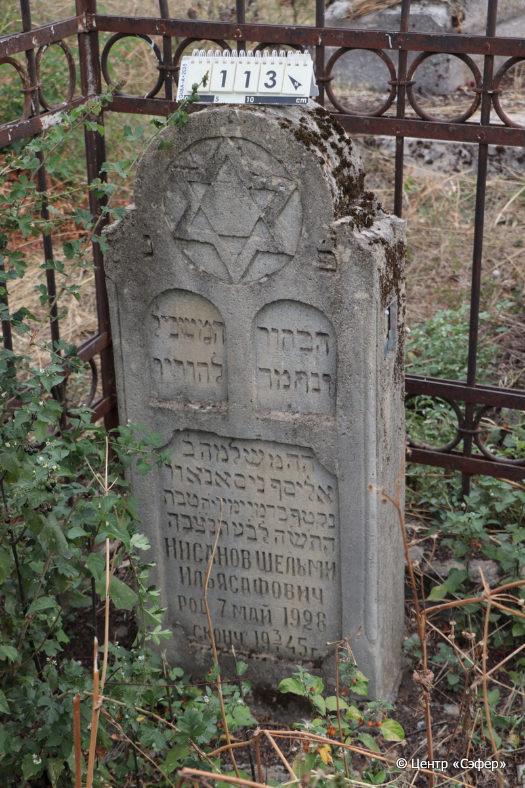
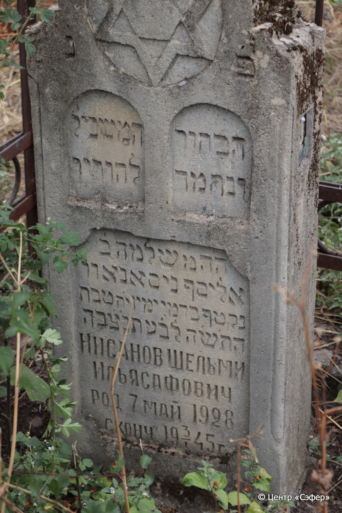
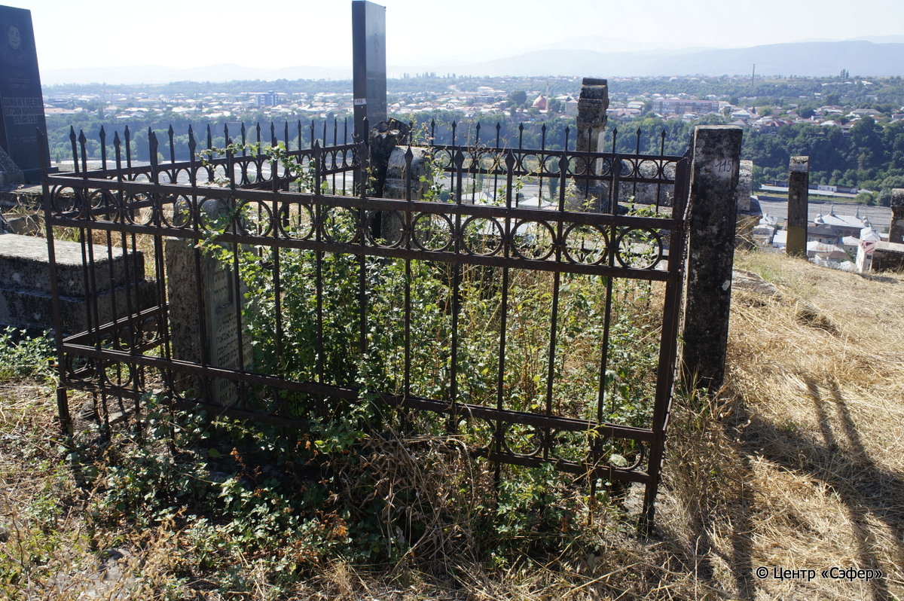

::: {style="font-size: 1em; margin-bottom: 1.2em"}
[Куба (центральное)](../cemeteries/QBA.html) > QBA0113
:::

```{r}
suppressPackageStartupMessages(library(tidyverse))
```


:::: {.columns}

::: {.column width="20%"}

```{r}
#| lightbox:
#|   group: photos





```
:::

::: {.column width="5%"}
:::

::: {.column width="74%"}

::: {.name-style}
НИСАНОВ Шломо, сын Эльясафа (Шельми Ильясаф)
:::

::: {style="font-size: 1.2em;"}
ניסאנאוו שלמה בן אליסף
:::

:::: {.columns}
::: {.column width="5%"}
{width=1.3em}
:::

::: {.column style="width: 40%; padding-left: 0.2em;"}
07.05.1928 /  
:::

::: {.column width="5%"}
{width=1.3em}
:::

::: {.column style="width: 50%; padding-left: 0.2em;"}
03.01.1945 / 18.Te.5705
:::

::::


::: {.panel-tabset}

#### Эпитафия

```{r}
tibble(`Оригинал` = "פ׳ נ׳
הבחור המשכיל
ונחמד להוריו 
ה֗ה֗ מ֗ שלמה ב֗
אליסף ניסאנאוו
נקטף בדמי ימיו י֗ח֗ טבת 
הת֗ש֗ה לב֗ע תנ֗צ֗בה 
Нисанов Шельми 
Ильясафович 
род 7 май 1928
сконч.  3/I 1945 г.",
       `Перевод` = "Здесь покоится
образованный юноша
отрада родителей,
которого зовут г-н Шломо, сын
Эльясафа Нисанова.
Сорван в расцвете дней, 18 тевета
5705 <года> от сотворения мира. Да будет душа его завязана в узле жизни.
Нисанов Шельми
Ильясафович
Родился 7 мая 1928 г.
Скончался 3.01.1945.") |>
  mutate(`Оригинал` = str_split(`Оригинал`, "
"),
         `Перевод` = str_split(`Перевод`, "
")) |>
  unnest_longer(c(`Оригинал`, `Перевод`)) |> 
  mutate(id = 1:n()) |> 
  relocate(id, .before = Перевод) |> 
  rename(` ` = id) |> 
  knitr::kable(align = c("r", "c", "l"))
```

|||
|-|---|
|**Примечания**| |
|**Язык**      |иврит, русский    |
|**Метки**     |юноша, преждевременная смерть, ученик, студент    |
: {tbl-colwidths="[25,75]"}

#### Памятник

|||
|-|---|
|**Тип памятника**   |стела                                                                         |
|**Материал**        |известняк (следы эрозии,разбитая вставка из стекла на правой боковой стороне)                                                     |
|**Размеры**         |115×47×18                                                                        |
|**Тип декора**      |архитектурно-орнаментальный, традиционная символика                                                                        |
|**Элементы декора** |полукруглое завершение со звездой Давида, три ниши для текста, две из которых напоминают скрижали                                                                          |
|**Координаты**      |[41.36973722, 48.50653902](https://www.google.com/maps/place/41.36973722, 48.50653902)                    |
: {tbl-colwidths="[25,75]"}

#### Источник

|||
|-|---|
|**Место хранения**        |Архив полевых исследований Центра «Сэфер»     |
|**Контакты**              |students@sefer.ru    |
|**Ссылка**                |https://sfira.org        |
|**Исходный ID**           |  |
|**Условия использования** |[CC BY-NC 4.0](https://creativecommons.org/licenses/by-nc/4.0/deed.ru)     |
: {tbl-colwidths="[25,75]"}

:::

:::

::::

