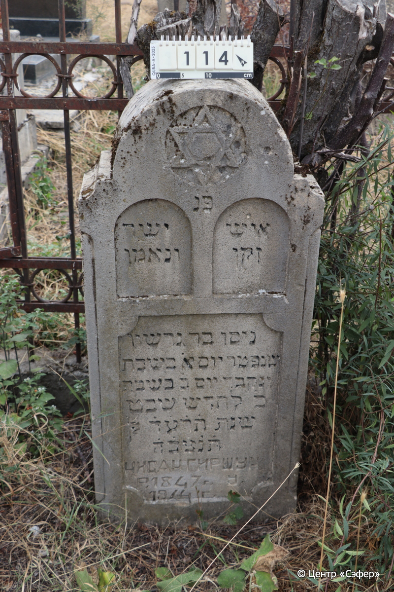
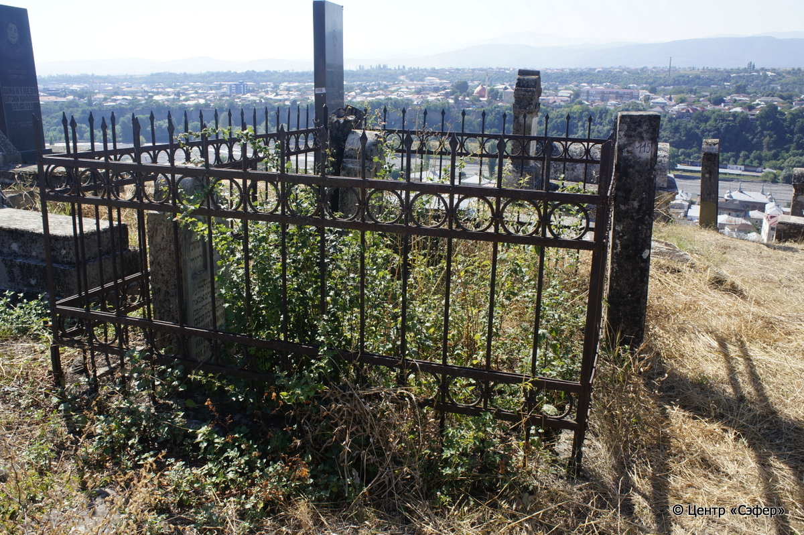

::: {style="font-size: 1em; margin-bottom: 1.2em"}
[Куба (центральное)](../cemeteries/QBA.html) > QBA0114
:::

```{r}
suppressPackageStartupMessages(library(tidyverse))
```


:::: {.columns}

::: {.column width="20%"}

```{r}
#| lightbox:
#|   group: photos




```
:::

::: {.column width="5%"}
:::

::: {.column width="74%"}

::: {.name-style}
Нисан, сын Гершона
:::

::: {style="font-size: 1.2em;"}
ניסן בן גרשון
:::

:::: {.columns}
::: {.column width="5%"}
{width=1.3em}
:::

::: {.column style="width: 40%; padding-left: 0.2em;"}
-.-.1874 /  
:::

::: {.column width="5%"}
{width=1.3em}
:::

::: {.column style="width: 50%; padding-left: 0.2em;"}
-.-.1914 / 20.Sh.5674
:::

::::


::: {.panel-tabset}

#### Эпитафия

```{r}
tibble(`Оригинал` = "פנ

справа
איש
זקן

слева
ישר
ונאמן

по центру
ניסן בר גרשון
שנפטר יום א֗ בשבת
ונקבר יום ב֗ בשבת
כ֗ לחדש שבט
שנת ת֗ר֗ע֗ד֗ לפק
ת֗נ֗צ֗ב֗ה
Нисан Гиршун
р. 1847 г.  у.
1914 г.",
       `Перевод` = "Здесь покоится


человек
пожилой


честный
и преданный


Нисан, сын Гершона,
который скончался в воскресенье
и похоронен в понедельник
20 числа месяца шват,
год 674 по малому исчислению.
Да будет душа его завязана в узле жизни.
Нисан Гиршун
Родился в 1874 г., умер
в 1914 г.") |>
  mutate(`Оригинал` = str_split(`Оригинал`, "
"),
         `Перевод` = str_split(`Перевод`, "
")) |>
  unnest_longer(c(`Оригинал`, `Перевод`)) |> 
  mutate(id = 1:n()) |> 
  relocate(id, .before = Перевод) |> 
  rename(` ` = id) |> 
  knitr::kable(align = c("r", "c", "l"))
```

|||
|-|---|
|**Примечания**| |
|**Язык**      |иврит, русский    |
|**Метки**     |пожилой(-ая)    |
: {tbl-colwidths="[25,75]"}

#### Памятник

|||
|-|---|
|**Тип памятника**   |стела                                                                         |
|**Материал**        |известняк (следы эрозии, сколы)                                                     |
|**Размеры**         |130×52×22                                                                        |
|**Тип декора**      |архитектурно-орнаментальный, традиционная символика                                                                        |
|**Элементы декора** |полукруглое завершение со звездой Давида, три фигурные ниши для текст, две из которых напоминают скрижали                                                                          |
|**Координаты**      |[41.36972143, 48.50654713](https://www.google.com/maps/place/41.36972143, 48.50654713)                    |
: {tbl-colwidths="[25,75]"}

#### Источник

|||
|-|---|
|**Место хранения**        |Архив полевых исследований Центра «Сэфер»     |
|**Контакты**              |students@sefer.ru    |
|**Ссылка**                |https://sfira.org        |
|**Исходный ID**           |  |
|**Условия использования** |[CC BY-NC 4.0](https://creativecommons.org/licenses/by-nc/4.0/deed.ru)     |
: {tbl-colwidths="[25,75]"}

:::

:::

::::

