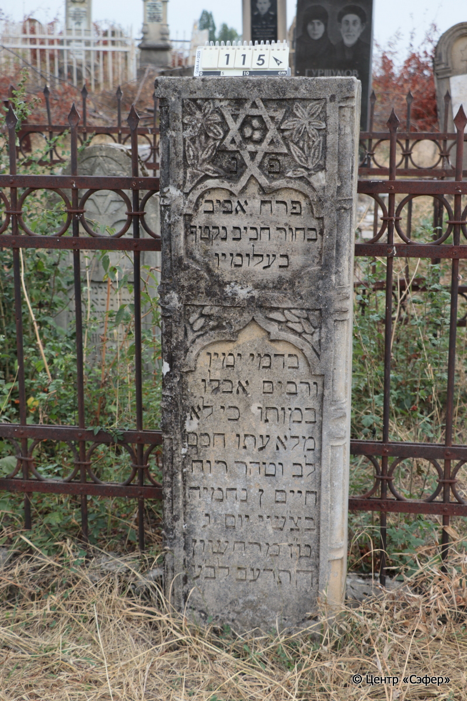
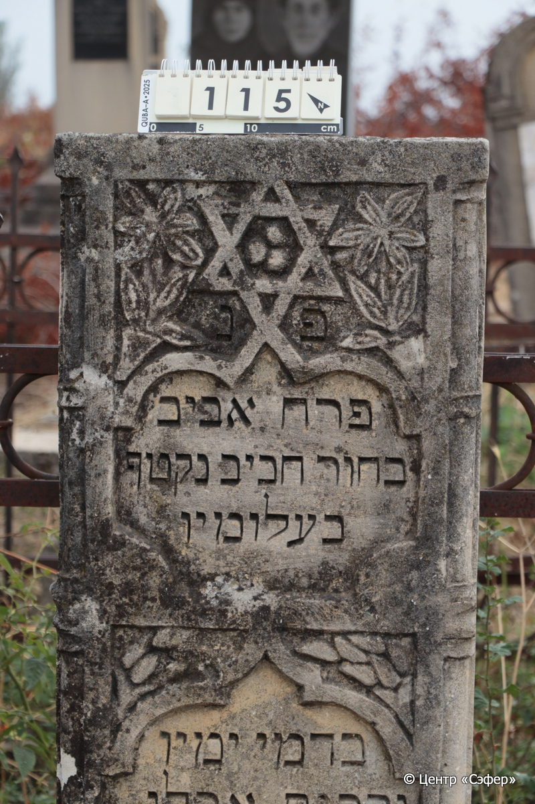
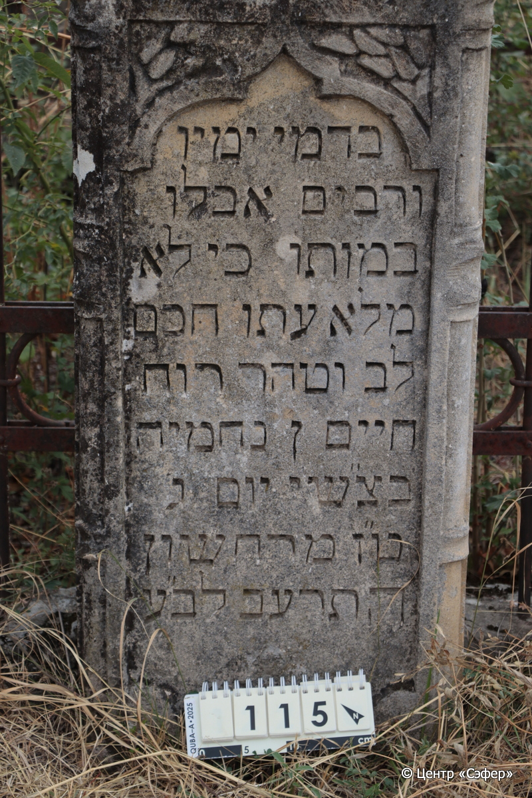

::: {style="font-size: 1em; margin-bottom: 1.2em"}
[Куба (центральное)](../cemeteries/QBA.html) > QBA0115
:::

```{r}
suppressPackageStartupMessages(library(tidyverse))
```


:::: {.columns}

::: {.column width="20%"}

```{r}
#| lightbox:
#|   group: photos





```
:::

::: {.column width="5%"}
:::

::: {.column width="74%"}

::: {.name-style}
Хаим, сын Нехемьи
:::

::: {style="font-size: 1.2em;"}
חיים בן נחמיה
:::

:::: {.columns}
::: {.column width="5%"}
{width=1.3em}
:::

::: {.column style="width: 40%; padding-left: 0.2em;"}
  /  
:::

::: {.column width="5%"}
{width=1.3em}
:::

::: {.column style="width: 50%; padding-left: 0.2em;"}
07.11.1911* / 16.Ch.5672
:::

::::


::: {.panel-tabset}

#### Эпитафия

```{r}
tibble(`Оригинал` = "פנ
פרח אביב 
בחור חביב נקטף
בעלומיו
בדמי ימיו 
ורבים אבלו
במותו כי לא
מלא עתו חכם 
לב וטהר רוח
חיים ן׳ נחמיה 
בצ״שי יום ג֗
ט״ז מרחשון
התרעב לב״ע",
       `Перевод` = "Здесь покоится
весенний цветок,
любимый юноша, сорванный
в юности
в расцвете дней.
Многие скорбят о его
смерти, поскольку не
подошло его время. Мудрый
сердцем и чистый душой,
Хаим, сын Нехемьи,
да упокоится в тени Всемогущего. <Скончался> во вторник,
16 мархешвана
5672 <года> от сотворения мира.") |>
  mutate(`Оригинал` = str_split(`Оригинал`, "
"),
         `Перевод` = str_split(`Перевод`, "
")) |>
  unnest_longer(c(`Оригинал`, `Перевод`)) |> 
  mutate(id = 1:n()) |> 
  relocate(id, .before = Перевод) |> 
  rename(` ` = id) |> 
  knitr::kable(align = c("r", "c", "l"))
```

|||
|-|---|
|**Примечания**| |
|**Язык**      |иврит    |
|**Метки**     |юноша, преждевременная смерть    |
: {tbl-colwidths="[25,75]"}

#### Памятник

|||
|-|---|
|**Тип памятника**   |стела                                                                         |
|**Материал**        |песчаник (следы эрозии, сколы)                                                     |
|**Размеры**         |136×45×19                                                                        |
|**Тип декора**      |архитектурно-орнаментальный, растительный, традиционная символика                                                                        |
|**Элементы декора** |звезда Давида меж двух цветов, две фигурные ниши для текста, между ними - ветви, у основания - три цветка                                                                          |
|**Координаты**      |[41.36972315, 48.50652135](https://www.google.com/maps/place/41.36972315, 48.50652135)                    |
: {tbl-colwidths="[25,75]"}

#### Источник

|||
|-|---|
|**Место хранения**        |Архив полевых исследований Центра «Сэфер»     |
|**Контакты**              |students@sefer.ru    |
|**Ссылка**                |https://sfira.org        |
|**Исходный ID**           |  |
|**Условия использования** |[CC BY-NC 4.0](https://creativecommons.org/licenses/by-nc/4.0/deed.ru)     |
: {tbl-colwidths="[25,75]"}

:::

:::

::::

