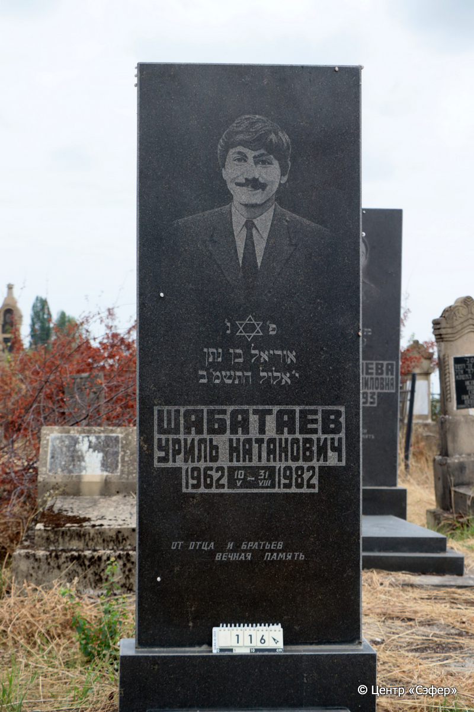
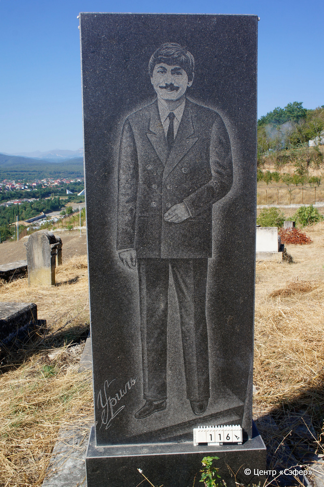
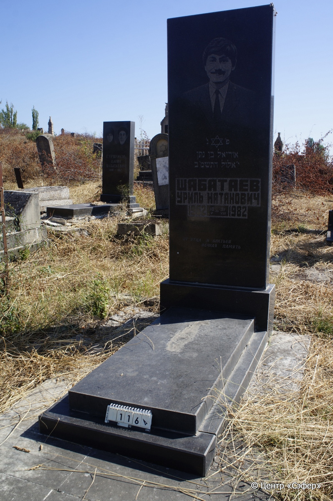

::: {style="font-size: 1em; margin-bottom: 1.2em"}
[Куба (центральное)](../cemeteries/QBA.html) > QBA0116
:::

```{r}
suppressPackageStartupMessages(library(tidyverse))
```


:::: {.columns}

::: {.column width="20%"}

```{r}
#| lightbox:
#|   group: photos





```
:::

::: {.column width="5%"}
:::

::: {.column width="74%"}

::: {.name-style}
ШАБАТАЕВ Уриэль, сын Натана (Уриль Натанович)
:::

::: {style="font-size: 1.2em;"}
אוריאל בן נתן
:::

:::: {.columns}
::: {.column width="5%"}
{width=1.3em}
:::

::: {.column style="width: 40%; padding-left: 0.2em;"}
10.05.1962 /  
:::

::: {.column width="5%"}
{width=1.3em}
:::

::: {.column style="width: 50%; padding-left: 0.2em;"}
-.08.1982 / 10.El.5742
:::

::::


::: {.panel-tabset}

#### Эпитафия

```{r}
tibble(`Оригинал` = "лицевая сторона
פ״ נ״
אוריאל בן נתן 
י״ אלול התשמ״ב 
Шабатаев 
Уриль Натанович
1962 10/V – 31/VIII 1982
от отца и братьев 
вечная память

обратная сторона
Уриль",
       `Перевод` = "
Здесь покоится
Уриэль, сын Натана
10 элула 5742
Шабатаев
Уриль Натанович
10.05.1962 – 31.08.1982
От отца и братьев
вечная память

 
Уриль") |>
  mutate(`Оригинал` = str_split(`Оригинал`, "
"),
         `Перевод` = str_split(`Перевод`, "
")) |>
  unnest_longer(c(`Оригинал`, `Перевод`)) |> 
  mutate(id = 1:n()) |> 
  relocate(id, .before = Перевод) |> 
  rename(` ` = id) |> 
  knitr::kable(align = c("r", "c", "l"))
```

|||
|-|---|
|**Примечания**|Григорианская дата смерти, видимо, записана с ошибкой: в августе 30 дней.|
|**Язык**      |иврит, русский    |
|**Метки**     |     |
: {tbl-colwidths="[25,75]"}

#### Памятник

|||
|-|---|
|**Тип памятника**   |L-образный                                                                         |
|**Материал**        |гранит (темный гранит, цементный раствор, стоит на площадке из серых мраморных плит)                                                     |
|**Размеры**         |210×78×27  --- стела; 10×61×131  --- плита; 10×78×138  --- основание                                                                        |
|**Тип декора**      |традиционная символика                                                                        |
|**Элементы декора** |портрет, звезда Давида                                                                          |
|**Координаты**      |[41.36970869, 48.50656741](https://www.google.com/maps/place/41.36970869, 48.50656741)                    |
: {tbl-colwidths="[25,75]"}

#### Источник

|||
|-|---|
|**Место хранения**        |Архив полевых исследований Центра «Сэфер»     |
|**Контакты**              |students@sefer.ru    |
|**Ссылка**                |https://sfira.org        |
|**Исходный ID**           |  |
|**Условия использования** |[CC BY-NC 4.0](https://creativecommons.org/licenses/by-nc/4.0/deed.ru)     |
: {tbl-colwidths="[25,75]"}

:::

:::

::::

