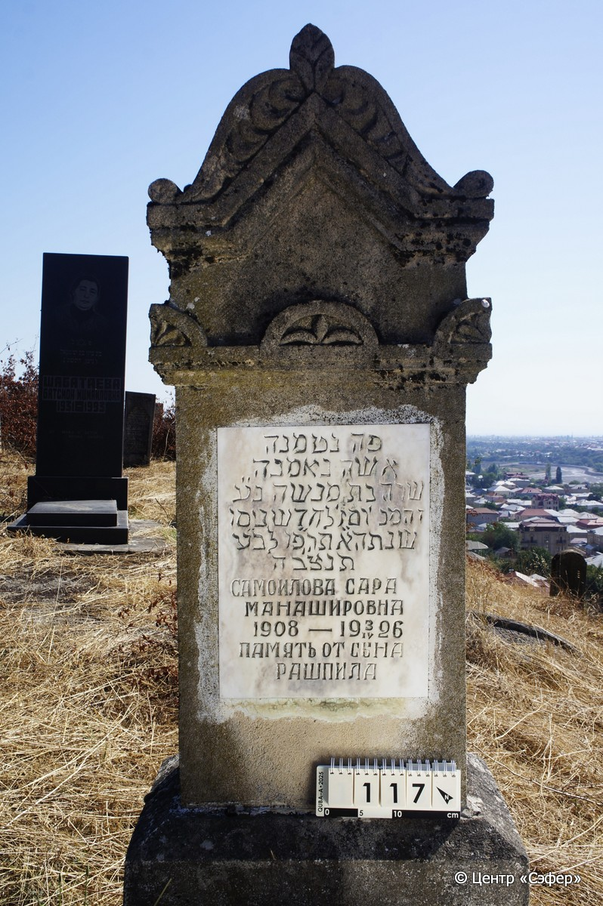
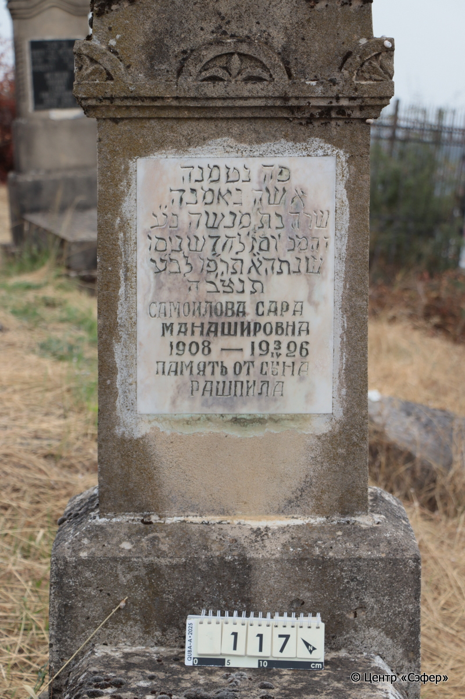
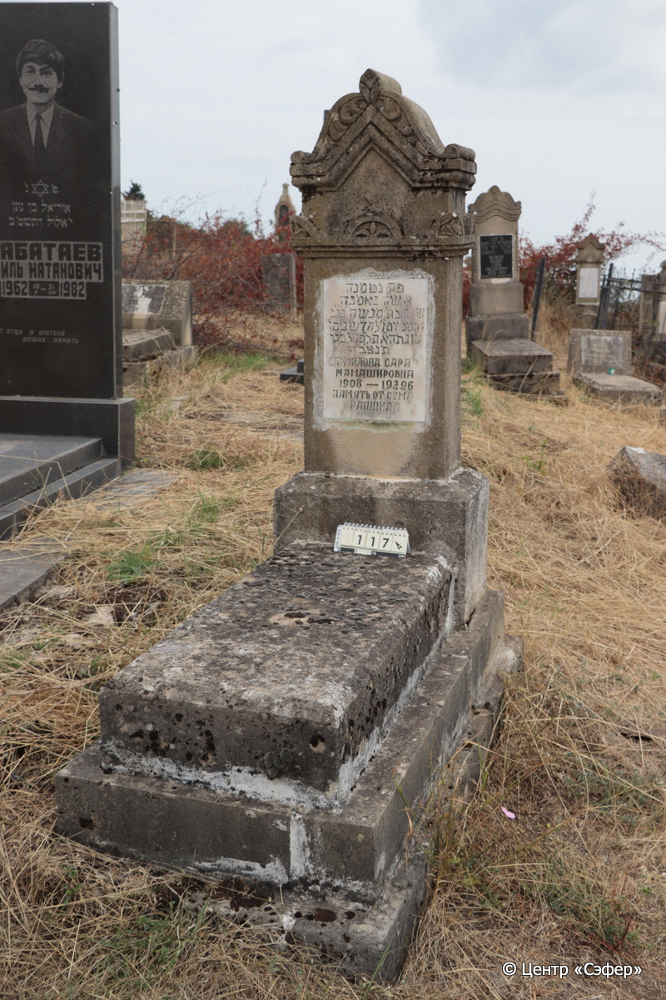

::: {style="font-size: 1em; margin-bottom: 1.2em"}
[Куба (центральное)](../cemeteries/QBA.html) > QBA0117
:::

```{r}
suppressPackageStartupMessages(library(tidyverse))
```


:::: {.columns}

::: {.column width="20%"}

```{r}
#| lightbox:
#|   group: photos





```
:::

::: {.column width="1.5em"}
:::

::: {.column width="74%"}

::: {.custom-frame}
::: {.name-ru-style}
**САМОИЛОВА Сара, дочь Менаше (Манашировна)**
:::

::: {.name-he-style}
שרה בת מנשה
:::

:::: {.columns .date-panel style="display: flex; align-items: top; margin-top: 0.8em;"}
::: {.column .text-center style="width: fit-content; flex: 0 0 auto;"}
{width=1.4em .nolightbox}
:::

::: {.column style="flex: 0 0 auto; width: fit-content; padding-left: 0.8em; padding-right: 3.5em;"}
-.-.1908 

[--]{style="color: #929292"}
:::

::: {.column .text-center style="width: fit-content; flex: 0 0 auto;"}
{width=1.4em .nolightbox}
:::

::: {.column style="flex: 0 0 auto; width: fit-content; padding-left: 0.8em;"}
03.04.1926 

[7.Ni.5686]{style="color: #929292"}
:::

::::

:::

::: {.panel-tabset}

#### Эпитафия

```{r}
tibble(`Оригинал` = "פה נטמנה 
אשה נאמנה 
שרה בת מנשה נ״ע
והמכ יום ז׳ לחדש ניסן 
שנת הא״ תר״פו לב׳ע׳
תנצ״בה
Самоилова Сара
Манашировна
1908 – 3/IV 1926
Память от сына 
Рашпила",
       `Перевод` = "Здесь похоронена
преданная женщина,
Сара, дочь Менаше, да упокоится в раю,
и будет благословен его покой. <Скончалась> на 7 день месяца нисан,
год 5686 от сотворения мира.
Да будет душа его завязана в узле жизни.
Самоилова Сара
Манашировна
1908 – 3.04.1926
Память от сына
Рашпила") |>
  mutate(`Оригинал` = str_split(`Оригинал`, "
"),
         `Перевод` = str_split(`Перевод`, "
")) |>
  unnest_longer(c(`Оригинал`, `Перевод`)) |> 
  mutate(id = 1:n()) |> 
  relocate(id, .before = Перевод) |> 
  rename(` ` = id) |> 
  knitr::kable(align = c("r", "c", "l"))
```

---

:::: {.custom-table-wrap}
::: {.list-table .borderless header-rows=0 aligns="l,l" tbl-colwidths="[21,79]"}
- - Примечания
  -  

- - Язык
  - иврит, русский

- - Метки
  -  

:::
::::

#### Памятник

:::: {.custom-table-wrap}
::: {.list-table .borderless header-rows=0 aligns="l,l" tbl-colwidths="[21,79]"}
- - Тип памятника
  - L-образный

- - Материал
  - песчаник, известняк (цементный раствор, мраморная вставка для текста, следы эрозии)

- - Размеры
  - 160×58×37  --- стела; 22×50×112  --- плита; 36×81×181  --- основание

- - Тип декора
  - архитектурно-орнаментальный, растительный

- - Элементы декора
  - треугольное завершение с цветочным орнаментом, полурозетки с листьями по периметру

- - Координаты
  - 41.36968589, 48.50656103 [Показать на карте](https://www.google.com/maps/place/41.36968589, 48.50656103){style="margin-left: 1em"}

:::
::::

#### Источник

:::: {.custom-table-wrap}
::: {.list-table .borderless header-rows=0 aligns="l,l" tbl-colwidths="[21,79]"}
- - Место хранения
  - Архив полевых исследований Центра «Сэфер»

- - Контакты
  - students@sefer.ru

- - Ссылка
  - [https://sfira.org](https://sfira.org)

- - Исходный ID
  -  

- - Условия использования
  - [CC BY-NC 4.0](https://creativecommons.org/licenses/by-nc/4.0/deed.ru)

:::
::::

:::

:::

:::

