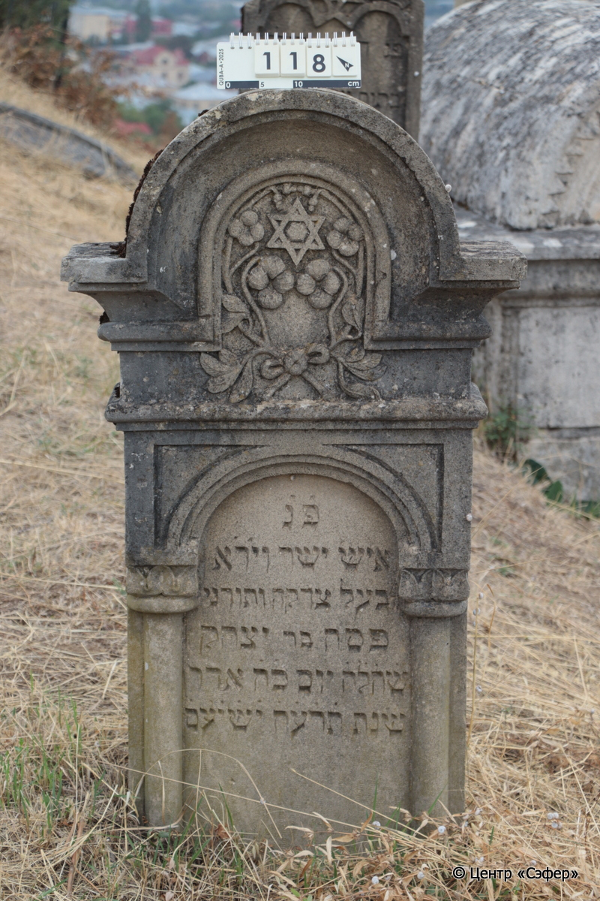

::: {style="font-size: 1em; margin-bottom: 1.2em"}
[Куба (центральное)](../cemeteries/QBA.html) > QBA0118
:::

```{r}
suppressPackageStartupMessages(library(tidyverse))
```


:::: {.columns}

::: {.column width="20%"}

```{r}
#| lightbox:
#|   group: photos



```
:::

::: {.column width="5%"}
:::

::: {.column width="74%"}

::: {.name-style}
Песах, сын Ицхака (Писах)
:::

::: {style="font-size: 1.2em;"}
פסח בן יצחק
:::

:::: {.columns}
::: {.column width="5%"}
{width=1.3em}
:::

::: {.column style="width: 40%; padding-left: 0.2em;"}
  /  
:::

::: {.column width="5%"}
{width=1.3em}
:::

::: {.column style="width: 50%; padding-left: 0.2em;"}
12.03.1918* / 28.Ad.5678
:::

::::


::: {.panel-tabset}

#### Эпитафия

```{r}
tibble(`Оригинал` = "פ֗נ֗
איש ישר וי֗ר֗א
בעל צדקה ותורני
פסח בר יצחק
ש֗ח֗ל֗ח֗ יום כ֗ח֗ אדר 
שנת ת֗ר֗ע֗ח֗ י֗ש֗י֗ע֗ם֗",
       `Перевод` = "Здесь покоится
человек честный и богобоязненный,
милостивый и сведущий в Писании,
Песах, сын Ицхака,
оставивший жизнь живущим в день 28 адара,
год {5}678. Обретёт покой и отдохнёт на своём ложе*.") |>
  mutate(`Оригинал` = str_split(`Оригинал`, "
"),
         `Перевод` = str_split(`Перевод`, "
")) |>
  unnest_longer(c(`Оригинал`, `Перевод`)) |> 
  mutate(id = 1:n()) |> 
  relocate(id, .before = Перевод) |> 
  rename(` ` = id) |> 
  knitr::kable(align = c("r", "c", "l"))
```

|||
|-|---|
|**Примечания**|*Цит. Ис 57:2|
|**Язык**      |иврит    |
|**Метки**     |знаток Писания    |
: {tbl-colwidths="[25,75]"}

#### Памятник

|||
|-|---|
|**Тип памятника**   |стела                                                                         |
|**Материал**        |известняк (следы эрозии, сколы)                                                     |
|**Размеры**         |125×70×29                                                                        |
|**Тип декора**      |архитектурно-орнаментальный, растительный, традиционная символика                                                                        |
|**Элементы декора** |полукруглое завершение, звезда Давида в портале, заполненном цветочным орнаментом, портал с текстом, оформленный с двух сторон полуколоннами с листьями на капителях                                                                          |
|**Координаты**      |[41.3696583, 48.50650252](https://www.google.com/maps/place/41.3696583, 48.50650252)                    |
: {tbl-colwidths="[25,75]"}

#### Источник

|||
|-|---|
|**Место хранения**        |Архив полевых исследований Центра «Сэфер»     |
|**Контакты**              |students@sefer.ru    |
|**Ссылка**                |https://sfira.org        |
|**Исходный ID**           |  |
|**Условия использования** |[CC BY-NC 4.0](https://creativecommons.org/licenses/by-nc/4.0/deed.ru)     |
: {tbl-colwidths="[25,75]"}

:::

:::

::::

