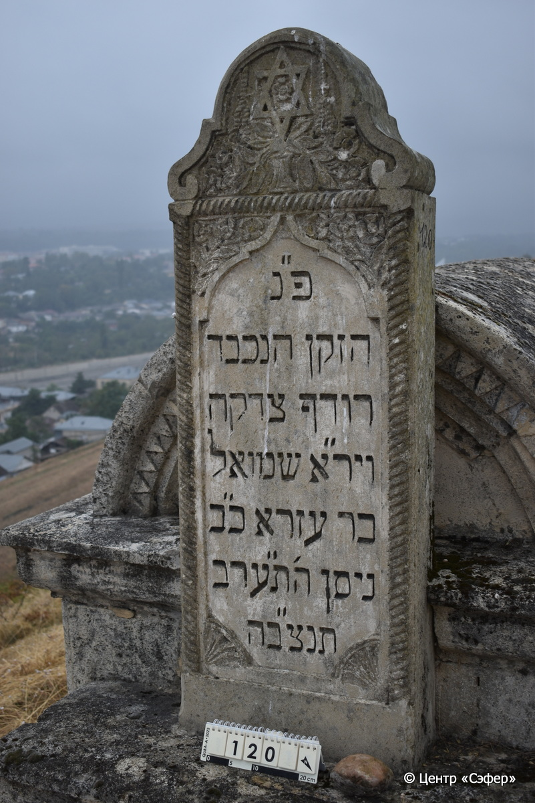
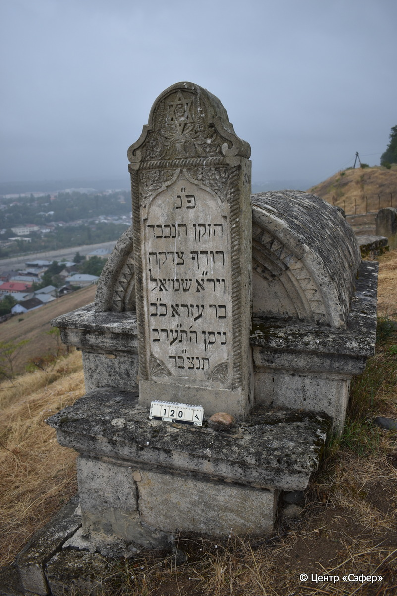
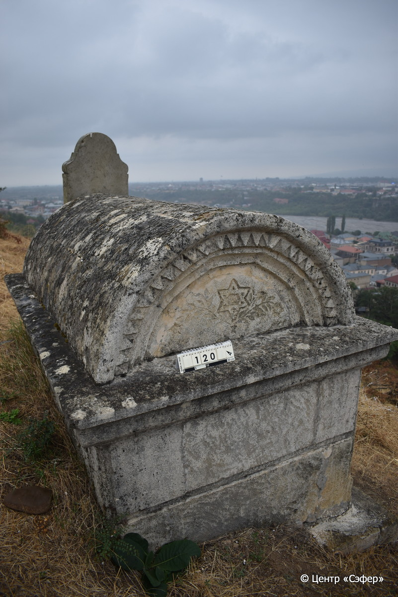

::: {style="font-size: 1em; margin-bottom: 1.2em"}
[Куба (центральное)](../cemeteries/QBA.html) > QBA0120
:::

```{r}
suppressPackageStartupMessages(library(tidyverse))
```


:::: {.columns}

::: {.column width="20%"}

```{r}
#| lightbox:
#|   group: photos





```
:::

::: {.column width="5%"}
:::

::: {.column width="74%"}

::: {.name-style}
Шмуэль, сын Эзры (Шамаил)
:::

::: {style="font-size: 1.2em;"}
שמואל בן עזרא
:::

:::: {.columns}
::: {.column width="5%"}
{width=1.3em}
:::

::: {.column style="width: 40%; padding-left: 0.2em;"}
  /  
:::

::: {.column width="5%"}
{width=1.3em}
:::

::: {.column style="width: 50%; padding-left: 0.2em;"}
09.04.1912* / 22.Ni.5672
:::

::::


::: {.panel-tabset}

#### Эпитафия

```{r}
tibble(`Оригинал` = "פ״נ
הזקן הנכבד 
רודף צדקה 
ויר״א שמואל 
בר עזרא כ״ב
ניסן ה׳ת״ערב 
תנצ״בה",
       `Перевод` = "Здесь покоится
уважаемый пожилой человек,
правдолюбивый
и богобоязненный, Шмуэль,
сын Эзры. <Скончался> 22
нисана 5672 <года>.
Да будет душа его завязана в узле жизни.") |>
  mutate(`Оригинал` = str_split(`Оригинал`, "
"),
         `Перевод` = str_split(`Перевод`, "
")) |>
  unnest_longer(c(`Оригинал`, `Перевод`)) |> 
  mutate(id = 1:n()) |> 
  relocate(id, .before = Перевод) |> 
  rename(` ` = id) |> 
  knitr::kable(align = c("r", "c", "l"))
```

|||
|-|---|
|**Примечания**| |
|**Язык**      |иврит    |
|**Метки**     |пожилой(-ая)    |
: {tbl-colwidths="[25,75]"}

#### Памятник

|||
|-|---|
|**Тип памятника**   |шатёр (охель)                                                                         |
|**Материал**        |песчаник, ракушечник (цементный раствор, следы эрозии)                                                     |
|**Размеры**         |143×53×19  --- стела; 60×131×213  --- саркофаг; 133×157×300  --- основание                                                                        |
|**Тип декора**      |архитектурно-орнаментальный, растительный, традиционная символика                                                                        |
|**Элементы декора** |на стеле – полукруглое завершение с волютами по бокам, звезда Давида с ветвями и цветами, фигурная ниша для текста, цветочный орнамент в промежутках, витые полуколонны на передних гранях; на саркофаге – зубчатый край                                                                          |
|**Координаты**      |[41.36966149, 48.5065765](https://www.google.com/maps/place/41.36966149, 48.5065765)                    |
: {tbl-colwidths="[25,75]"}

#### Источник

|||
|-|---|
|**Место хранения**        |Архив полевых исследований Центра «Сэфер»     |
|**Контакты**              |students@sefer.ru    |
|**Ссылка**                |https://sfira.org        |
|**Исходный ID**           |  |
|**Условия использования** |[CC BY-NC 4.0](https://creativecommons.org/licenses/by-nc/4.0/deed.ru)     |
: {tbl-colwidths="[25,75]"}

:::

:::

::::

