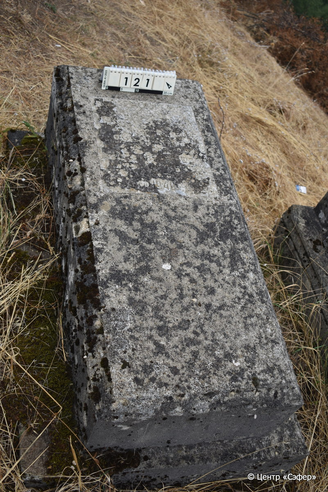
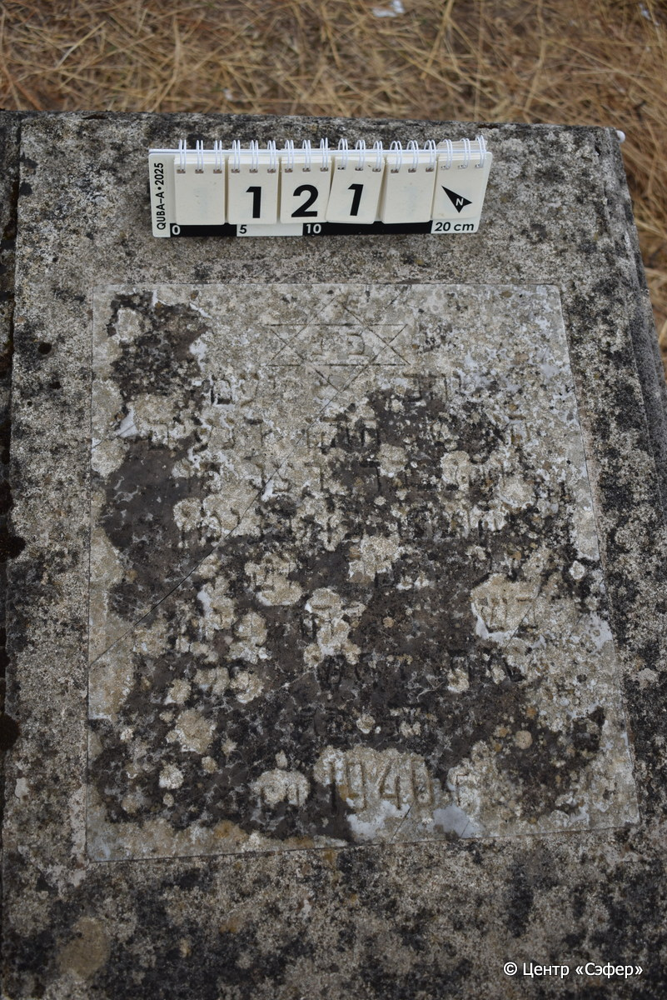
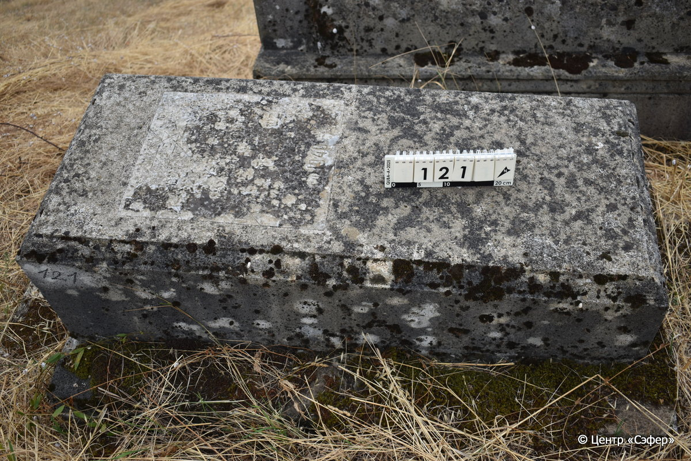

::: {style="font-size: 1em; margin-bottom: 1.2em"}
[Куба (центральное)](../cemeteries/QBA.html) > QBA0121
:::

```{r}
suppressPackageStartupMessages(library(tidyverse))
```


:::: {.columns}

::: {.column width="20%"}

```{r}
#| lightbox:
#|   group: photos





```
:::

::: {.column width="5%"}
:::

::: {.column width="74%"}

::: {.name-style}
Йехонатан, сын Беньямина (Ювнотон)
:::

::: {style="font-size: 1.2em;"}
יהונתן בן בנימן
:::

:::: {.columns}
::: {.column width="5%"}
{width=1.3em}
:::

::: {.column style="width: 40%; padding-left: 0.2em;"}
  /  
:::

::: {.column width="5%"}
{width=1.3em}
:::

::: {.column style="width: 50%; padding-left: 0.2em;"}
-.-.1940 / 13.Si.5700
:::

::::


::: {.panel-tabset}

#### Эпитафия

```{r}
tibble(`Оригинал` = "פנ
יחב יעמ
האיש הזקן הנעים
והנכבד רצ״ו מ֗ו
יהונתן בן בנימן
נ֗ע והמ֗כ יום ד
בש֗ יג לחד סיון
שנת התש לפק
תנצבה 
ск 1940 г.",
       `Перевод` = "Здесь покоится –
пусть торжествуют праведники во славе и радуются на ложах своих* – 
пожилой человек, милый
и уважаемый, правдолюбивый и милостивый, наш учитель
Йехонатан, сын Беньямина,
да упокоится в раю, и будет благословен его покой. <Скончался> в среду
13 числа месяца сиван,
год 5700 по малому исчислению.
Да будет его душа завязана в узле жизни.
Скончался в 1940 г.") |>
  mutate(`Оригинал` = str_split(`Оригинал`, "
"),
         `Перевод` = str_split(`Перевод`, "
")) |>
  unnest_longer(c(`Оригинал`, `Перевод`)) |> 
  mutate(id = 1:n()) |> 
  relocate(id, .before = Перевод) |> 
  rename(` ` = id) |> 
  knitr::kable(align = c("r", "c", "l"))
```

|||
|-|---|
|**Примечания**|*Цит. Пс 149:2|
|**Язык**      |иврит, русский    |
|**Метки**     |пожилой(-ая)    |
: {tbl-colwidths="[25,75]"}

#### Памятник

|||
|-|---|
|**Тип памятника**   |плита/саркофаг                                                                         |
|**Материал**        |известняк, мрамор (мраморная вставка для текста)                                                     |
|**Размеры**         |34×54×124  --- плита; 42×91×195  --- основание                                                                        |
|**Тип декора**      |традиционная символика                                                                        |
|**Элементы декора** |звезда Давида на вставке                                                                          |
|**Координаты**      |[41.36964086, 48.50653333](https://www.google.com/maps/place/41.36964086, 48.50653333)                    |
: {tbl-colwidths="[25,75]"}

#### Источник

|||
|-|---|
|**Место хранения**        |Архив полевых исследований Центра «Сэфер»     |
|**Контакты**              |students@sefer.ru    |
|**Ссылка**                |https://sfira.org        |
|**Исходный ID**           |  |
|**Условия использования** |[CC BY-NC 4.0](https://creativecommons.org/licenses/by-nc/4.0/deed.ru)     |
: {tbl-colwidths="[25,75]"}

:::

:::

::::

