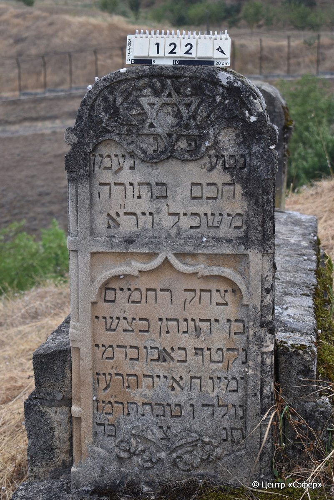
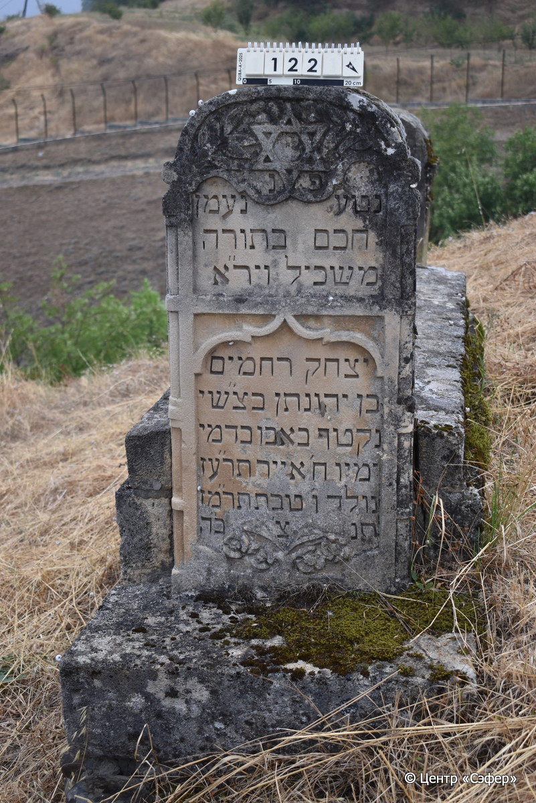
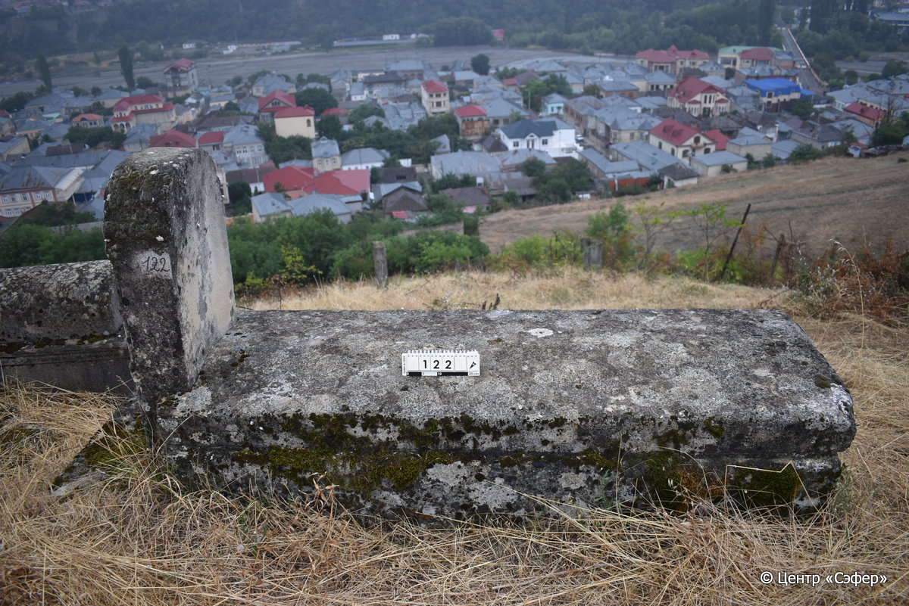

::: {style="font-size: 1em; margin-bottom: 1.2em"}
[Куба (центральное)](../cemeteries/QBA.html) > QBA0122
:::

```{r}
suppressPackageStartupMessages(library(tidyverse))
```


:::: {.columns}

::: {.column width="20%"}

```{r}
#| lightbox:
#|   group: photos





```
:::

::: {.column width="5%"}
:::

::: {.column width="74%"}

::: {.name-style}
Ицхак Рахамим, сын Йехонатана (Исхог)
:::

::: {style="font-size: 1.2em;"}
יצחק רחמים בן יהונתן
:::

:::: {.columns}
::: {.column width="5%"}
{width=1.3em}
:::

::: {.column style="width: 40%; padding-left: 0.2em;"}
02.01.1887* / 6.Te.5647
:::

::: {.column width="5%"}
{width=1.3em}
:::

::: {.column style="width: 50%; padding-left: 0.2em;"}
30.04.1917* / 8.Iy.5677
:::

::::


::: {.panel-tabset}

#### Эпитафия

```{r}
tibble(`Оригинал` = "פנ
נטע נעמן
חכם בתורה
משכיל ויר״א
יצחק רחמים
בן יהונתן בצ״שי
נקטך באבו בדמי
ימיו ח׳ אייר תר״עז
נולד ו׳ טבת תר״מז
ת״נ צ׳ ב״ה",
       `Перевод` = "Здесь покоится
прекрасный саженец,
знаток Торы,
просвещённый и богобоязненный,
Ицхак Рахамим,
сын Йехонатана, да упокоится в тени Всемогущего.
Сорван преждевременно, в расцвете
дней, 8 ияра {5}677 <года>.
Родился 6 тевета {5}647 <года>.
Да будет душа его завязана в узле жизни.") |>
  mutate(`Оригинал` = str_split(`Оригинал`, "
"),
         `Перевод` = str_split(`Перевод`, "
")) |>
  unnest_longer(c(`Оригинал`, `Перевод`)) |> 
  mutate(id = 1:n()) |> 
  relocate(id, .before = Перевод) |> 
  rename(` ` = id) |> 
  knitr::kable(align = c("r", "c", "l"))
```

|||
|-|---|
|**Примечания**| |
|**Язык**      |иврит    |
|**Метки**     |знаток Писания, просвещенный, преждевременная смерть    |
: {tbl-colwidths="[25,75]"}

#### Памятник

|||
|-|---|
|**Тип памятника**   |L-образный                                                                         |
|**Материал**        |песчаник, известняк (следы эрозии, необработанные камни в основании)                                                     |
|**Размеры**         |104×52×20  --- стела; 61×73×217  --- плита; 23×96×270  --- основание                                                                        |
|**Тип декора**      |архитектурно-орнаментальный, растительный, традиционная символика                                                                        |
|**Элементы декора** |полукруглое завершение стелы, звезда Давида с ветвями по бокам, цветы у основания, две фигурные ниши с текстом, фигурное оформление лицевых граней                                                                          |
|**Координаты**      |[41.36963872, 48.50650486](https://www.google.com/maps/place/41.36963872, 48.50650486)                    |
: {tbl-colwidths="[25,75]"}

#### Источник

|||
|-|---|
|**Место хранения**        |Архив полевых исследований Центра «Сэфер»     |
|**Контакты**              |students@sefer.ru    |
|**Ссылка**                |https://sfira.org        |
|**Исходный ID**           |  |
|**Условия использования** |[CC BY-NC 4.0](https://creativecommons.org/licenses/by-nc/4.0/deed.ru)     |
: {tbl-colwidths="[25,75]"}

:::

:::

::::

