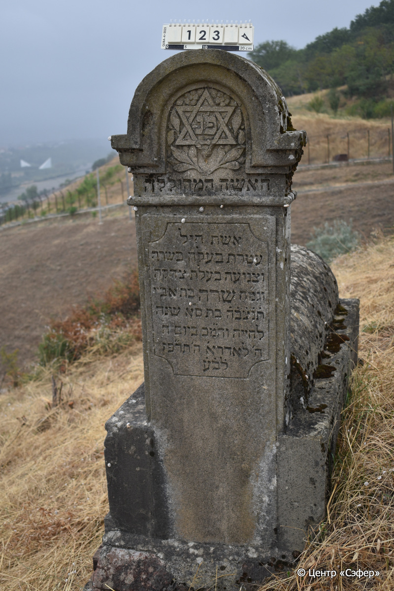
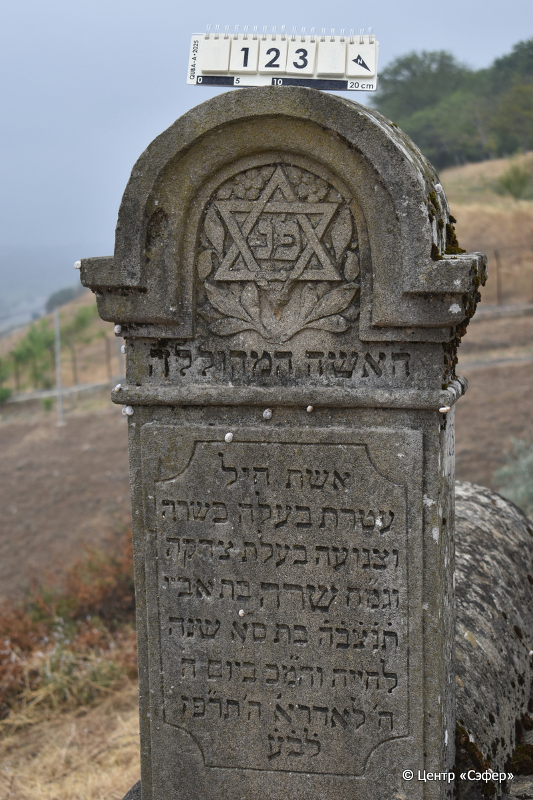
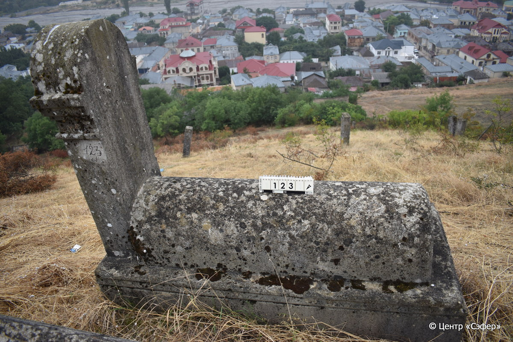

::: {style="font-size: 1em; margin-bottom: 1.2em"}
[Куба (центральное)](../cemeteries/QBA.html) > QBA0123
:::

```{r}
suppressPackageStartupMessages(library(tidyverse))
```


:::: {.columns}

::: {.column width="20%"}

```{r}
#| lightbox:
#|   group: photos





```
:::

::: {.column width="5%"}
:::

::: {.column width="74%"}

::: {.name-style}
Сара, дочь Абайи
:::

::: {style="font-size: 1.2em;"}
שרה בת אביי
:::

:::: {.columns}
::: {.column width="5%"}
{width=1.3em}
:::

::: {.column style="width: 40%; padding-left: 0.2em;"}
  /  
:::

::: {.column width="5%"}
{width=1.3em}
:::

::: {.column style="width: 50%; padding-left: 0.2em;"}
  / 8.Ad1.5687
:::

::::


::: {.panel-tabset}

#### Эпитафия

```{r}
tibble(`Оригинал` = "פ׳נ׳
האשה המהוללה
אשת חיל
עטרת בעלה כשרה
וצנועה בעלת צדקה
וגמ״ח שרה בת אביי 
ת֗נ֗צ֗ב֗ה֗ בת ס֗א שנה
לחייה והמ֗כ ביום ה׳
ח׳ לאדר א׳ ה׳ תר״פז
ל֗ב֗ע֗",
       `Перевод` = "Здесь покоится
женщина, прославлена
добродетельная жена,
венец мужа своего*, праведная
и скромная, щедрая
и воздающая милость, Сара, дочь Абайи,
да будет душа её завязана в узле жизни. <Скончалась на> 61 году
жизни, да будет благословен её покой, в четверг,
8 адара I 5687 <года>
от сотворения мира.") |>
  mutate(`Оригинал` = str_split(`Оригинал`, "
"),
         `Перевод` = str_split(`Перевод`, "
")) |>
  unnest_longer(c(`Оригинал`, `Перевод`)) |> 
  mutate(id = 1:n()) |> 
  relocate(id, .before = Перевод) |> 
  rename(` ` = id) |> 
  knitr::kable(align = c("r", "c", "l"))
```

|||
|-|---|
|**Примечания**| |
|**Язык**      |иврит    |
|**Метки**     |     |
: {tbl-colwidths="[25,75]"}

#### Памятник

|||
|-|---|
|**Тип памятника**   |L-образный                                                                         |
|**Материал**        |известняк, кирпич (следы эрозии, в основании кирпичи, цементный раствор)                                                     |
|**Размеры**         |150×53×24  --- стела; 41×51×133  --- Саркофаг; 100×92×240  --- основание                                                                        |
|**Тип декора**      |архитектурно-орнаментальный, растительный, традиционная символика                                                                        |
|**Элементы декора** |полукруглое завершение со звездой Давида в центре, ветви по сторонам, рамка для текста                                                                          |
|**Координаты**      |[41.36963098, 48.50653207](https://www.google.com/maps/place/41.36963098, 48.50653207)                    |
: {tbl-colwidths="[25,75]"}

#### Источник

|||
|-|---|
|**Место хранения**        |Архив полевых исследований Центра «Сэфер»     |
|**Контакты**              |students@sefer.ru    |
|**Ссылка**                |https://sfira.org        |
|**Исходный ID**           |  |
|**Условия использования** |[CC BY-NC 4.0](https://creativecommons.org/licenses/by-nc/4.0/deed.ru)     |
: {tbl-colwidths="[25,75]"}

:::

:::

::::

