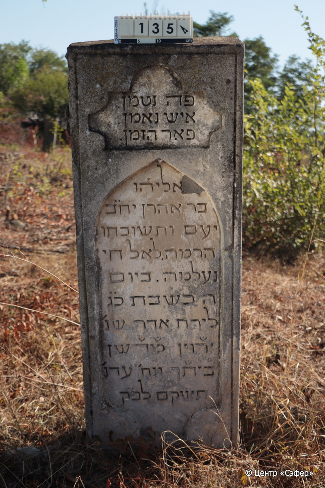
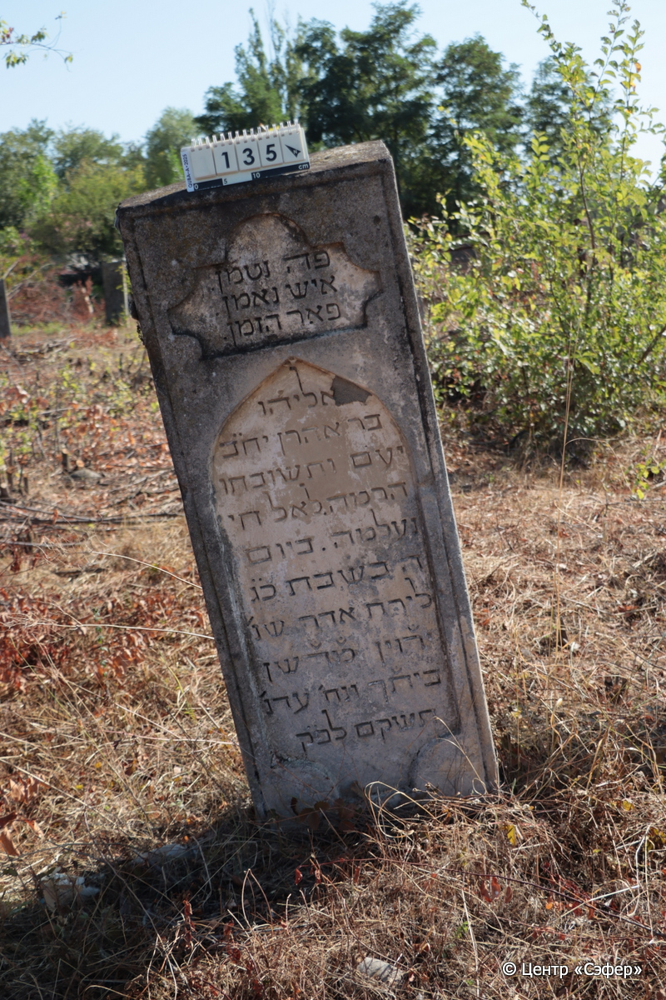

::: {style="font-size: 1em; margin-bottom: 1.2em"}
[Куба (центральное)](../cemeteries/QBA.html) > QBA0135
:::

```{r}
suppressPackageStartupMessages(library(tidyverse))
```


:::: {.columns}

::: {.column width="20%"}

```{r}
#| lightbox:
#|   group: photos




```
:::

::: {.column width="5%"}
:::

::: {.column width="74%"}

::: {.name-style}
Элияху, сын Аарона (Илягу)
:::

::: {style="font-size: 1.2em;"}
אליהו בן אהרן
:::

:::: {.columns}
::: {.column width="5%"}
{width=1.3em}
:::

::: {.column style="width: 40%; padding-left: 0.2em;"}
  /  
:::

::: {.column width="5%"}
{width=1.3em}
:::

::: {.column style="width: 50%; padding-left: 0.2em;"}
20.03.1884* / 23.Ad.5644
:::

::::


::: {.panel-tabset}

#### Эпитафия

```{r}
tibble(`Оригинал` = "פה נטמן.
איש נאמן.
פאר הזמן.
אליהו
בר אהרן יח״ב
יע׳ם ותשובתו 
הרמה. לאל חי
נעלמה. ביום 
ה׳ בשבת כ״ג
לירח אדר שנ׳
יר֗וין מ֗ד֗שן
בית֗ך ונח׳ עדנ׳
תשקם לפ״ק",
       `Перевод` = "Здесь покоится
преданный человек,
прославленный временем,
Элияху,
сын Аарона. Пусть торжествуют праведники во славе
и радуются на ложах своих*. Он вернулся
в Раму**, к Всевышнему жизнь
отошла в 
четверг, 23 <числа>
месяца адар, год
насыщаются яствами
дома Твоего, ты поишь их
потоками сладости Твоей*** {644}, по малому исчислению.") |>
  mutate(`Оригинал` = str_split(`Оригинал`, "
"),
         `Перевод` = str_split(`Перевод`, "
")) |>
  unnest_longer(c(`Оригинал`, `Перевод`)) |> 
  mutate(id = 1:n()) |> 
  relocate(id, .before = Перевод) |> 
  rename(` ` = id) |> 
  knitr::kable(align = c("r", "c", "l"))
```

|||
|-|---|
|**Примечания**|Первая часть эпитафии составлена в стихотворной форме.
*Цит. Пс 149:2
** Цит. 1 Цар 7:17 – в библейском тексте описывается возвращение пророка Шмуэля в свой родной город Раму. Этимологически название города происходит от возвышенности или высокого места. Таким образом возвращение в Раму может ассоциироваться с возвращением к Всевышнему.
*** Год смерти записан с помощью хронограммы в виде библейского стиха Пс 36:9, в коротом числовое значение отмеченных букв соответствует 644.|
|**Язык**      |иврит    |
|**Метки**     |     |
: {tbl-colwidths="[25,75]"}

#### Памятник

|||
|-|---|
|**Тип памятника**   |L-образный                                                                         |
|**Материал**        |известняк, гранит, мрамор (цементный раствор, мраморная вставка на плите для текста, гранитная вставка на стеле с портретом и текстом, следы эрозии, трещины)                                                     |
|**Размеры**         |210×78×27  --- стела; 10×61×131  --- плита; 10×78×138  --- основание                                                                        |
|**Тип декора**      |архитектурно-орнаментальный, растительный, традиционная символика                                                                        |
|**Элементы декора** |объём стелы завершает двойная горизонтальная плита. Плита оформлена барельефом с тремя поникшими цветами. Портрет и звезда Давида на гранитной вставке, звезда Давида на мраморной вставке.                                                                          |
|**Координаты**      |[41.3708271, 48.50622249](https://www.google.com/maps/place/41.3708271, 48.50622249)                    |
: {tbl-colwidths="[25,75]"}

#### Источник

|||
|-|---|
|**Место хранения**        |Архив полевых исследований Центра «Сэфер»     |
|**Контакты**              |students@sefer.ru    |
|**Ссылка**                |https://sfira.org        |
|**Исходный ID**           |  |
|**Условия использования** |[CC BY-NC 4.0](https://creativecommons.org/licenses/by-nc/4.0/deed.ru)     |
: {tbl-colwidths="[25,75]"}

:::

:::

::::

