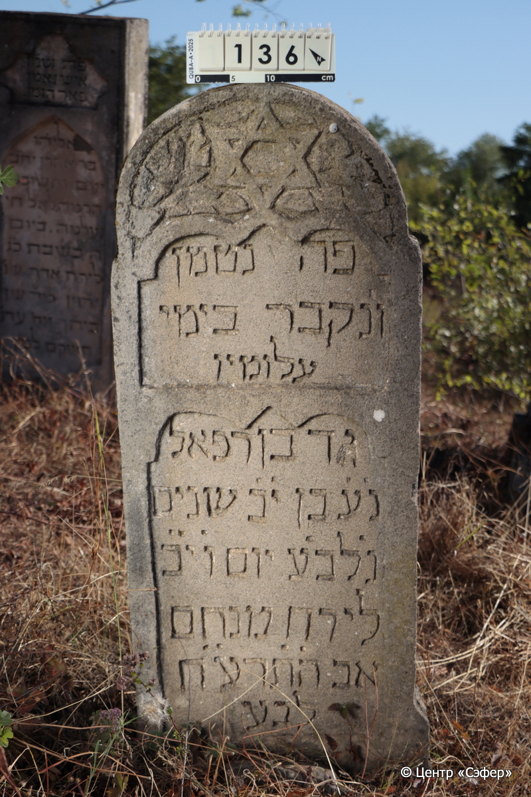
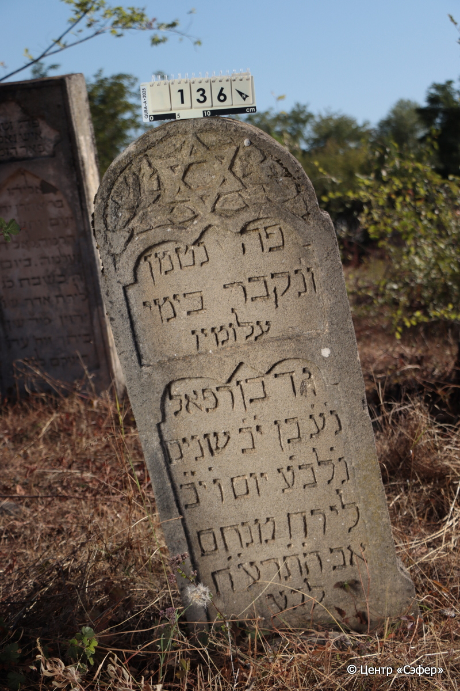

::: {style="font-size: 1em; margin-bottom: 1.2em"}
[Куба (центральное)](../cemeteries/QBA.html) > QBA0136
:::

```{r}
suppressPackageStartupMessages(library(tidyverse))
```


:::: {.columns}

::: {.column width="20%"}

```{r}
#| lightbox:
#|   group: photos




```
:::

::: {.column width="5%"}
:::

::: {.column width="74%"}

::: {.name-style}
Гад, сын Рафаэля (Год)
:::

::: {style="font-size: 1.2em;"}
גד בן רפאל
:::

:::: {.columns}
::: {.column width="5%"}
{width=1.3em}
:::

::: {.column style="width: 40%; padding-left: 0.2em;"}
  /  
:::

::: {.column width="5%"}
{width=1.3em}
:::

::: {.column style="width: 50%; padding-left: 0.2em;"}
21.07.1918* / 12.Av.5678
:::

::::


::: {.panel-tabset}

#### Эпитафия

```{r}
tibble(`Оригинал` = "פה נטמן
ונקבר בימי
עלומיו
גד בן רפאל
נ֗ע֗ בן י֗ב֗ שנים
נ׳לב׳ע יום ו֗ יב֗֗
לירח מנחם
אב ה֗ת֗רע֗ח֗
לבע",
       `Перевод` = "Здесь похоронен
и погребён в
дни юности
Гад, сын Рафаэля,
да упокоится в раю, <умерший> в 12 лет.
Отправился в дом вечности в пятницу, 12 <числа>
месяца менахем-
ава, 5678 <года>
от сотворения мира.") |>
  mutate(`Оригинал` = str_split(`Оригинал`, "
"),
         `Перевод` = str_split(`Перевод`, "
")) |>
  unnest_longer(c(`Оригинал`, `Перевод`)) |> 
  mutate(id = 1:n()) |> 
  relocate(id, .before = Перевод) |> 
  rename(` ` = id) |> 
  knitr::kable(align = c("r", "c", "l"))
```

|||
|-|---|
|**Примечания**| |
|**Язык**      |иврит    |
|**Метки**     |юноша, преждевременная смерть    |
: {tbl-colwidths="[25,75]"}

#### Памятник

|||
|-|---|
|**Тип памятника**   |L-образный                                                                         |
|**Материал**        |известняк, мрамор (мраморная вставка для текста, керамический медальон с портретом. Следы эрозии, цементный раствор)                                                     |
|**Размеры**         |160×58×37  --- стела; 22×50×112  --- плита; 36×81×181  --- основание                                                                        |
|**Тип декора**      |традиционная символика                                                                        |
|**Элементы декора** |звезда Давида на текстовой вставке, медальон с портретом                                                                          |
|**Координаты**      |[41.37080467, 48.50620606](https://www.google.com/maps/place/41.37080467, 48.50620606)                    |
: {tbl-colwidths="[25,75]"}

#### Источник

|||
|-|---|
|**Место хранения**        |Архив полевых исследований Центра «Сэфер»     |
|**Контакты**              |students@sefer.ru    |
|**Ссылка**                |https://sfira.org        |
|**Исходный ID**           |  |
|**Условия использования** |[CC BY-NC 4.0](https://creativecommons.org/licenses/by-nc/4.0/deed.ru)     |
: {tbl-colwidths="[25,75]"}

:::

:::

::::

