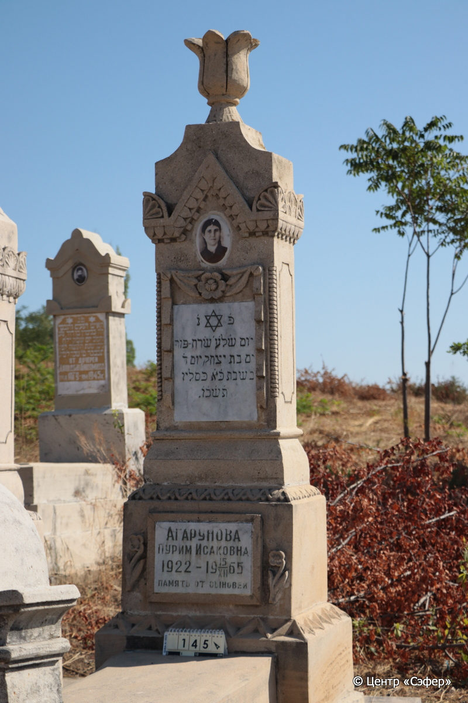
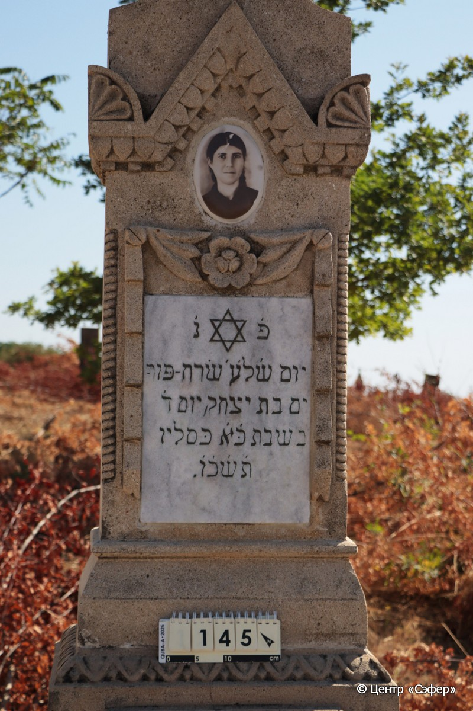
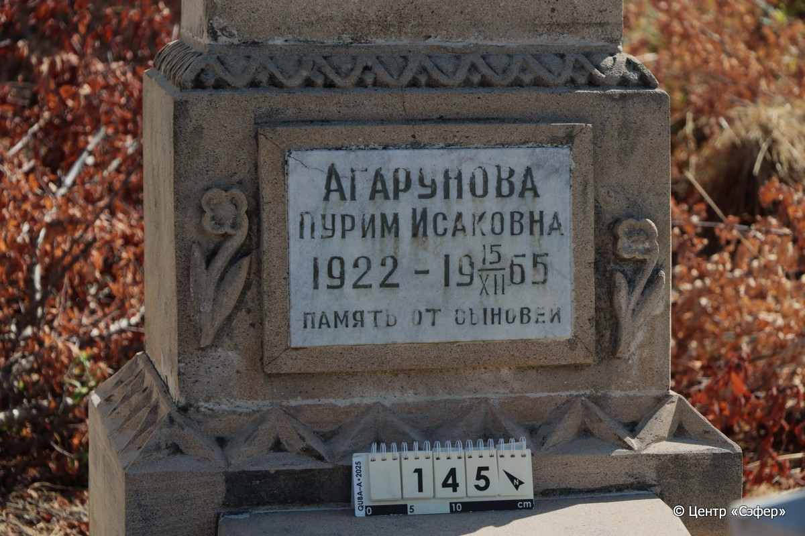
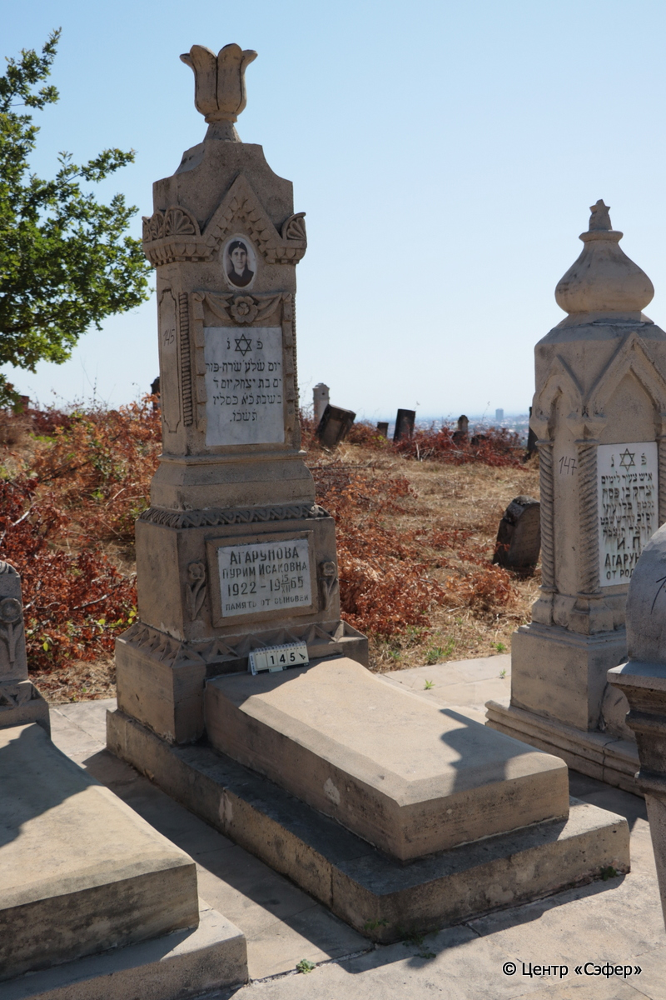

::: {style="font-size: 1em; margin-bottom: 1.2em"}
[Куба (центральное)](../cemeteries/QBA.html) > QBA0145
:::

```{r}
suppressPackageStartupMessages(library(tidyverse))
```


:::: {.columns}

::: {.column width="20%"}

```{r}
#| lightbox:
#|   group: photos






```
:::

::: {.column width="5%"}
:::

::: {.column width="74%"}

::: {.name-style}
АГАРУНОВА Серах Пурим, дочь Ицхака (Исаковна)
:::

::: {style="font-size: 1.2em;"}
שרח פורים בת יצחק
:::

:::: {.columns}
::: {.column width="5%"}
{width=1.3em}
:::

::: {.column style="width: 40%; padding-left: 0.2em;"}
-.-.1922 /  
:::

::: {.column width="5%"}
{width=1.3em}
:::

::: {.column style="width: 50%; padding-left: 0.2em;"}
15.12.1965 / 21.Ki.5726
:::

::::


::: {.panel-tabset}

#### Эпитафия

```{r}
tibble(`Оригинал` = "сверху
פ׳ נ׳
יום ש׳ל׳ע׳ שֺרח-פּור-
ים בת יצחק יום ד׳
בשבת כּ׳א׳ כּסליו
ת׳ש׳כ׳ו׳.

снизу
Агарунова
Пурим Исаковна
1922 – 15/XII 1965
Память от сыновей",
       `Перевод` = "
Здесь покоится
День, когда ушла в дом вечности Серах-Пурим,
дочь Ицхака. <Скончалась> в среду,
21 кислева
{5}726 <года>.

 
Агарунова
Пурим Исаковна
1922 – 15.12.1965
Память от сыновей") |>
  mutate(`Оригинал` = str_split(`Оригинал`, "
"),
         `Перевод` = str_split(`Перевод`, "
")) |>
  unnest_longer(c(`Оригинал`, `Перевод`)) |> 
  mutate(id = 1:n()) |> 
  relocate(id, .before = Перевод) |> 
  rename(` ` = id) |> 
  knitr::kable(align = c("r", "c", "l"))
```

|||
|-|---|
|**Примечания**| |
|**Язык**      |иврит, русский    |
|**Метки**     |     |
: {tbl-colwidths="[25,75]"}

#### Памятник

|||
|-|---|
|**Тип памятника**   |стела                                                                         |
|**Материал**        |известняк (следы эрозии, следы краски)                                                     |
|**Размеры**         |157×56×31  --- стела; 17×55×118  --- плита; 28×73×170  --- основание                                                                        |
|**Тип декора**      |архитектурно-орнаментальный, растительный, традиционная символика                                                                        |
|**Элементы декора** |две фигурные ниши для текста, наверху звезда Давида в обрамлении цветочных композиций, два цветочных композиций между нишами. У основания изображения подсвечников                                                                          |
|**Координаты**      |[41.37030733, 48.50643408](https://www.google.com/maps/place/41.37030733, 48.50643408)                    |
: {tbl-colwidths="[25,75]"}

#### Источник

|||
|-|---|
|**Место хранения**        |Архив полевых исследований Центра «Сэфер»     |
|**Контакты**              |students@sefer.ru    |
|**Ссылка**                |https://sfira.org        |
|**Исходный ID**           |  |
|**Условия использования** |[CC BY-NC 4.0](https://creativecommons.org/licenses/by-nc/4.0/deed.ru)     |
: {tbl-colwidths="[25,75]"}

:::

:::

::::

