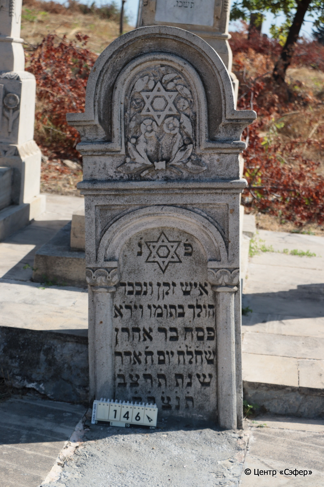
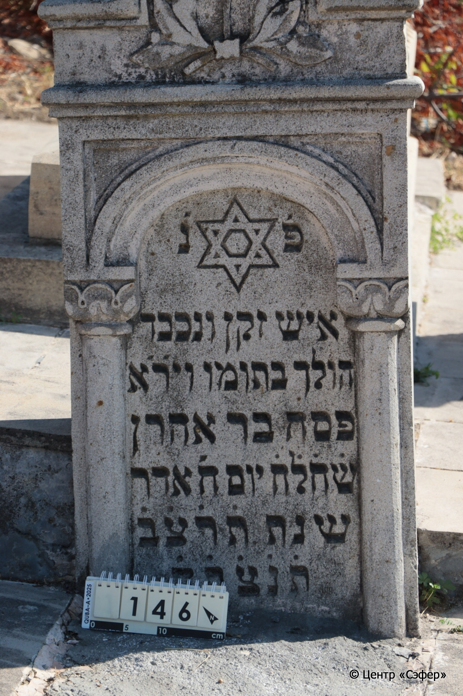
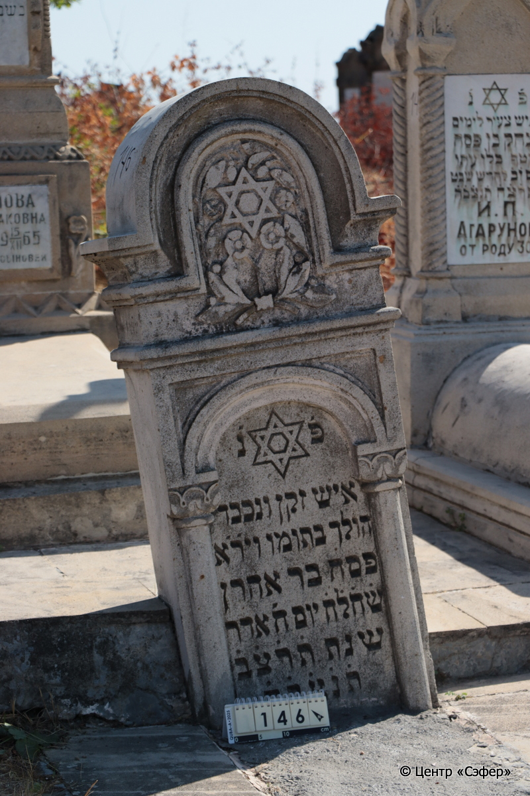
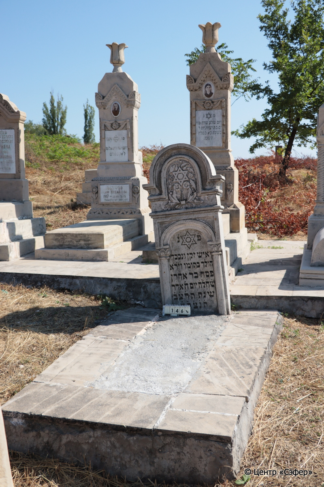

::: {style="font-size: 1em; margin-bottom: 1.2em"}
[Куба (центральное)](../cemeteries/QBA.html) > QBA0146
:::

```{r}
suppressPackageStartupMessages(library(tidyverse))
```


:::: {.columns}

::: {.column width="20%"}

```{r}
#| lightbox:
#|   group: photos






```
:::

::: {.column width="5%"}
:::

::: {.column width="74%"}

::: {.name-style}
Песах, сын Аарона (Писах)
:::

::: {style="font-size: 1.2em;"}
פסח בן אהרן
:::

:::: {.columns}
::: {.column width="5%"}
{width=1.3em}
:::

::: {.column style="width: 40%; padding-left: 0.2em;"}
  /  
:::

::: {.column width="5%"}
{width=1.3em}
:::

::: {.column style="width: 50%; padding-left: 0.2em;"}
15.02.1932* / 8.Ad.5692
:::

::::


::: {.panel-tabset}

#### Эпитафия

```{r}
tibble(`Оригинал` = "פ֗ נ֗
איש זקן ונכבד 
הולך בתומו ויר֗א֗
פסח בר אהרן
ש֗ח֗ל֗ח֗ יום ח׳ אדר
שנת ת֗ר֗צ֗ב֗
ת֗נ֗צ֗ב֗ה֗",
       `Перевод` = "Здесь покоится
человек пожилой и уважаемый,
поступавший праведно и богобоязненный,
Песах, сын р. Аарона,
оставивший жизнь живущим в день 8 адара,
год {5}692.
Да будет душа его завязана в узле жизни.") |>
  mutate(`Оригинал` = str_split(`Оригинал`, "
"),
         `Перевод` = str_split(`Перевод`, "
")) |>
  unnest_longer(c(`Оригинал`, `Перевод`)) |> 
  mutate(id = 1:n()) |> 
  relocate(id, .before = Перевод) |> 
  rename(` ` = id) |> 
  knitr::kable(align = c("r", "c", "l"))
```

|||
|-|---|
|**Примечания**| |
|**Язык**      |иврит    |
|**Метки**     |пожилой(-ая)    |
: {tbl-colwidths="[25,75]"}

#### Памятник

|||
|-|---|
|**Тип памятника**   |стела                                                                         |
|**Материал**        |песчаник, известняк, бетон (стела из известняка, основание из плит из песчаника, в центре залито бетоном, на стеле следы эрозии, основание в трещинах)                                                     |
|**Размеры**         |128×62×24  --- стела; 26×110×203  --- основание                                                                        |
|**Тип декора**      |архитектурно-орнаментальный, растительный, традиционная символика                                                                        |
|**Элементы декора** |полукруглое завершение, в портале которого - звезда Давида с цветами по сторонам с снизу, текст в нише, оформленной сводом арки и полуколоннами с растительными капителями, звезда Давида в нише                                                                          |
|**Координаты**      |[41.37029495, 48.50641222](https://www.google.com/maps/place/41.37029495, 48.50641222)                    |
: {tbl-colwidths="[25,75]"}

#### Источник

|||
|-|---|
|**Место хранения**        |Архив полевых исследований Центра «Сэфер»     |
|**Контакты**              |students@sefer.ru    |
|**Ссылка**                |https://sfira.org        |
|**Исходный ID**           |  |
|**Условия использования** |[CC BY-NC 4.0](https://creativecommons.org/licenses/by-nc/4.0/deed.ru)     |
: {tbl-colwidths="[25,75]"}

:::

:::

::::

