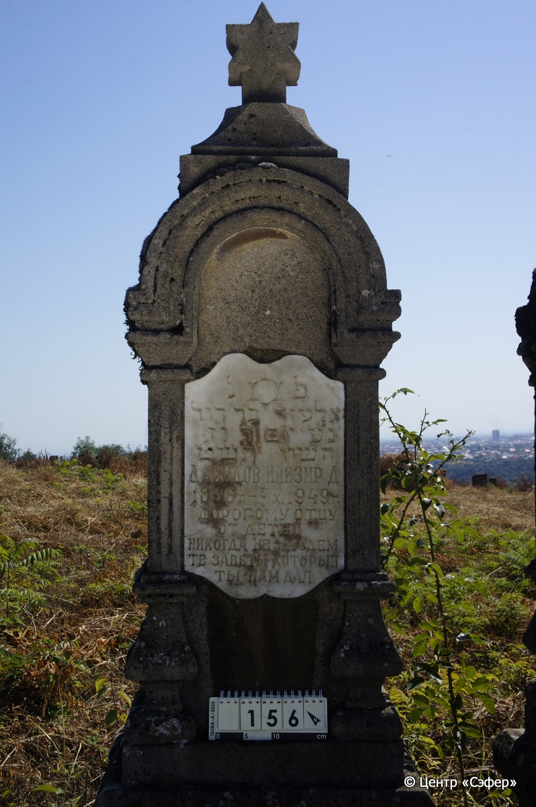
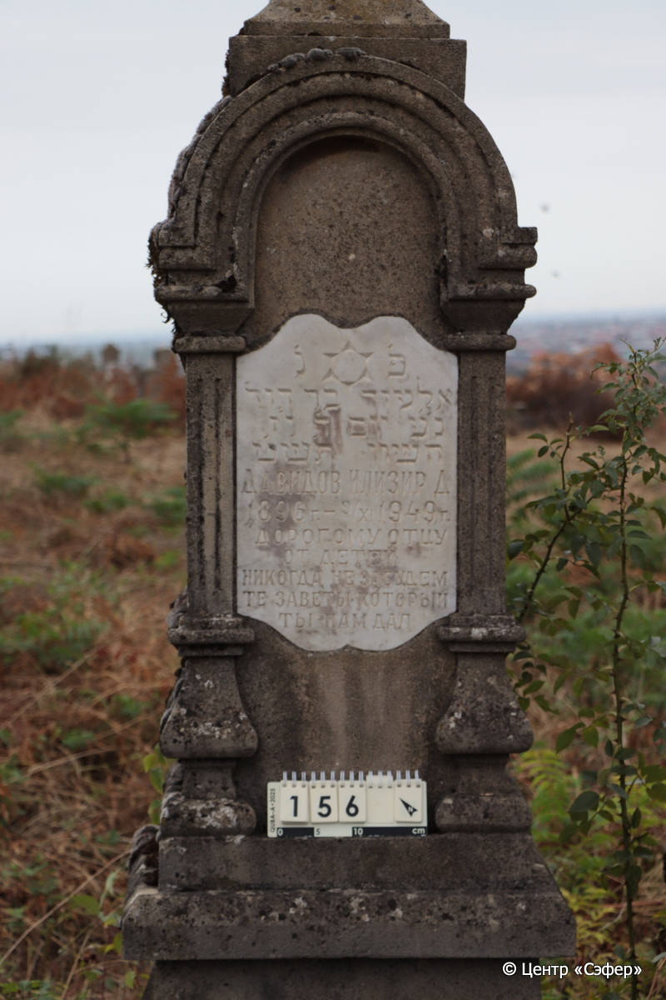
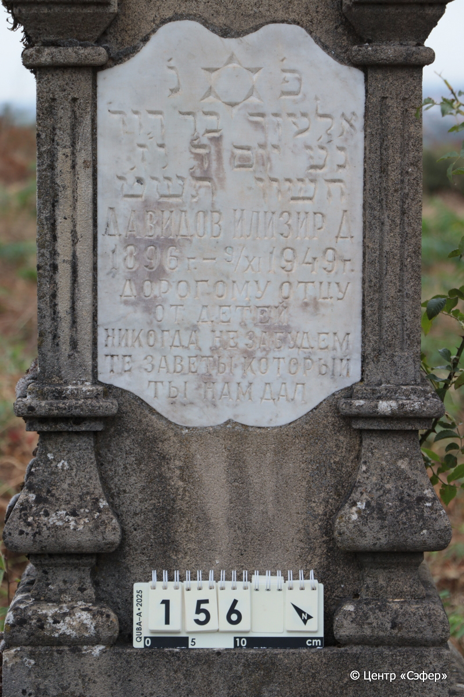
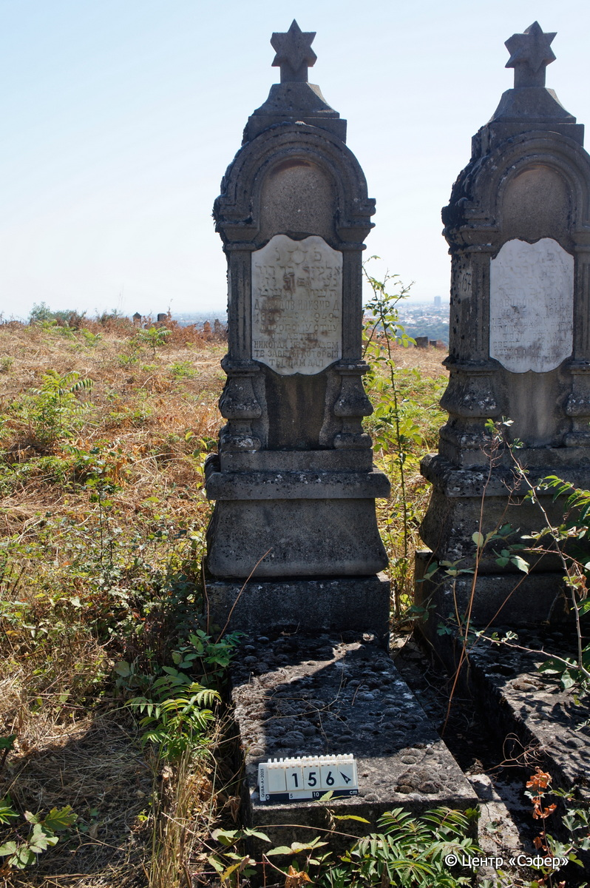

::: {style="font-size: 1em; margin-bottom: 1.2em"}
[Куба (центральное)](../cemeteries/QBA.html) > QBA0156
:::

```{r}
suppressPackageStartupMessages(library(tidyverse))
```


:::: {.columns}

::: {.column width="20%"}

```{r}
#| lightbox:
#|   group: photos






```
:::

::: {.column width="5%"}
:::

::: {.column width="74%"}

::: {.name-style}
ДАВИДОВ Эльазар, сын Давида (Илизир Давидович)
:::

::: {style="font-size: 1.2em;"}
אלעזר בן דוד
:::

:::: {.columns}
::: {.column width="5%"}
{width=1.3em}
:::

::: {.column style="width: 40%; padding-left: 0.2em;"}
-.-.1896 /  
:::

::: {.column width="5%"}
{width=1.3em}
:::

::: {.column style="width: 50%; padding-left: 0.2em;"}
09.11.1949 / 17.Ch.5709
:::

::::


::: {.panel-tabset}

#### Эпитафия

```{r}
tibble(`Оригинал` = "פ׳ נ׳
אלעזר בר דוד 
נ״ע יום ד׳ י״ז
׳חשון ת׳ש׳ט
 Давидов Илизир Д
1896 г. – 9/XI 1949 г.
Дорогому отцу
от детей
Никогда не забудем
те заветы который
ты нам дал",
       `Перевод` = "Здесь покоится
Эльазар, сын р. Давида,
да упокоится в раю. <Скончался> в среду, 17
хешвана {5}709 <года>.
Давидов Илизир Д[авидович]
1896 – 09.11.1949
Дорогому отцу
от детей
Никогда не забудем
те заветы, которые
ты нам дал") |>
  mutate(`Оригинал` = str_split(`Оригинал`, "
"),
         `Перевод` = str_split(`Перевод`, "
")) |>
  unnest_longer(c(`Оригинал`, `Перевод`)) |> 
  mutate(id = 1:n()) |> 
  relocate(id, .before = Перевод) |> 
  rename(` ` = id) |> 
  knitr::kable(align = c("r", "c", "l"))
```

|||
|-|---|
|**Примечания**| |
|**Язык**      |иврит, русский    |
|**Метки**     |     |
: {tbl-colwidths="[25,75]"}

#### Памятник

|||
|-|---|
|**Тип памятника**   |L-образный                                                                         |
|**Материал**        |известняк, мрамор (следы эрозии, мраморная вставка для текста)                                                     |
|**Размеры**         |211×62×41  --- стела; 20×49×120  --- плита; 19×221×138  --- основание (общее с 157, 158)                                                                        |
|**Тип декора**      |архитектурно-орнаментальный, традиционная символика                                                                        |
|**Элементы декора** |архитектурное навершие, увенчанное звездой Давида, с лицевой стороны полукруглая арка на полуколоннах, звезда Давида на вставке                                                                          |
|**Координаты**      |[41.37048257, 48.50647047](https://www.google.com/maps/place/41.37048257, 48.50647047)                    |
: {tbl-colwidths="[25,75]"}

#### Источник

|||
|-|---|
|**Место хранения**        |Архив полевых исследований Центра «Сэфер»     |
|**Контакты**              |students@sefer.ru    |
|**Ссылка**                |https://sfira.org        |
|**Исходный ID**           |  |
|**Условия использования** |[CC BY-NC 4.0](https://creativecommons.org/licenses/by-nc/4.0/deed.ru)     |
: {tbl-colwidths="[25,75]"}

:::

:::

::::

