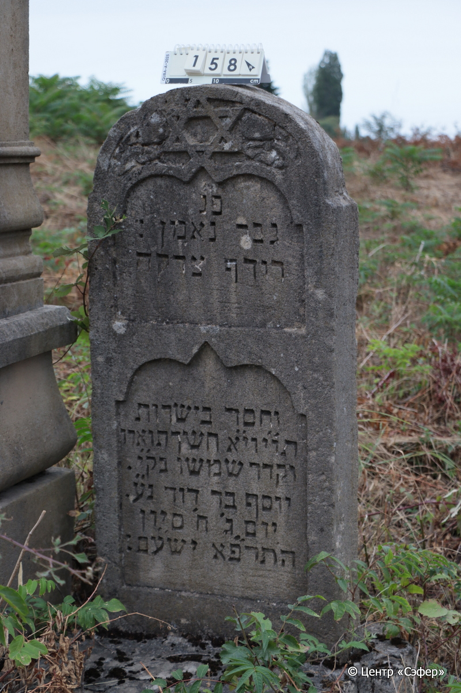
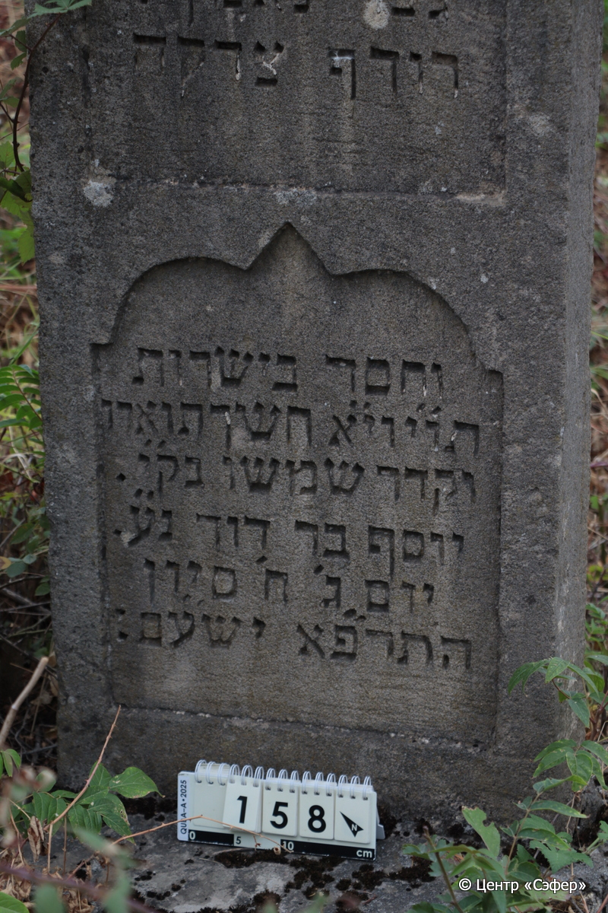

::: {style="font-size: 1em; margin-bottom: 1.2em"}
[Куба (центральное)](../cemeteries/QBA.html) > QBA0158
:::

```{r}
suppressPackageStartupMessages(library(tidyverse))
```


:::: {.columns}

::: {.column width="20%"}

```{r}
#| lightbox:
#|   group: photos




```
:::

::: {.column width="5%"}
:::

::: {.column width="74%"}

::: {.name-style}
Йосеф, сын Давида (Юсиф)
:::

::: {style="font-size: 1.2em;"}
יוסף בן דוד
:::

:::: {.columns}
::: {.column width="5%"}
{width=1.3em}
:::

::: {.column style="width: 40%; padding-left: 0.2em;"}
  /  
:::

::: {.column width="5%"}
{width=1.3em}
:::

::: {.column style="width: 50%; padding-left: 0.2em;"}
14.06.1921* / 8.Si.5681
:::

::::


::: {.panel-tabset}

#### Эпитафия

```{r}
tibble(`Оригинал` = "פ׳׳נ
:גבר נאמן
רודף צדקה
וחסד בישרות 
תו״י וי״א חשך תוארו
וקדר שמשו בק״י
יוסף ב׳ר דוד נ״ע
יום ג׳ ח׳ סיון
ה׳תרפ״א יש׳׳עם:",
       `Перевод` = "Здесь покоится
преданный человек,
правдолюбивый
и милостивый искренне,
честный, прямодушный и богобоязненный. Угас его образ,
и померкло солнце в начале дней,
Йосеф, сын р. Давида, да упокоится в раю.
<Скончался> во вторник, 8 сивана
5681 <года>. Он обретает покой! Те, кто идет прямым путем, отдохнут на своём ложе*.") |>
  mutate(`Оригинал` = str_split(`Оригинал`, "
"),
         `Перевод` = str_split(`Перевод`, "
")) |>
  unnest_longer(c(`Оригинал`, `Перевод`)) |> 
  mutate(id = 1:n()) |> 
  relocate(id, .before = Перевод) |> 
  rename(` ` = id) |> 
  knitr::kable(align = c("r", "c", "l"))
```

|||
|-|---|
|**Примечания**|* Цит. Ис 57:2|
|**Язык**      |иврит    |
|**Метки**     |     |
: {tbl-colwidths="[25,75]"}

#### Памятник

|||
|-|---|
|**Тип памятника**   |стела                                                                         |
|**Материал**        |известняк (следы эрозии, сколы)                                                     |
|**Размеры**         |118×54×14 ; 19×221×138  --- основание (общее с 156, 157)                                                                        |
|**Тип декора**      |архитектурно-орнаментальный, растительный, традиционная символика                                                                        |
|**Элементы декора** |две фигурные ниши с текстом, звезда Давида с растительным орнаментом у полукруглого завершения                                                                          |
|**Координаты**      |[41.37047191, 48.5064766](https://www.google.com/maps/place/41.37047191, 48.5064766)                    |
: {tbl-colwidths="[25,75]"}

#### Источник

|||
|-|---|
|**Место хранения**        |Архив полевых исследований Центра «Сэфер»     |
|**Контакты**              |students@sefer.ru    |
|**Ссылка**                |https://sfira.org        |
|**Исходный ID**           |  |
|**Условия использования** |[CC BY-NC 4.0](https://creativecommons.org/licenses/by-nc/4.0/deed.ru)     |
: {tbl-colwidths="[25,75]"}

:::

:::

::::

