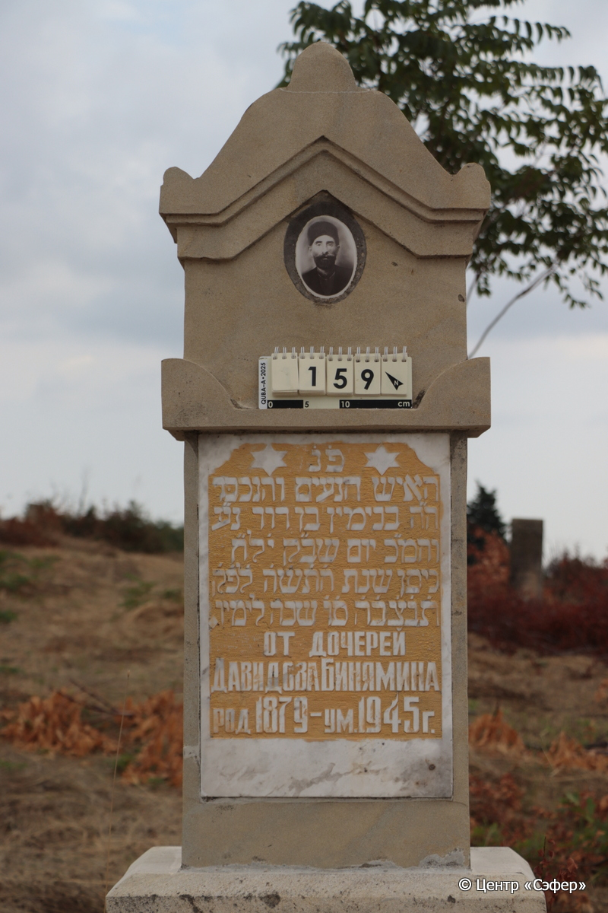
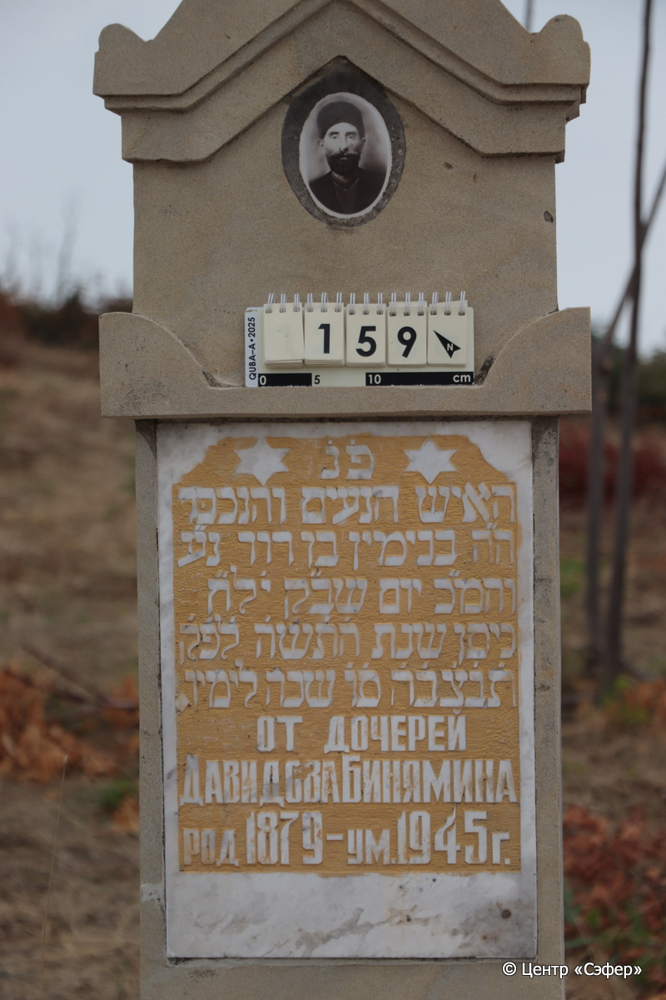
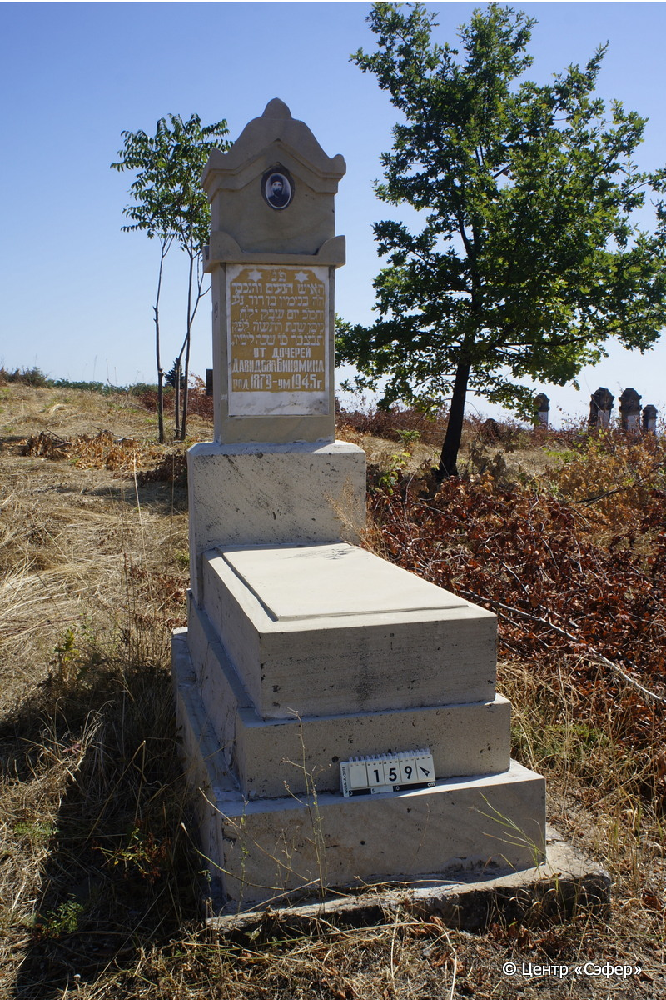

::: {style="font-size: 1em; margin-bottom: 1.2em"}
[Куба (центральное)](../cemeteries/QBA.html) > QBA0159
:::

```{r}
suppressPackageStartupMessages(library(tidyverse))
```


:::: {.columns}

::: {.column width="20%"}

```{r}
#| lightbox:
#|   group: photos





```
:::

::: {.column width="5%"}
:::

::: {.column width="74%"}

::: {.name-style}
ДАВИДОВ Беньямин, сын Давида (Бинямин)
:::

::: {style="font-size: 1.2em;"}
בנימין בן דוד
:::

:::: {.columns}
::: {.column width="5%"}
{width=1.3em}
:::

::: {.column style="width: 40%; padding-left: 0.2em;"}
-.-.1879 /  
:::

::: {.column width="5%"}
{width=1.3em}
:::

::: {.column style="width: 50%; padding-left: 0.2em;"}
-.-.1945 / 10.Ni.5705
:::

::::


::: {.panel-tabset}

#### Эпитафия

```{r}
tibble(`Оригинал` = "פ֗נ֗
האיש הנעים והנכבּד
ה״ה בנימין בן דוד נ׳׳ע 
והמ׳׳כ יום שב׳׳ק י׳ לח״
ניסן שנת ה֗ת֗ש֗ה֗ ל֗פ֗ק֗
ת֗נ֗צ֗ב֗ה֗ ס֗ו֗ שנה לימיו.
От дочерей
Давидова Бинямина 
род 1879 – ум. 1945 г.",
       `Перевод` = "Здесь покоится
человек милый и уважаемый,
Беньямин, сын Давида, да упокоится в раю,
и будет благословен его покой. <Скончался> в день святой субботы, 10 <числа> месяца
нисан, год 5705 по малому исчислению.
Да будет душа его завязана в узле жизни. <В> 66 лет.
От дочерей
Давидова Бинямина
Родился в 1879 г. – умер в 1945 г.") |>
  mutate(`Оригинал` = str_split(`Оригинал`, "
"),
         `Перевод` = str_split(`Перевод`, "
")) |>
  unnest_longer(c(`Оригинал`, `Перевод`)) |> 
  mutate(id = 1:n()) |> 
  relocate(id, .before = Перевод) |> 
  rename(` ` = id) |> 
  knitr::kable(align = c("r", "c", "l"))
```

|||
|-|---|
|**Примечания**| |
|**Язык**      |иврит, русский    |
|**Метки**     |     |
: {tbl-colwidths="[25,75]"}

#### Памятник

|||
|-|---|
|**Тип памятника**   |L-образный                                                                         |
|**Материал**        |известняк, мрамор, бетон (мраморная текстовая вставка с золотой краской, керамический медальон с фото-портретом, цементный раствор)                                                     |
|**Размеры**         |188×60×32  --- стела; 20×56×119  --- плита; 46×92×182  --- основание                                                                        |
|**Тип декора**      |архитектурно-орнаментальный, традиционная символика                                                                        |
|**Элементы декора** |архитектурное завершение, медальон с фото-портретом, две звёзды Давида на текстовой вставке                                                                          |
|**Координаты**      |[41.3703395, 48.50645524](https://www.google.com/maps/place/41.3703395, 48.50645524)                    |
: {tbl-colwidths="[25,75]"}

#### Источник

|||
|-|---|
|**Место хранения**        |Архив полевых исследований Центра «Сэфер»     |
|**Контакты**              |students@sefer.ru    |
|**Ссылка**                |https://sfira.org        |
|**Исходный ID**           |  |
|**Условия использования** |[CC BY-NC 4.0](https://creativecommons.org/licenses/by-nc/4.0/deed.ru)     |
: {tbl-colwidths="[25,75]"}

:::

:::

::::

