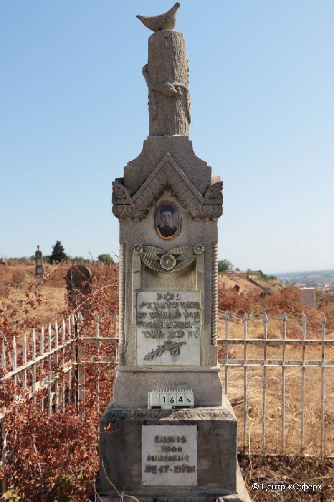
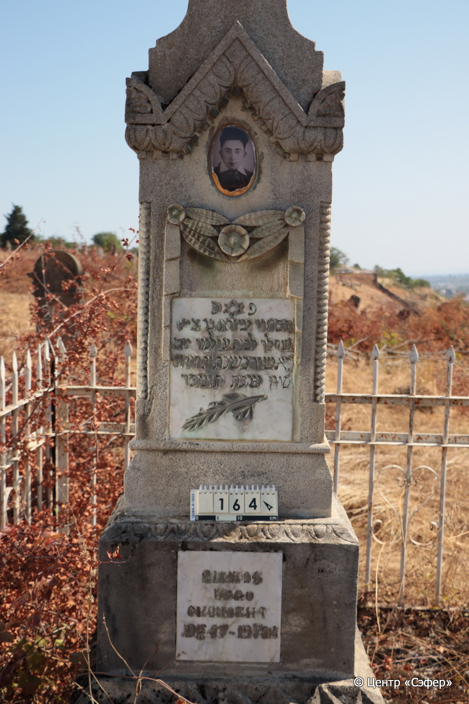
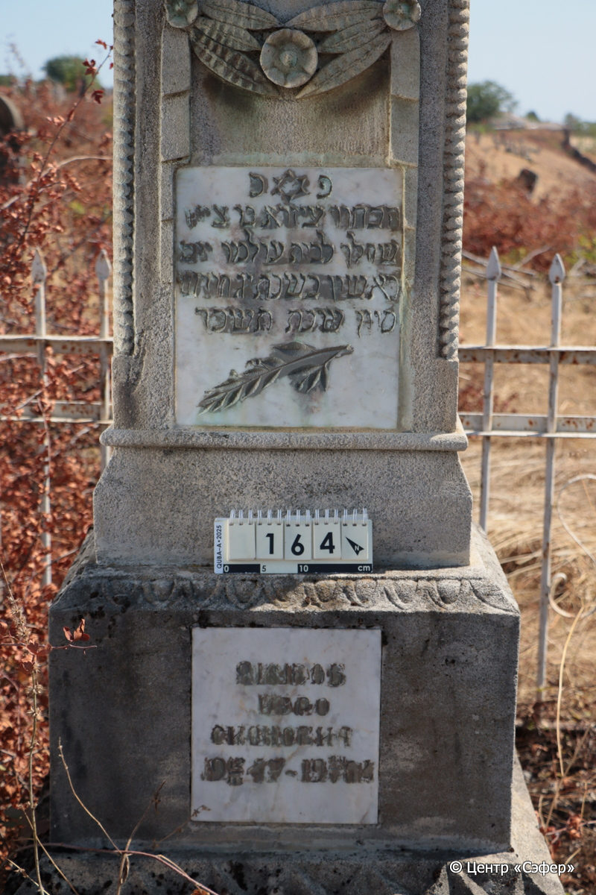
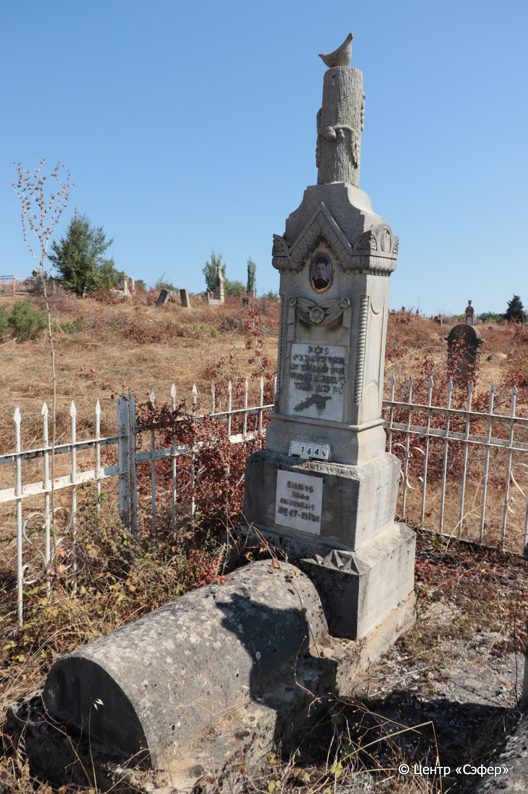
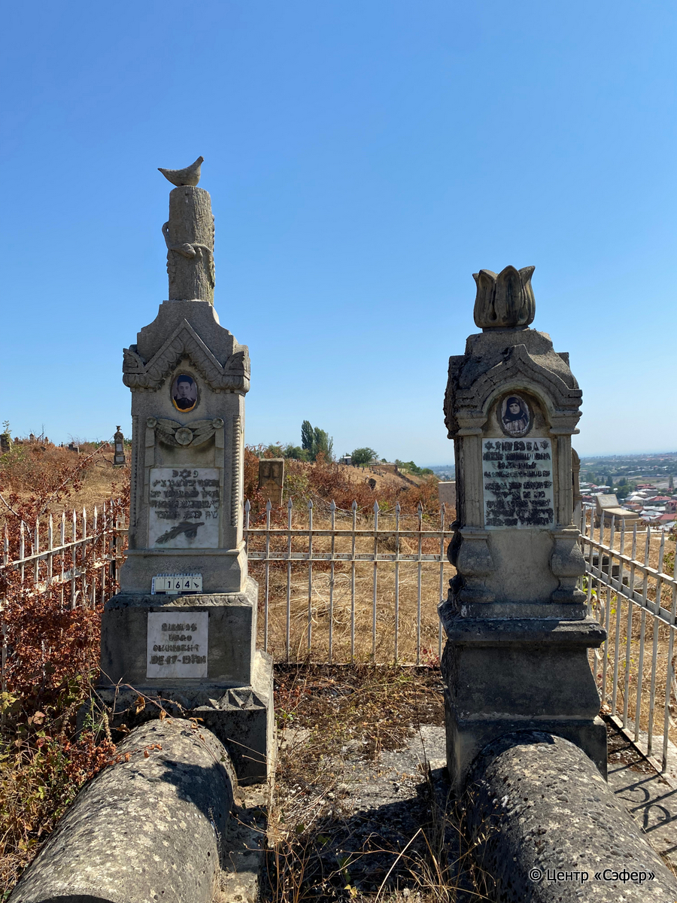

::: {style="font-size: 1em; margin-bottom: 1.2em"}
[Куба (центральное)](../cemeteries/QBA.html) > QBA0164
:::

```{r}
suppressPackageStartupMessages(library(tidyverse))
```


:::: {.columns}

::: {.column width="20%"}

```{r}
#| lightbox:
#|   group: photos







```
:::

::: {.column width="5%"}
:::

::: {.column width="74%"}

::: {.name-style}
ЯКУБОВ Эзра, сын Циона (Изро Сионович)
:::

::: {style="font-size: 1.2em;"}
עיזרא בן ציון
:::

:::: {.columns}
::: {.column width="5%"}
{width=1.3em}
:::

::: {.column style="width: 40%; padding-left: 0.2em;"}
12.03.1947 /  
:::

::: {.column width="5%"}
{width=1.3em}
:::

::: {.column style="width: 50%; padding-left: 0.2em;"}
24.05.1964 / 13.Si.5724
:::

::::


::: {.panel-tabset}

#### Эпитафия

```{r}
tibble(`Оригинал` = "сверху
פ נ
הבחור עיזרא בר ציון
שהלך לבית עולמו יום 
ראשון בשבת יג חודש
סיון שנת תשכד

снизу
ЯКУБОВ
ИЗРО
СИОНОВИЧ
12/III 1947 – 24/V 1964",
       `Перевод` = "
Здесь покоится
юноша Эзра, сын р. Циона,
ушедший в дом вечности в
воскресенье, 13 <числа> месяца
сиван, год {5}724.

 
Якубов
Изро
Сионович
12.03.1947 – 24.05.1964") |>
  mutate(`Оригинал` = str_split(`Оригинал`, "
"),
         `Перевод` = str_split(`Перевод`, "
")) |>
  unnest_longer(c(`Оригинал`, `Перевод`)) |> 
  mutate(id = 1:n()) |> 
  relocate(id, .before = Перевод) |> 
  rename(` ` = id) |> 
  knitr::kable(align = c("r", "c", "l"))
```

|||
|-|---|
|**Примечания**| |
|**Язык**      |иврит, русский    |
|**Метки**     |юноша    |
: {tbl-colwidths="[25,75]"}

#### Памятник

|||
|-|---|
|**Тип памятника**   |L-образный                                                                         |
|**Материал**        |известняк, мрамор (две мраморные вставки для текста, следы эрозии, керамический медальон с фрагментом золотого цвета и фото-портретом)                                                     |
|**Размеры**         |270×76×70  --- стела; 28×54×115  --- Саркофаг; 17×78×191  --- основание                                                                        |
|**Тип декора**      |архитектурно-орнаментальный, растительный, зооморфный, традиционная символика                                                                        |
|**Элементы декора** |древовидное навершие в виде спиленного дерева, которое обвивает поникшая ветвь с листьями. На спиле скульптурная фигурка птицы, похожей на горлицу. Витые полуколонны на лицевых гранях стелы, гирлянда из лент, цветов и листьев на лицевой стороне. Ветка и звезда Давида на мраморной вставке. Три орнаментальных пояса, на верхнем – пальметки. На медальоне фотопортрет. Рамки на боковых и задней сторонах.                                                                          |
|**Координаты**      |[41.36983594, 48.50670237](https://www.google.com/maps/place/41.36983594, 48.50670237)                    |
: {tbl-colwidths="[25,75]"}

#### Источник

|||
|-|---|
|**Место хранения**        |Архив полевых исследований Центра «Сэфер»     |
|**Контакты**              |students@sefer.ru    |
|**Ссылка**                |https://sfira.org        |
|**Исходный ID**           |  |
|**Условия использования** |[CC BY-NC 4.0](https://creativecommons.org/licenses/by-nc/4.0/deed.ru)     |
: {tbl-colwidths="[25,75]"}

:::

:::

::::

