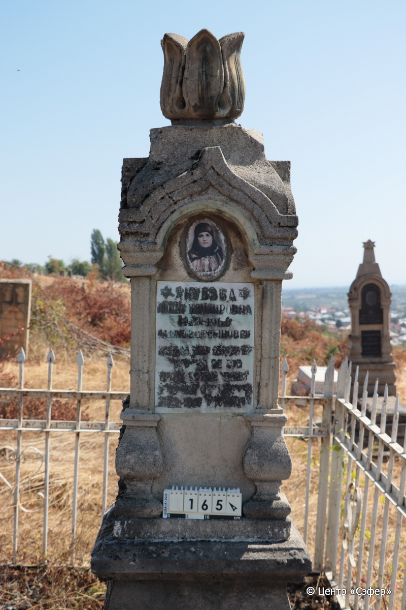
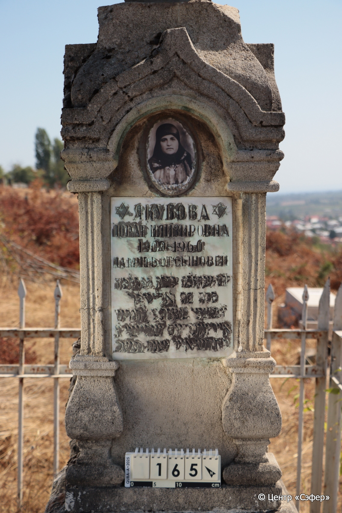
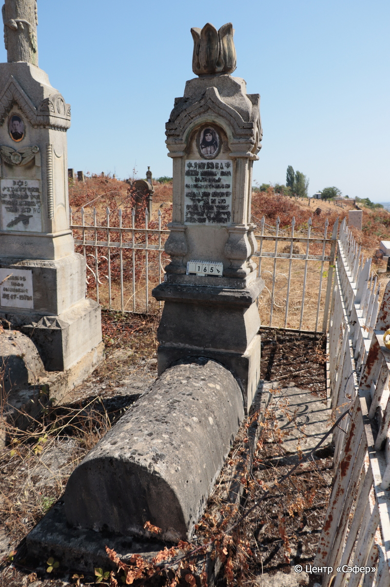
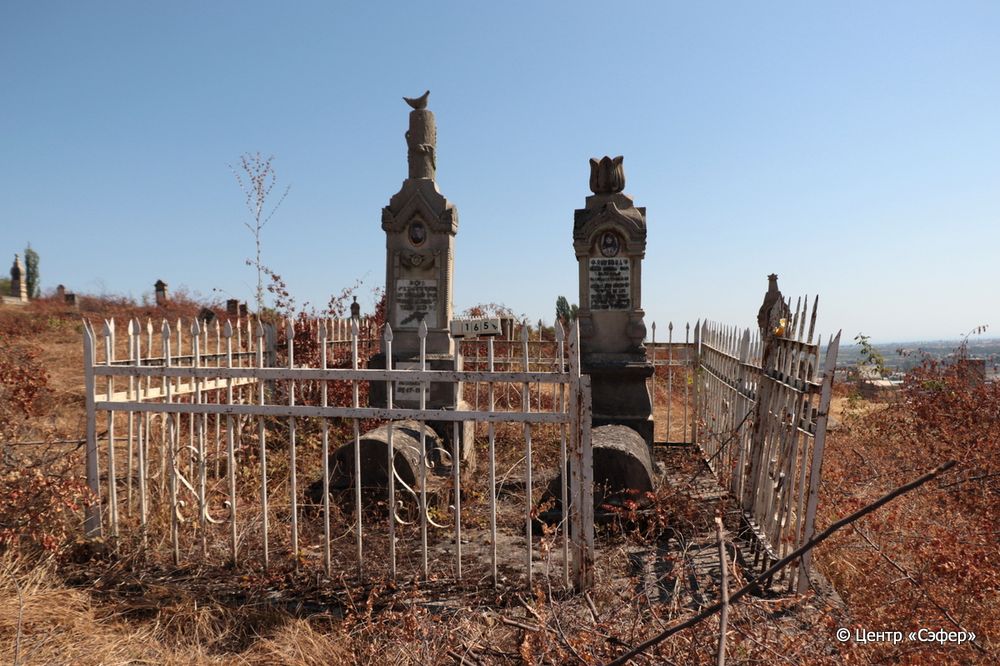

::: {style="font-size: 1em; margin-bottom: 1.2em"}
[Куба (центральное)](../cemeteries/QBA.html) > QBA0165
:::

```{r}
suppressPackageStartupMessages(library(tidyverse))
```


:::: {.columns}

::: {.column width="20%"}

```{r}
#| lightbox:
#|   group: photos






```
:::

::: {.column width="5%"}
:::

::: {.column width="74%"}

::: {.name-style}
ЯКУБОВА Парат, дочь Элиэзера (Порат Илизировна)
:::

::: {style="font-size: 1.2em;"}
פרת בת אליעזר
:::

:::: {.columns}
::: {.column width="5%"}
{width=1.3em}
:::

::: {.column style="width: 40%; padding-left: 0.2em;"}
-.-.1909 /  
:::

::: {.column width="5%"}
{width=1.3em}
:::

::: {.column style="width: 50%; padding-left: 0.2em;"}
-.-.1960 / 12.Iy.5720
:::

::::


::: {.panel-tabset}

#### Эпитафия

```{r}
tibble(`Оригинал` = "ЯКУБОВА
 ПОРАТ ИЛИЗИРОВНА
1909–1960
ПАМЯТЬ ОТ СЫНОВЕЙ

יום שהלכה לבית עולמה
פרת בת אליעזר
יום שני בשבת יב לחודש
אייר ונקבר יום שלישי יג֗
לחודש אייר שנת תשכ",
       `Перевод` = "Якубова
Порат Илизировна
1909 – 1960
Память от сыновей

День, когда ушла в дом вечности,
Парат, дочь Элиэзера –
<Скончалась> в понедельник, 12 <числа> месяца
ияр, и похоронена во вторник, 13 <числа>
месяца ияр, год {5}720.") |>
  mutate(`Оригинал` = str_split(`Оригинал`, "
"),
         `Перевод` = str_split(`Перевод`, "
")) |>
  unnest_longer(c(`Оригинал`, `Перевод`)) |> 
  mutate(id = 1:n()) |> 
  relocate(id, .before = Перевод) |> 
  rename(` ` = id) |> 
  knitr::kable(align = c("r", "c", "l"))
```

|||
|-|---|
|**Примечания**| |
|**Язык**      |иврит, русский    |
|**Метки**     |     |
: {tbl-colwidths="[25,75]"}

#### Памятник

|||
|-|---|
|**Тип памятника**   |L-образный                                                                         |
|**Материал**        |известняк, мрамор (цементный раствор, мраморная вставка для текста, керамический медальон с фото-портретом, следы эрозии, следы краски)                                                     |
|**Размеры**         |225×55×46  --- стела; 33×49×108  --- саркофаг; 13×70×174  --- основание                                                                        |
|**Тип декора**      |архитектурно-орнаментальный, растительный, традиционная символика                                                                        |
|**Элементы декора** |архитектурное завершение, увенчанное бутоном. Полукруглые арки со стрельчатой крышей, стоящие на полуколоннах. Медальон с фото-портретом и рельефным растительным орнаментом. Две звезды Давида на текстовой вставке.                                                                          |
|**Координаты**      |[41.36982336, 48.506707](https://www.google.com/maps/place/41.36982336, 48.506707)                    |
: {tbl-colwidths="[25,75]"}

#### Источник

|||
|-|---|
|**Место хранения**        |Архив полевых исследований Центра «Сэфер»     |
|**Контакты**              |students@sefer.ru    |
|**Ссылка**                |https://sfira.org        |
|**Исходный ID**           |  |
|**Условия использования** |[CC BY-NC 4.0](https://creativecommons.org/licenses/by-nc/4.0/deed.ru)     |
: {tbl-colwidths="[25,75]"}

:::

:::

::::

