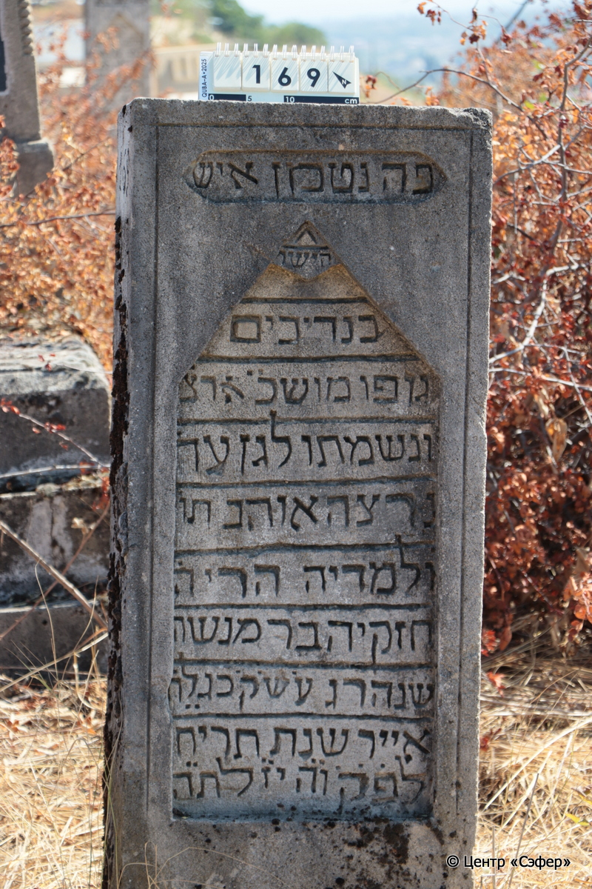
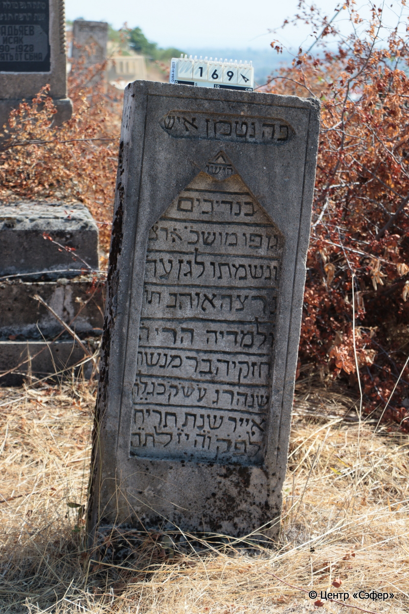

::: {style="font-size: 1em; margin-bottom: 1.2em"}
[Куба (центральное)](../cemeteries/QBA.html) > QBA0169
:::

```{r}
suppressPackageStartupMessages(library(tidyverse))
```


:::: {.columns}

::: {.column width="20%"}

```{r}
#| lightbox:
#|   group: photos




```
:::

::: {.column width="5%"}
:::

::: {.column width="74%"}

::: {.name-style}
Хизкия, сын Менаше (Изгиё)
:::

::: {style="font-size: 1.2em;"}
חזקיה בן מנשה
:::

:::: {.columns}
::: {.column width="5%"}
{width=1.3em}
:::

::: {.column style="width: 40%; padding-left: 0.2em;"}
  /  
:::

::: {.column width="5%"}
{width=1.3em}
:::

::: {.column style="width: 50%; padding-left: 0.2em;"}
07.05.1858* / 23.Iy.5618
:::

::::


::: {.panel-tabset}

#### Эпитафия

```{r}
tibble(`Оригинал` = "פה נטמן איש
הישר
בנדיבים
גופו מושכ״ ארצ׳
ונשמתו לגן עד׳
נרצה אוהב תו׳
ולמדיה הרי ה׳
חזקיה בר מנשה
שנהרג ע֗ש֗ק֗ כג לח״
אייר שנת תריח
ל֗פ֗ק֗ ו״ה י״ז לת״ה",
       `Перевод` = "Здесь похоронен человек
праведный
среди великодушных,
его тело покоится в земле,
а душа в райский сад
призвана, любивший Тору
и изучавший её,
Хизкия, сын р. Менаше,
убитый в канун субботы, 23 <числа> месяца
ияр, год 618
по малому исчислению. [...]") |>
  mutate(`Оригинал` = str_split(`Оригинал`, "
"),
         `Перевод` = str_split(`Перевод`, "
")) |>
  unnest_longer(c(`Оригинал`, `Перевод`)) |> 
  mutate(id = 1:n()) |> 
  relocate(id, .before = Перевод) |> 
  rename(` ` = id) |> 
  knitr::kable(align = c("r", "c", "l"))
```

|||
|-|---|
|**Примечания**| |
|**Язык**      |иврит    |
|**Метки**     |знаток Писания    |
: {tbl-colwidths="[25,75]"}

#### Памятник

|||
|-|---|
|**Тип памятника**   |стела                                                                         |
|**Материал**        |известняк (следы эрозии)                                                     |
|**Размеры**         |120×48×25  --- стела                                                                        |
|**Тип декора**      |архитектурно-орнаментальный                                                                        |
|**Элементы декора** |две фигурные ниши для текста, рамка                                                                          |
|**Координаты**      |[41.36974756, 48.50669611](https://www.google.com/maps/place/41.36974756, 48.50669611)                    |
: {tbl-colwidths="[25,75]"}

#### Источник

|||
|-|---|
|**Место хранения**        |Архив полевых исследований Центра «Сэфер»     |
|**Контакты**              |students@sefer.ru    |
|**Ссылка**                |https://sfira.org        |
|**Исходный ID**           |  |
|**Условия использования** |[CC BY-NC 4.0](https://creativecommons.org/licenses/by-nc/4.0/deed.ru)     |
: {tbl-colwidths="[25,75]"}

:::

:::

::::

