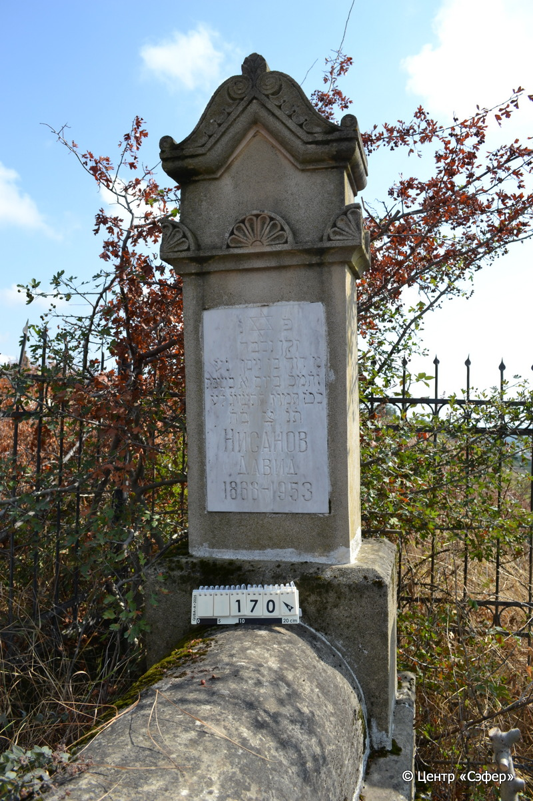
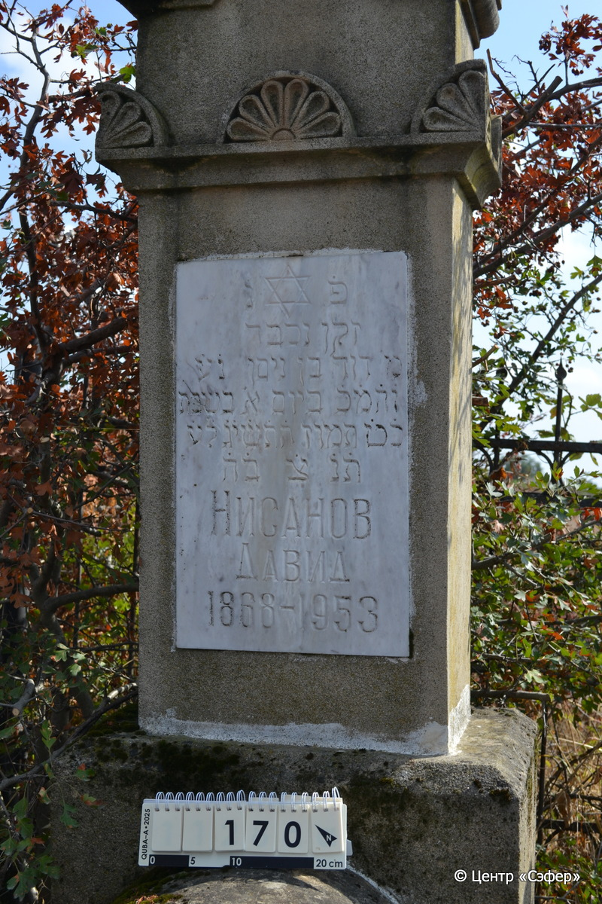
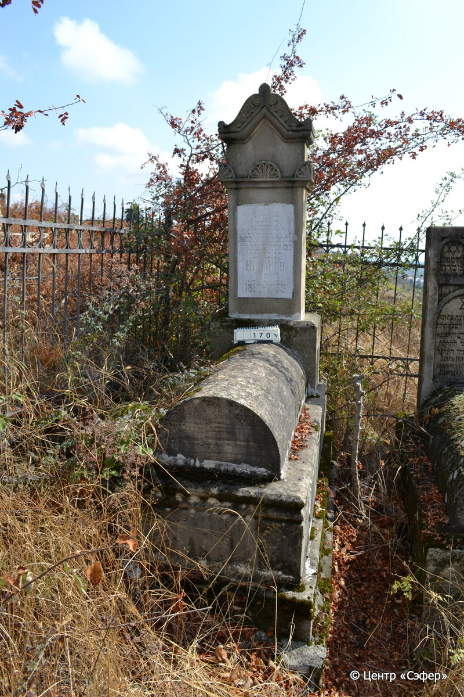

::: {style="font-size: 1em; margin-bottom: 1.2em"}
[Куба (центральное)](../cemeteries/QBA.html) > QBA0170
:::

```{r}
suppressPackageStartupMessages(library(tidyverse))
```


:::: {.columns}

::: {.column width="20%"}

```{r}
#| lightbox:
#|   group: photos





```
:::

::: {.column width="5%"}
:::

::: {.column width="74%"}

::: {.name-style}
НИСАНОВ Давид, сын Нисана
:::

::: {style="font-size: 1.2em;"}
דוד בן ניסן
:::

:::: {.columns}
::: {.column width="5%"}
{width=1.3em}
:::

::: {.column style="width: 40%; padding-left: 0.2em;"}
-.-.1868 /  
:::

::: {.column width="5%"}
{width=1.3em}
:::

::: {.column style="width: 50%; padding-left: 0.2em;"}
-.-.1953 / 11.Ta.5713
:::

::::


::: {.panel-tabset}

#### Эпитафия

```{r}
tibble(`Оригинал` = "פ׳ נ׳
זקן נכבד
מ׳ דוד בן ניסן נ֗ע֗
וה֗מ֗כ֗ ביום א׳ בשבת 
כ֗ט֗ תמוז ה֗ת֗ש֗י֗ג֗ ל֗ע֗
ת֗נ֗ צ֗ ב֗ה֗
НИСАНОВ
ДАВИД
1868 – 1953",
       `Перевод` = "Здесь покоится
пожилой и уважаемый
г-н Давид, сын Нисана, да упокоится в раю,
и будет благословен его покой. <Скончался> в воскресенье,
29 таммуза, 5713 <года> от сотворения мира.
Да будет душа его завязана в узле жизни.
Нисанов
Давид
1868 – 1953") |>
  mutate(`Оригинал` = str_split(`Оригинал`, "
"),
         `Перевод` = str_split(`Перевод`, "
")) |>
  unnest_longer(c(`Оригинал`, `Перевод`)) |> 
  mutate(id = 1:n()) |> 
  relocate(id, .before = Перевод) |> 
  rename(` ` = id) |> 
  knitr::kable(align = c("r", "c", "l"))
```

|||
|-|---|
|**Примечания**| |
|**Язык**      |иврит, русский    |
|**Метки**     |пожилой(-ая)    |
: {tbl-colwidths="[25,75]"}

#### Памятник

|||
|-|---|
|**Тип памятника**   |L-образный                                                                         |
|**Материал**        |песчаник, известняк, мрамор (мраморная вставка для текста, следы эрозии, цементный раствор)                                                     |
|**Размеры**         |163×60×39  --- стела; 35×50×107  --- Саркофаг; 50×90×185  --- основание                                                                        |
|**Тип декора**      |архитектурно-орнаментальный, растительный, традиционная символика                                                                        |
|**Элементы декора** |архитектурное завершение с двумя волютами, конёк, орнаментальный пояс с пальметками, звезда Давида на вставке                                                                          |
|**Координаты**      |[41.36974754, 48.50676108](https://www.google.com/maps/place/41.36974754, 48.50676108)                    |
: {tbl-colwidths="[25,75]"}

#### Источник

|||
|-|---|
|**Место хранения**        |Архив полевых исследований Центра «Сэфер»     |
|**Контакты**              |students@sefer.ru    |
|**Ссылка**                |https://sfira.org        |
|**Исходный ID**           |  |
|**Условия использования** |[CC BY-NC 4.0](https://creativecommons.org/licenses/by-nc/4.0/deed.ru)     |
: {tbl-colwidths="[25,75]"}

:::

:::

::::

