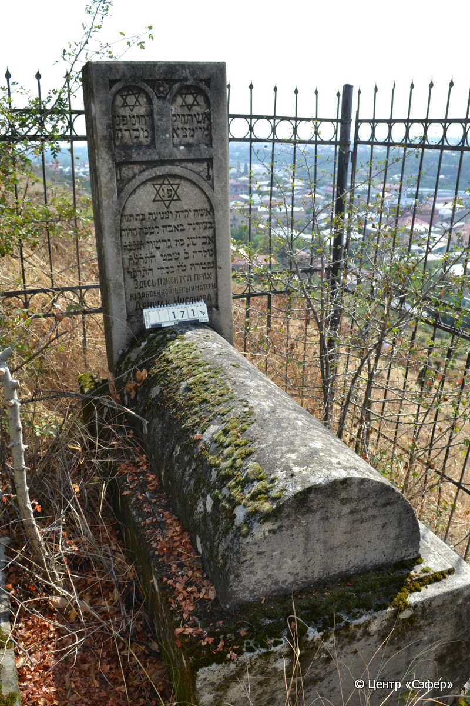
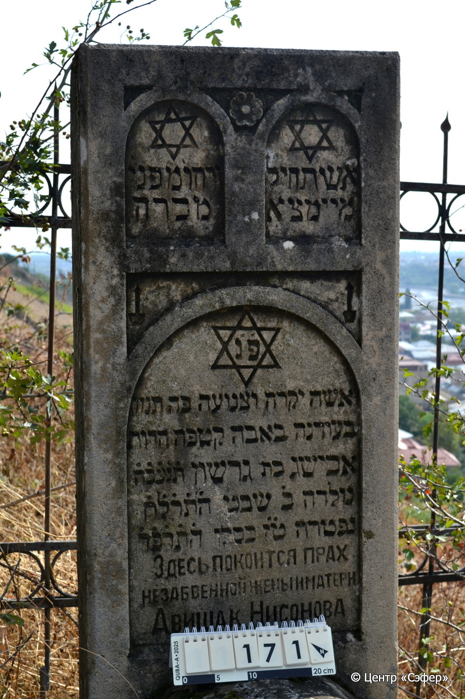

::: {style="font-size: 1em; margin-bottom: 1.2em"}
[Куба (центральное)](../cemeteries/QBA.html) > QBA0171
:::

```{r}
suppressPackageStartupMessages(library(tidyverse))
```


:::: {.columns}

::: {.column width="20%"}

```{r}
#| lightbox:
#|   group: photos




```
:::

::: {.column width="5%"}
:::

::: {.column width="74%"}

::: {.name-style}
НИСОНОВА Авишаг, дочь Гершона (Авишак)
:::

::: {style="font-size: 1.2em;"}
אבישג בת גרשון
:::

:::: {.columns}
::: {.column width="5%"}
{width=1.3em}
:::

::: {.column style="width: 40%; padding-left: 0.2em;"}
06.01.1878* / 2.Sh.5638
:::

::: {.column width="5%"}
{width=1.3em}
:::

::: {.column style="width: 50%; padding-left: 0.2em;"}
24.11.1923* / 16.Ki.5684
:::

::::


::: {.panel-tabset}

#### Эпитафия

```{r}
tibble(`Оригинал` = "справа
אשת חיל
מי ימצא

слева
ורחו׳ מפני׳
מכרה

по центру
פ֗נ֗
אשה יקרה וצנועה פה תנוח
בעודנה באבה קטפה הרו[ח]
אבישג בת גרשון ת֗נ֗צ֗ב֗ה֗
נולדה ב֗ שבט ה֗ת֗ר֗ל֗ח֗
נפטרה ט֗ז֗ כסלו ה֗ת֗ר֗פ֗ד֗
Здесь покоится прах
незабвенной жены и матери
Авишак Нисонова",
       `Перевод` = "
Добродетельную жену
кто найдёт?

 
Она драгоценнее
жемчуга!*

 
Здесь покоится
женщина дорогая и скромная здесь упокоится,
в расцвете сорвана её душа,
Авишаг, дочь Гершона. Да будет душа её завязана в узле жизни.
Родилась 2 швата 5638 <года>,
скончалась 16 кислева 5684 <года>.
Здесь покоится прах
незабвенной жены и матери
Авишак Нисоновой") |>
  mutate(`Оригинал` = str_split(`Оригинал`, "
"),
         `Перевод` = str_split(`Перевод`, "
")) |>
  unnest_longer(c(`Оригинал`, `Перевод`)) |> 
  mutate(id = 1:n()) |> 
  relocate(id, .before = Перевод) |> 
  rename(` ` = id) |> 
  knitr::kable(align = c("r", "c", "l"))
```

|||
|-|---|
|**Примечания**|*Цит. Притч 31:10|
|**Язык**      |иврит, русский    |
|**Метки**     |     |
: {tbl-colwidths="[25,75]"}

#### Памятник

|||
|-|---|
|**Тип памятника**   |L-образный                                                                         |
|**Материал**        |песчаник, известняк (следы эрозии, трещины, стоит на основании из кирпичей)                                                     |
|**Размеры**         |126×51×22  --- стела; 28×51×136  --- Саркофаг; 43×74×180  --- основание                                                                        |
|**Тип декора**      |архитектурно-орнаментальный, растительный, традиционная символика                                                                        |
|**Элементы декора** |три фигурные ниши для текста, розетка с цветком, три звезды Давида, два подсвечника                                                                          |
|**Координаты**      |[41.36974024, 48.50677104](https://www.google.com/maps/place/41.36974024, 48.50677104)                    |
: {tbl-colwidths="[25,75]"}

#### Источник

|||
|-|---|
|**Место хранения**        |Архив полевых исследований Центра «Сэфер»     |
|**Контакты**              |students@sefer.ru    |
|**Ссылка**                |https://sfira.org        |
|**Исходный ID**           |  |
|**Условия использования** |[CC BY-NC 4.0](https://creativecommons.org/licenses/by-nc/4.0/deed.ru)     |
: {tbl-colwidths="[25,75]"}

:::

:::

::::

